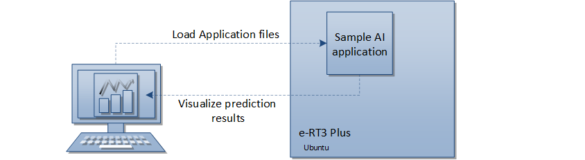
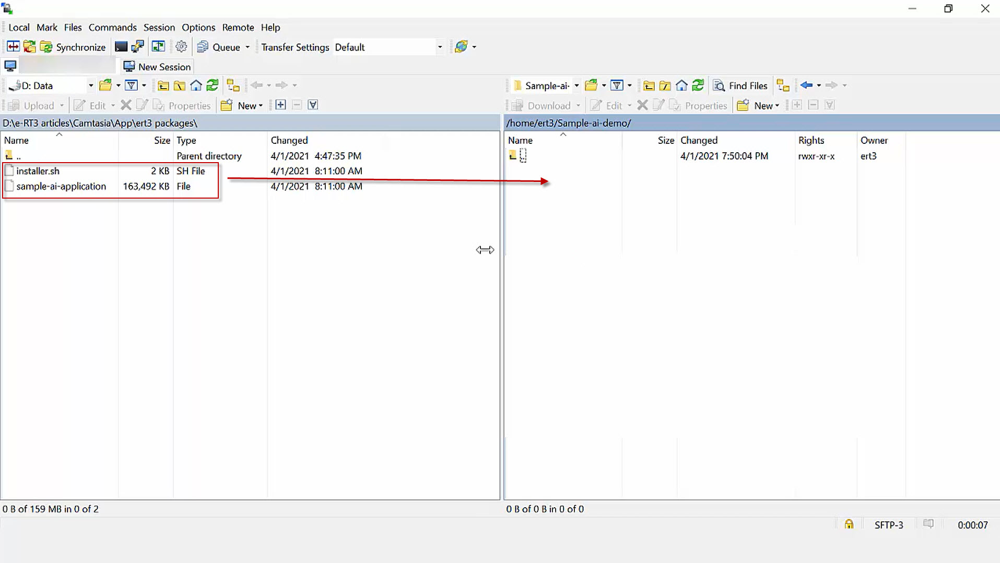
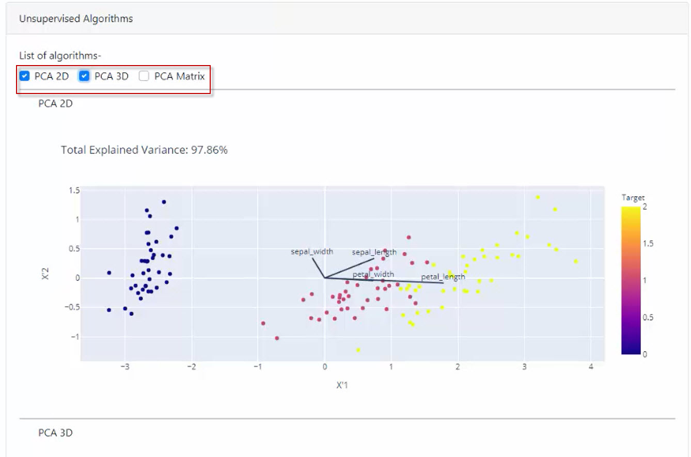
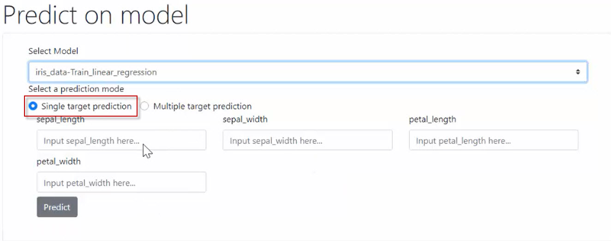
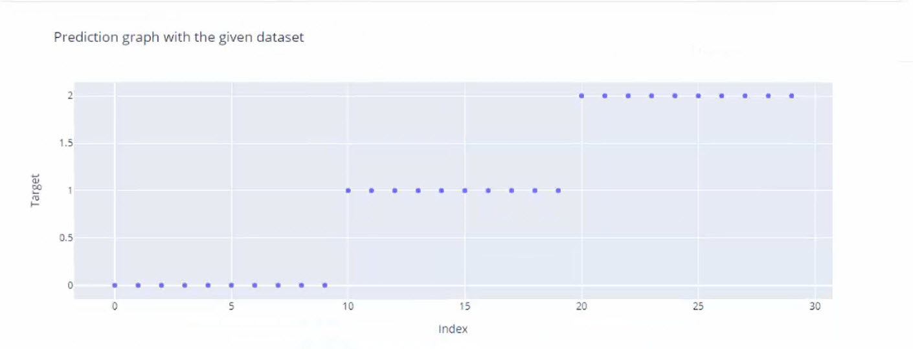
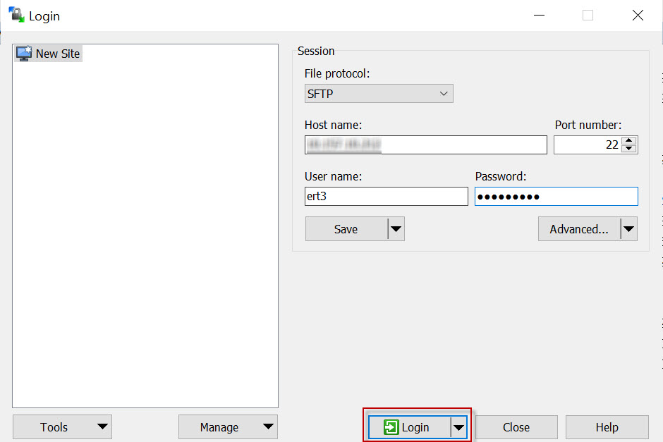

# Deploying a sample AI application on e-RT3 Plus

## Introduction

e-RT3 Plus is a high-performance controller with connected intelligence. Its ability to support Python programming, coupled with edge computing, has equipped it to provide productive insights and deliver customized solutions for target industry sectors.

In this article, we will show how to deploy a sample AI application on the e-RT3 Plus device. The aim is to create a data model and visualize the prediction for a sample [Iris dataset](https://archive.ics.uci.edu/ml/datasets/Iris) by using the AI application. However, the Iris dataset is a sample dataset and can be substituted for any other machine learning dataset of your choice.



We start by installing a sample AI application on the e-RT3 Plus device. Next, we upload the sample data from a .csv file to the AI application, following which we select the features and create a data model for prediction. Finally, we predict the data based on the created data model.

## Workflow

The following figure shows the workflow for deploying an AI application and visualizing the data prediction.


## Prerequisites

Before you can start deploying an AI application to e-RT3 Plus, the following requirements must be met:

1. The necessary hardware connections must be completed.
2. WinSCP must be installed on the computer.
3. PuTTY must be installed on the computer.
4. A processed dataset for AI prediction must be available in .csv format.
    > **Note**: The .csv file is required to have column headers. Additionally, there must be a column named `Target` which contains the expected prediction values. The processed dataset file must not have any null, strings, objects, or categorical data.
5. The AI application files must be available.
    > **Note**: You can develop your own AI application files, or you can download the sample application files [here](https://github.com/Yokogawa-Technologies-Solutions-India/e-RT3-docs/tree/master/Libraries/Sample%20AI%20Application).

----

## Getting Started

Once you have your setup ready, and have met all the requirements in the prerequisite section, you are ready to start deploying a sample AI application on the e-RT3 Plus device.

This can be accomplished in four steps:

  1. [Install the AI application files on e-RT3 Plus](#install-the-ai-application-files-on-e-rt3-plus)
  2. [Upload data and select features](#upload-data-and-select-features)
  3. [Create data model](#create-data-model)
  4. [Run data prediction](#run-data-prediction)
  
### Install the AI application files on e-RT3 Plus

Follow these steps to install the AI application files on e-RT3 Plus:

1. Open WinSCP and log on to the e-RT3 Plus device.

    For more information about how to connect to e-RT3 and transfer files using WinSCP, refer to the [Appendix](#using-winscp-to-transfer-files-to-e-rt3-plus).
2. Upload the AI application file `sample-ai-application`, and installer `installer.sh` to the e-RT3 Plus device using WinSCP.
    

    Click [here](https://github.com/Yokogawa-Technologies-Solutions-India/e-RT3-docs/tree/master/Libraries/Sample%20AI%20Application) to download the files.
    >**Note**: These files are available for use as is, and does not include support.
3. Log on to PuTTY.

    For more information about how to communicate with e-RT3 Plus using PuTTY, refer to [Remote communication with e-RT3 Plus](https://github.com/Yokogawa-Technologies-Solutions-India/e-RT3-docs/blob/master/Articles/e-RT3/Communication-with-e-RT3-Plus.md#establishing-ssh-connection-to-e-rt3-plus).
4. Run the following command to navigate to the folder where you saved the installer and AI application file.

    ```bash
    cd {FILEPATH_OF_AI_APPLICATION} 
    ```

5. Run the following command to verify that the files have been copied successfully.

    ```bash
    ls 
    ```

    The saved AI application file and installer file are listed.
6. Run the following command to set *execute* permission for the `installer.sh` file.

    ```bash
    sudo chmod +x installer.sh
    ```

7. Run the following command to install the AI application.

    ```bash
    sudo ./installer.sh 
    ```

The sample AI application installation is complete.

 > **Note**: For more information about enabling sudo privileges, refer to [Send telemetry data from e-RT3 Plus to Azure IoT hub](https://github.com/Yokogawa-Technologies-Solutions-India/e-RT3-docs/blob/master/Articles/Azure/Send-telemetry-data-from-e-RT3-to-azure-IoT-hub.md#enabling-sudo-user).

### Upload data and select features

Before creating a model, you must select the data visualization features that you want for your model by using the correlation matrix.

Follow these steps to select the data visualization features:

1. Open a web browser and specify the following URL in the address bar to open the sample AI application.

    `http://{e-RT3_PLUS_IP_ADDRESS}:9092/`

    The home page of the AI application appears.

    

2. In the Feature Selection section, click **Navigate**.

    The *Feature Selection* page appears.
    

3. Click **Click here to browse**.
4. Navigate to the folder that contains the (.csv) file of the dataset you have chosen to test. In this example, we are using the Iris dataset.
5. Select the .csv file and click **Open**.

    The data table from the .csv file is displayed.

    

    Additionally, the Scatter Matrix and the Correlation Matrix appear, displaying the relationship between the target data and the features.

    

    For more information about how the Scatter matrix and Correlation matrix are used in prediction, refer to [Understanding the correlation matrix](https://www.displayr.com/what-is-a-correlation-matrix/#:~:text=There%20are%20three%20broad%20reasons%20for%20computing%20a,As%20a%20diagnostic%20when%20checking%20other%20analyses.%20) and [How to read a correlation matrix](https://www.statology.org/how-to-read-a-correlation-matrix/).

6. If it is required to make modifications to the table, click the **Edit** icon to rename the column header.

   Alternatively, you can modify the table with Python. The .csv file is available as a Pandas DataFrame. You can access the DataFrame by using the **df** variable.

   Follow these steps to modify the table using Python code:
   1. Click **Modify Table with python**.

      A Python code editor appears.
        

   2. Specify the following code in the editor to rename the column

        ```bash
        df = df.rename(columns={'Class':'Target'})
        ```

   3. Click **Execute Code** to update the table.

        The updated Pandas DataFrame will be used by the Sample AI application.

    >**Note**: You can also access libraries like Numpy and Pandas by using np and pd respectively. Either way, **df** must be updated.

7. Select **Select features manually** to select the features you want to view in the scatter matrix.
8. Select the features that must appear in the scatter matrix from the drop-down list.
    

    > **Note**: Select **Select all features** to view all features in the scatter matrix.
9. If you want to visualize your dataset by using the Principal Component Analysis (PCA) algorithm, select the  **PCA 2D**, **PCA 3D**, or **PCA matrix** checkboxes according to your data visualization requirements.

    The PCA algorithm uses the dimensionality-reduction method for data analysis and prediction.

    

    Using these features, large chunks of information across the entire data set are effectively compressed and visualized in fewer feature columns.

10. After you finalize the features for visualization, click **Save the table**.

     The selected dataset is saved on the e-RT3 Plus device.

### Create data model

Follow these steps to create the data model for AI prediction:

1. On the AI application home page, in the Model Generation section, click **Navigate**.

    The *Generate Your model* page appears.

    

2. From the **Select dataset** drop-down list, select the dataset for which you selected the features.

    

3. Select an algorithm as necessary and click **Generate**.

    In this AI application provided by Yokogawa, four AI algorithms are supported:

     - Linear regression
     - Logistic regression
     - Random forest
     - xg_boost

   An evaluation graph of the model accuracy based on the selected dataset is displayed.

    

    > **Note**: Ensure that you note the model name which will be used for predicting the data.

The evaluation graph indicates the percentage of data that is accurately identified along with a graph based on the selected dataset. In this case, it is a class of flowers.

### Run data prediction

Follow these steps to start the data prediction:

1. On the AI application home page, in the Prediction section, click **Navigate** .

    The *Predict on model* page appears.

    
  
2. From the **Select Model** drop-down list, select the model name which was generated while creating the model.

    

3. Select one of the following prediction modes.

    - **Single target prediction**

      1. Select **Single target prediction**.
      2. Specify the parameters, which in this case are, sepal length, petal length, and petal width.
       

    - **Multiple target prediction**  

      1. Select **Multiple target prediction**.
      2. Click **Click here to browse**.
      3. Browse to select the required .csv file.
      >**Note**: The .csv file uploaded here must have the same column names as the one used during Feature Selection. However, the `Target` column must be removed. This is because, in this step the application will predict the target values.

      

4. Click **Predict**.
  
   A prediction graph is displayed, which in this case predicts the target class/specimen to which the flower belongs.

    

----

## Conclusion

As demonstrated in this article, it is easy to deploy and use AI applications on the e-RT3 Plus. Further, by leveraging the AI capabilities of e-RT3 Plus, you can develop your own code and create more advanced AI applications based on your plant or industrial requirements.

----

## Appendix

### Using WinSCP to transfer files to e-RT3 Plus

WinSCP is an open-source software for Windows. You can use WinSCP to transfer files between the e-RT3 Plus device and your local computer.
WinSCP also enables you to create, modify, or delete files and directories on the e-RT3 Plus device remotely from your local computer.

For more information about WinSCP, click [here](https://winscp.net/eng/docs/introduction).

Follow these steps to transfer files to the e-RT3 Plus device by using WinSCP:

1. Open WinSCP on your PC.

    The *Login* window appears.

    

2. In the **Host name** box, specify the IP address of the e-RT3 Plus device.
3. In the **Port number** box, specify the port number as 22.
4. In the **User name** and **Password** boxes, specify the login credentials.
5. Click **Login**.

   The *WinSCP* window appears. The folder structure of the local PC is displayed on the left and the e-RT3 Plus device folder structure is displayed on the right.

   

6. On the left panel, browse to the source folder location.
7. On the right panel, browse to the destination folder location.
8. Select the files you wish to transfer from the source folder and drag it to the destination folder.

    The file transfer starts.
    

The transferred files appear in the destination folder.
    

Similarly, you can transfer files from the e-RT3 Plus device to your local computer.

----

## References

1. [Remote communication with e-RT3 Plus](https://github.com/Yokogawa-Technologies-Solutions-India/e-RT3-docs/blob/master/Articles/e-RT3/Communication-with-e-RT3-Plus.md)
2. [Iris Dataset](https://archive.ics.uci.edu/ml/datasets/Iris)

   Dua, D. and Graff, C. (2019). UCI Machine Learning Repository [http://archive.ics.uci.edu/ml]. Irvine, CA: University of California, School of Information and Computer Science

----
