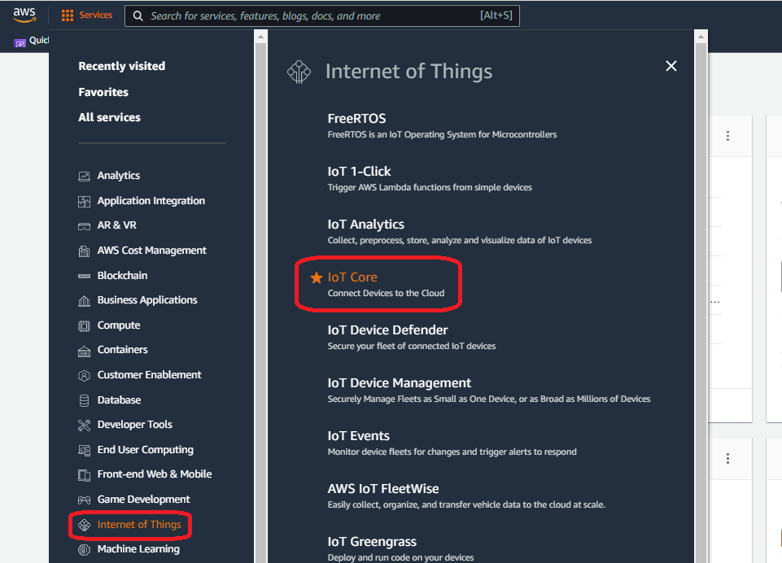
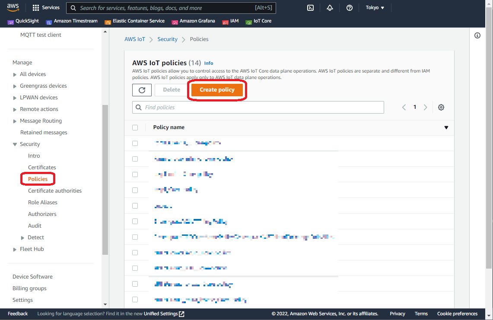
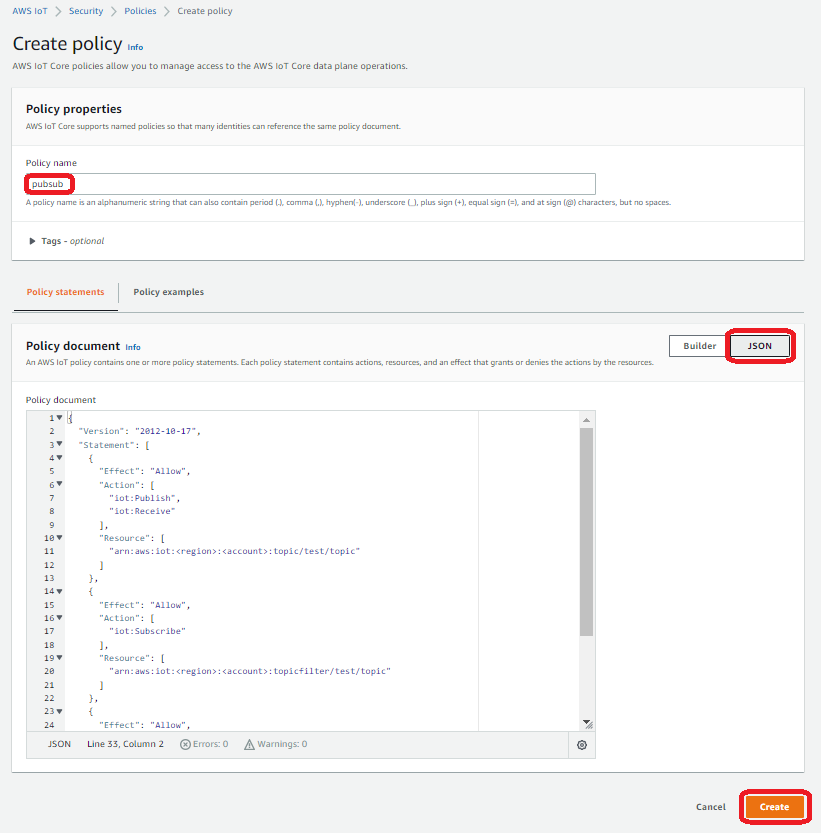
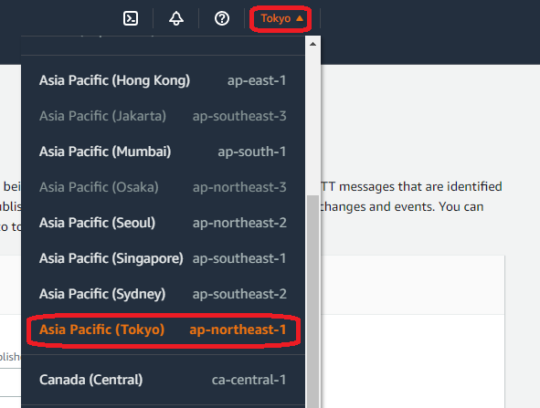
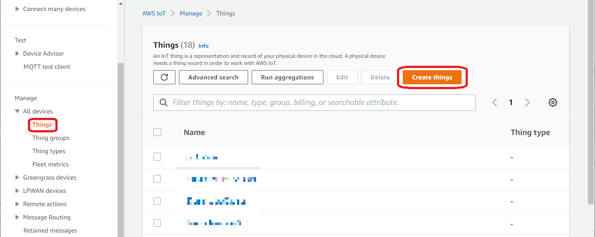
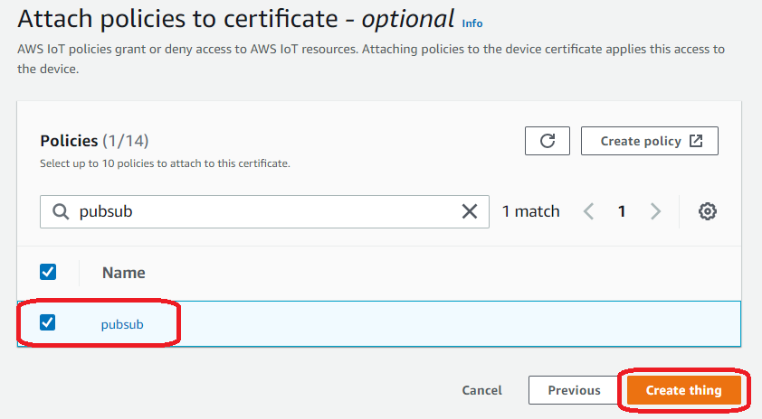
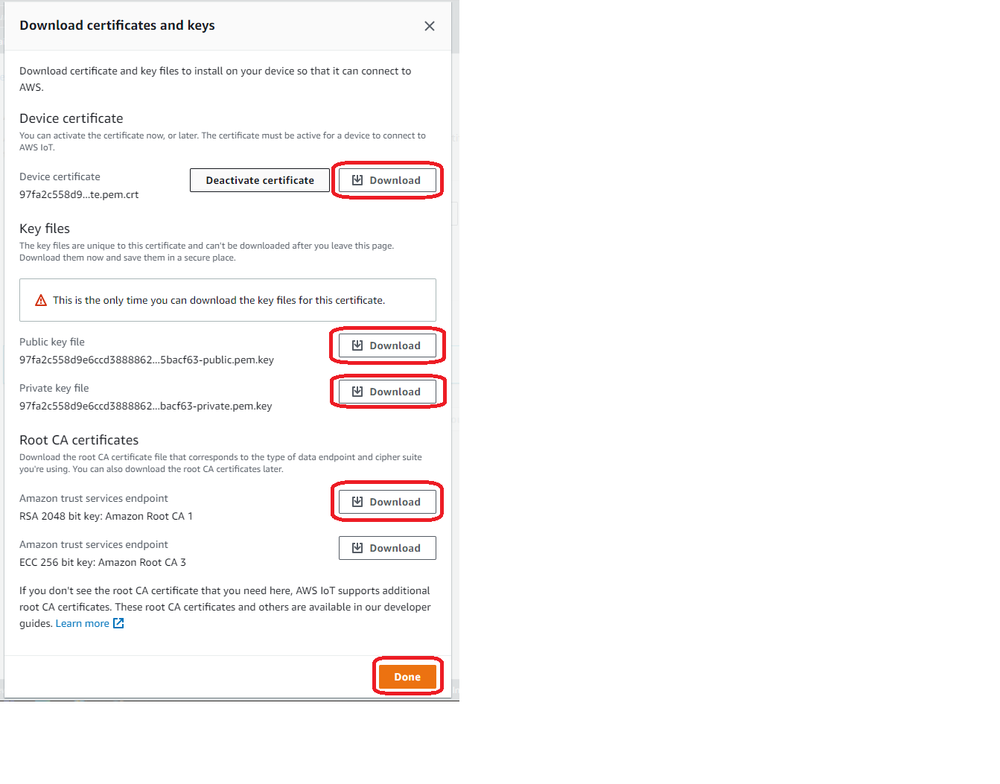
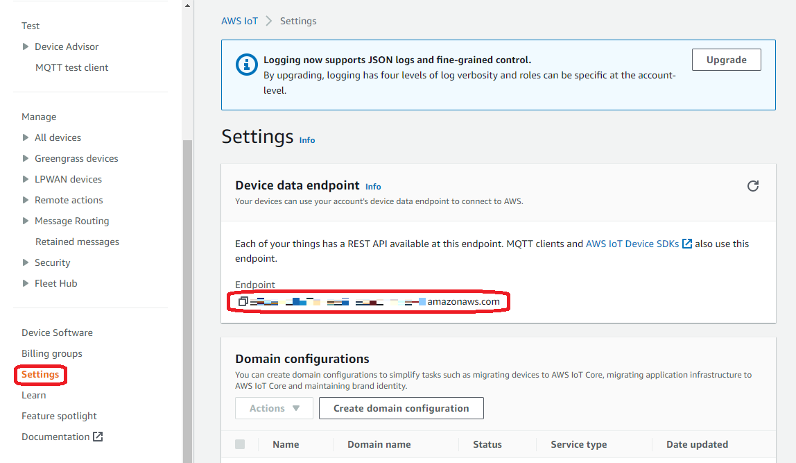
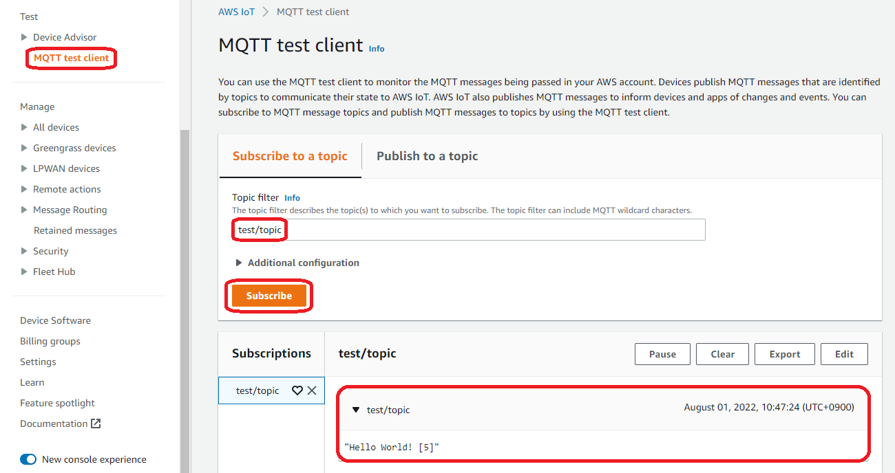
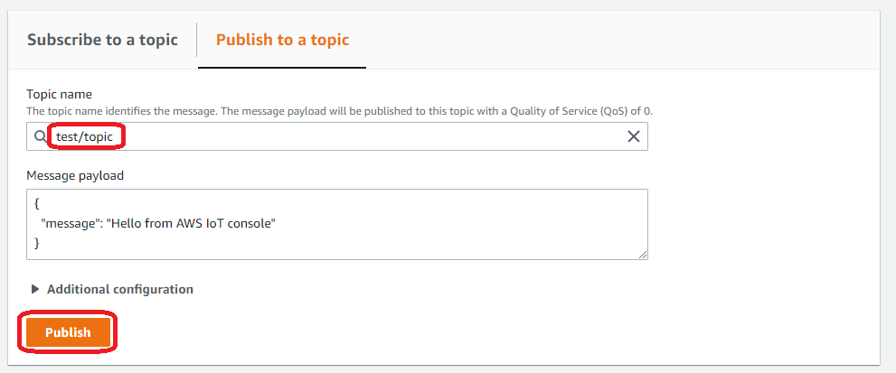

# Transmitting messages between AWS IoT Core and Edge device

## Introduction

In this article, we describe how to register an Edge device in AWS IoT Core and transmit messages between an Edge device and AWS IoT Core. You can easily send messages without having to install runtime in the Edge device.

For details about installing AWS IoT Greengrass(V1) on an Edge device and connecting it to AWS, refer to [this article](https://github.com/Yokogawa-Technologies-Solutions-India/e-RT3-docs/blob/master/Articles/AWS/Installing_AWS-IoT_Greengrass.md).

## Environment

**Supported devices (OS)**

- e-RT3 Plus F3RP70-2L（Ubuntu 18.04 32-bit）
- Raspberry Pi 4 Model B （Ubuntu Server 20.04 32-bit）

The `armhf` architecture package runs on these devices.

## Getting started

You must configure the following settings to transmit messages between AWS and the Edge device:

- [Configure AWS settings](#configuring-aws-settings)
- [Configure Edge device settings](#configuring-edge-device-settings)

## Configuring AWS settings

Configuring AWS settings involves the following steps:

1. [Creating Edge device policy](#creating-edge-device-policy)
2. [Registering Edge device](#registering-edge-device)

### Creating Edge device policy

To allow sending and receiving messages between the Edge device and AWS, we must create an Edge device policy.

1. Navigate to the *Services* page in AWS Console, and select **Internet of Things** on the left pane.
    

2. On the right pane, under **Internet of Things**, select **IoT Core**.

    The *AWS IoT* page appears.

    

3. On the left pane, select **Security > Policies**, and then click **Create Policy**.

    The *Create Policy* page appears.

    

4. In the **Policy name** box, type the name of the policy you want to create for the IoT device.
5. On the **Policy statements** tab, click **JSON**, and then enter the following JSON code to define the policy.

    ```json
    {
        "Version": "2012-10-17",
        "Statement": [
            {
                "Effect": "Allow",
                "Action": [
                    "iot:Publish",
                    "iot:Receive"
                ],
                "Resource": [
                    "arn:aws:iot:<region>:<account>:topic/test/topic"
                ]
            },
            {
                "Effect": "Allow",
                "Action": [
                    "iot:Subscribe"
                ],
                "Resource": [
                    "arn:aws:iot:<region>:<account>:topicfilter/test/topic"
                ]
            },
            {
                "Effect": "Allow",
                "Action": [
                    "iot:Connect"
                ],
                "Resource": [
                    "arn:aws:iot:<region>:<account>:client/test-*"
                ]
            }
        ]
    }
    ```

    In the code, replace \<account> and \<region> with your account and region names respectively.

    > **NOTE:** The region name is displayed in the upper-right corner of the AWS page.

    

    To obtain the account name, refer to this [procedure](https://docs.aws.amazon.com/IAM/latest/UserGuide/console_account-alias.html).

6. Click **Create**.

    The policy for the IoT device is created.

### Registering Edge device

1. On the left pane of the *AWS IoT* page, select **All devices > Things**, and then click **Create things**.

    

2. Create a **Thing** with the following settings.

    | Setting item | Description |
    |---|---|
    | No. of things to be created | Create one thing |
    | Name of the thing | Any (In this example, “testdevice”) |
    | Device license | Automatically creates new license |

3. Select the policy you created in the [previous section](#creating-edge-device-policy), and click **Create things**.

    

4. Download the following files:
   - Device certificate
   - Public key file
   - Private key file
   - Root CA certificate for Amazon trust services endpoint

    

    > **Note**: These files are required to [enable message transmission](#message-transmission) between the Edge device and AWS IoT core. Therefore, you must save these files locally on your computer for further usage.

5. Click **Done**.
    
    The Edge device is registered as an IoT device on AWS.

## Configuring Edge device settings

Configuring the Edge device settings involves the following steps:

1. [Install required packages](#installing-required-packages)
2. [Set up virtual environment](#setting-up-virtual-environment)
3. [Install SDK](#installing-sdk)
4. [Prepare sample program](#preparing-sample-program)

### Installing required packages

1. Run the following commands to install the required packages:

    ```bash
    sudo apt update
    sudo apt install cmake python3-dev python3-venv
    ```

2. In case of Raspberry Pi, SDK installation is not possible with the default compiler. Therefore, you must run the following commands to install the gcc package.

    ```bash
    sudo apt install build-essential
    sudo apt install gcc-8
    ```

    > **Note**: If the Edge device is under proxy environment, configuring [proxy settings](https://github.com/Yokogawa-Technologies-Solutions-India/e-RT3-docs/blob/master/Articles/Azure/Send-telemetry-data-from-e-RT3-to-azure-IoT-hub.md#proxy-settings) is mandatory.

### Setting up virtual environment

Run the following commands to create a virtual environment.

```bash
python3 -m venv venv
source venv/bin/activate
```

### Installing SDK

Run the following commands to install the SDK.

- **For e-RT3**
    Install `awsiotsdk`.

    ```bash
    (venv) username@ubuntu:~$ python3 -m pip install wheel
    (venv) username@ubuntu:~$ python3 -m pip install awsiotsdk
    ```

- **For Raspberry Pi**
    Specify the compiler and install `awsiotsdk`.

    ```bash
    (venv) username@ubuntu:~$ python3 -m pip install wheel
    (venv) username@ubuntu:~$ CC=/path/to/gcc-8 python3 -m pip install awsiotsdk
    ```

> **Note**: gcc-8 path can be verified by runnning the following command.
`username@ubuntu:~$ which gcc-8`
`/usr/bin/gcc-8`

>**Note**: If encoding-related error occurs during installation, specify the locale and run the following command.
Example:
`(venv) username@ubuntu:~$ LC_CTYPE=C.UTF-8 python3 -m pip install awsiotsdk`

### Preparing sample program

Save the AWS SDK2 sample program, [pubsub.py](https://github.com/aws/aws-iot-device-sdk-python-v2/blob/v1.7.1/samples/pubsub.py), in the Edge device. The license is saved [here](https://github.com/aws/aws-iot-device-sdk-python-v2/blob/v1.7.1/LICENSE).

>**Note**: This article uses v1.7.1 of the code.

Place the certificates and the key files that you downloaded while [registering the Edge device](#registering-edge-device) in the same directory where the sample program is placed.

## Message transmission

To enable transmission of messages, run the following command to start the sample program in the Edge device:

```bash
(venv) username@ubuntu:~$ python3 pubsub.py --endpoint xxx.amazonaws.com --root-ca AmazonRootCA1.pem --cert xxx-certificate.pem.crt --key xxx-private.pem.key 
```

In the arguments, specify the Root CA certificate, license, and key files that you downloaded while [registering the Edge device](#registering-edge-device). In addition, specify the endpoint in the command.

To obtain the endpoint, on the *AWS IoT* page, select **Settings**.

The endpoint is displayed in the *Device data endpoint* section.



>**Note**: If the Edge device is under proxy environment [configuring proxy settings](#configuring-proxy-settings) is mandatory.

The following output indicates that message is sent successfully.

```bash
Connecting to xxx.amazonaws.com with client ID 'test-xxx'...
Connected!
Subscribing to topic 'test/topic'...
Subscribed with QoS.AT_LEAST_ONCE
Sending 10 message(s)
Publishing message to topic 'test/topic': Hello World! [1]
Received message from topic 'test/topic': b'"Hello World! [1]"'
Publishing message to topic 'test/topic': Hello World! [2]
Received message from topic 'test/topic': b'"Hello World! [2]"'
Publishing message to topic 'test/topic': Hello World! [3]
```

In addition to publishing the message in ‘test/topic’ topic, this program subscribes to the ‘test/topic’ topic and stops after sending and receiving messages ten times.

### Verifying D2C message transmission

Follow these steps to verify if the message from the Edge device has reached the Cloud:

1. On the *AWS IoT* page, on the left pane, select **MQTT test client**.

    

2. On the **Subscribe to topic** tab, in the **Topic filter** box, type the name of the topic for which the message was sent from the Edge device.

3. Click **Subscribe**.

   You are subscribed to the specified topic.

If the message is received, it is displayed at the bottom of the screen.

### Verifying C2D message transmission

Follow these steps to send and verify C2D message transmission:

1. In the Edge device, run the following command to start the pubsub.py program without publishing the message.

    ```bash
    (venv) username@ubuntu:~$ python3 pubsub.py --endpoint xxx.amazonaws.com --root-ca AmazonRootCA1.pem --cert xxx-certificate.pem.crt --key xxx-private.pem.key --message ""
    ```

2. To send the message from cloud to the Edge device, click the **Publish to a topic** tab.

    

3. In the **Topic name** box, type `test/topic`.
4. In the **Message payload** box, specify the message to be sent.
    For example,

    ```bash
    {
        "message":"Hello from AWS IoT console"
    }
    ```

5. Click **Publish**.

   If the following output is generated in the Edge device, the C2D message is transmitted successfully. The program stops after sending ten messages.

    ```bash
    Received message from topic 'test/topic': b'{\n "message": "This is a message from AWS"\n}'
    ```

## Appendix

### Configuring proxy settings

If the Edge device is in proxy environment, run the `pubsub.py` program by using the following command.

```bash
(venv) username@ubuntu:~$ python3 pubsub.py --endpoint xxx.amazonaws.com --root-ca AmazonRootCA1.pem --cert xxx-certificate.pem.crt --key xxx-private.pem.key --proxy-host "proxy.example.com" --proxy-port xx
```

If user name and password are required, specify the same in the program as follows:

**Before modification**

```bash
pubsub.py
if (args.proxy_host):
proxy_options = http.HttpProxyOptions(host_name=args.proxy_host, port=args.proxy_port)
```

**After modification**

```bash
pubsub.py
if (args.proxy_host):
proxy_options = http.HttpProxyOptions(host_name=args.proxy_host, port=args.proxy_port, auth_type = http.HttpProxyAuthenticationType.Basic, auth_username="<username>", auth_password="<password>")
```

## References

1. [AI platform for industries | Yokogawa Electric Corp](https://www.yokogawa.com/solutions/products-platforms/control-system/ert3-embedded-controller/#Overview)
2. [GitHub - aws/aws-iot-device-sdk-python-v2: Next generation AWS IoT Client SDK for Python using the AWS Common Runtime](https://github.com/aws/aws-iot-device-sdk-python-v2)
