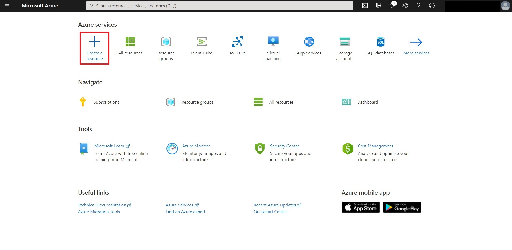
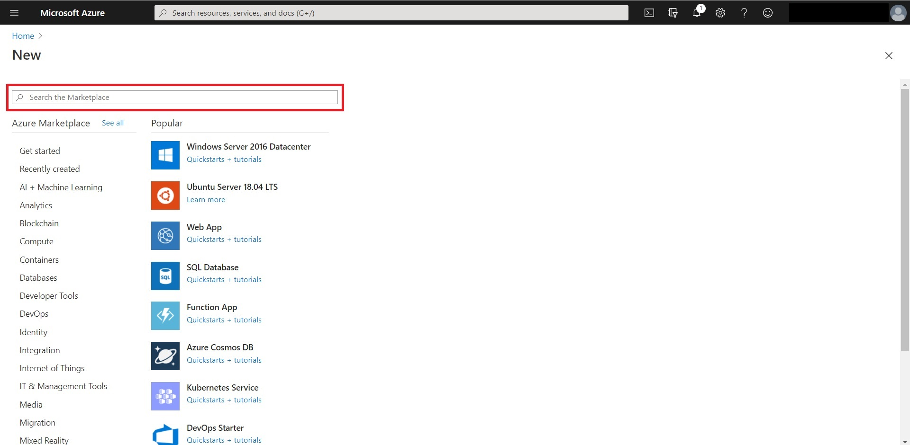
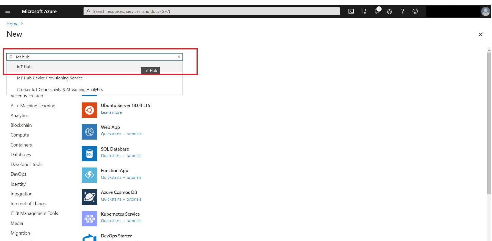
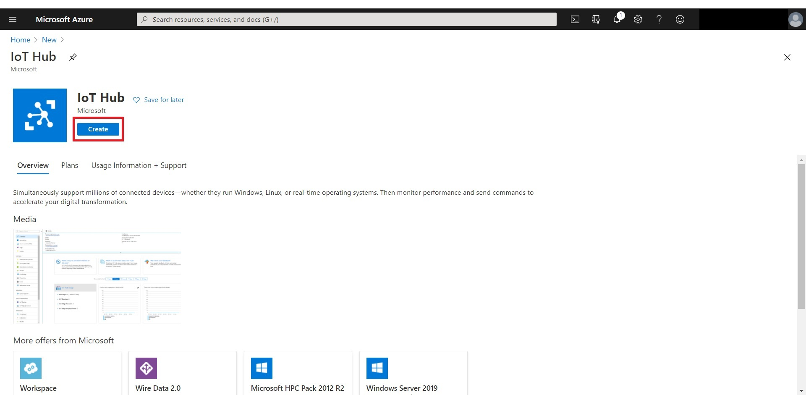
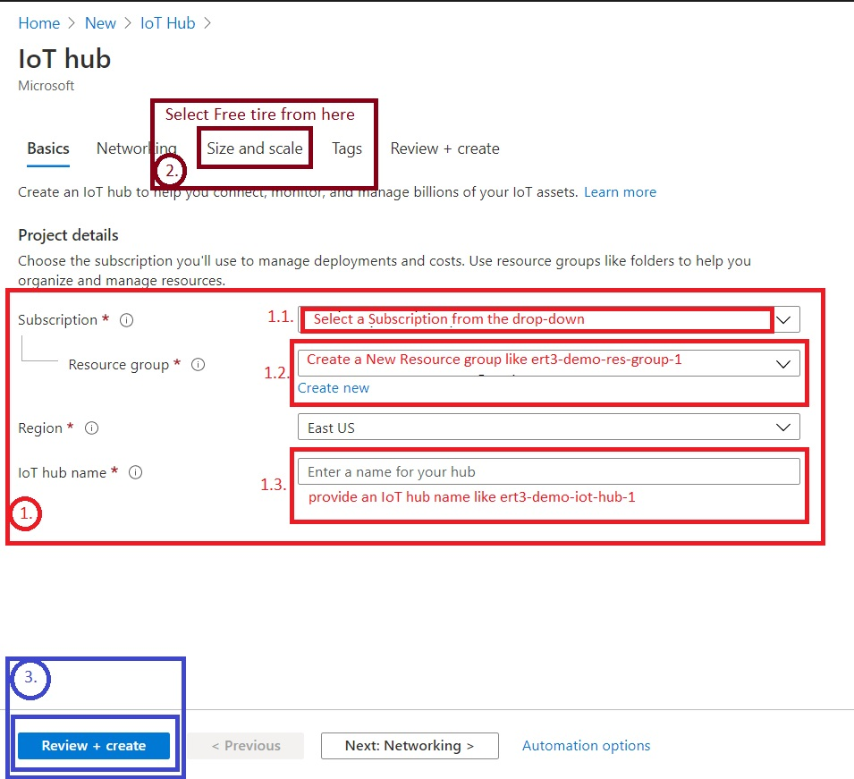
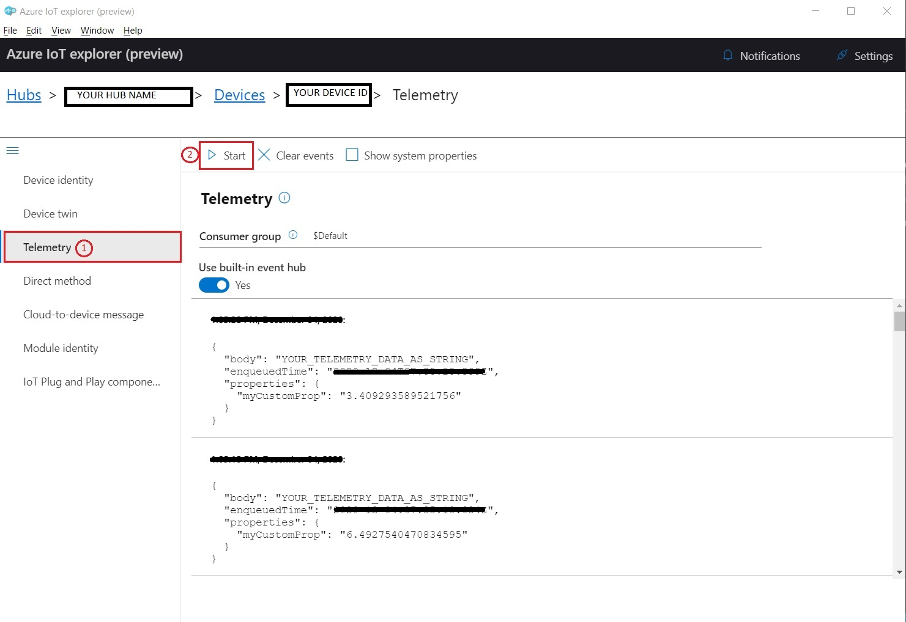

# Send telemetry data from e-RT3 to Azure IoT hub

In this tutorial, we are going to establish telemetry communication between e-RT3 and azure IoT Hub. There
are some basic pre-requisites for this tutorial as followed -

1. [Azure IoT Hub](https://portal.azure.com/)
2. [Python](https://www.python.org/)
3. [**e-RT3 Plus device**](#link-to-e-rt3-into)
4. [**SSH communication between e-RT3 and PC**](#link-to-e-rt3-ssh)

In this tutorial, we have used -

1. [Azure Portal](https://portal.azure.com/) to **Create an IoT Hub**.
2. [Azure Cloud Shell](https://shell.azure.com/) to **Create a device** and to get the **Connection String** from the created device.
3. [Visual Studio Code](https://code.visualstudio.com/) to write a `Python` script to **_send the telemetry data_**.
4. [Azure IoT explorer](https://github.com/Azure/azure-iot-explorer/releases) to **verify the received data**.

---

## Table of contents

In this tutorial, we are going to cover the following things -

- 1\. [Configure Azure IoT hub](#Configure-Azure-IoT-hub)
  - 1.1\. [Create an IoT hub](#Create-an-IoT-hub)
  - 1.2\. [Register a device in the IoT hub](#Register-a-device-in-the-IoT-hub)
- 2\. [Send simulated telemetry data with python](#Send-simulated-telemetry-data-with-python)
  - 2.1\. [Create a python virtual environment](#Create-a-python-virtual-environment)
  - 2.2\. [Python code to send the simulated data](#Python-code-to-send-the-simulated-data)
- 3\. [Read the telemetry data from the IoT hub](#Read-the-telemetry-data-from-the-IoT-hub)
- 4\. [Supplementary](#Supplementary)
  - 4.1\. [Proxy settings](#Proxy-settings)
- 5\. [Conclusion](#Conclusion)

---

## Configure Azure IoT hub

This section is to describes how to configure an IoT hub in [Azure Portal](https://portal.azure.com/). This section is divided into two parts -

1. [Create an IoT hub](#Create-an-IoT-hub)
2. [Register a device in the IoT hub](#Register-a-device-in-the-IoT-hub)

### Create an IoT hub

To create an IoT hub in [Azure portal](https://portal.azure.com/) we need to follow the following steps -

1. Sign in to your [Azure portal](https://portal.azure.com/). After a successful login to the portal, your web browser should look like as follow -
   

> **_Note:_** If your web browser does not look like the same as mentioned here, then please consider to refer the [official documentation](https://docs.microsoft.com/en-us/azure/iot-hub/iot-hub-create-through-portal) provided by Microsoft.

2. Create an `IoT Hub resource`. To create an IoT hub please select the **+ Create a resource** button.
   
   After clicking this button it will navigate to the Azure marketplace.
   
   Type `IoT hub` in the search box and **select IoT Hub** from the drop-down option.
   
   Once you select the `IoT Hub` from the list it will navigate to the hub page. After successful navigation click on the **Create** button.
   

3. Complete the `IoT Hub` form.
   
   On the **Basics** tab, you need to fill-up the form provided by Azure.
   Once you complete the review click on the **Create** button to create the hub (This might take some time to complete).

### Register a device in the IoT hub

To register a device inside your IoT hub you need to follow the following steps -

1. Open a new tab and navigate to [Azure Cloud Shell](https://shell.azure.com/).

2. Now, checked whether your account has an `azure-iot` extension or not by using the following command

```azure cli
az extension list
```

3. If you can't find an extension named `azure-iot` then you should install it by using the following command

```azure cli
az extension add --name azure-iot
```

4. Execute the following command, Where, **YOUR_HUB_NAME** is the name of the IoT hub you provided during the creation of the IoT hub and **YOUR_DEVICE_ID** This is the name of the device you're registering.

```azure cli
az iot hub device-identity create --hub-name YOUR_HUB_NAME --device-id YOUR_DEVICE_ID
```

5. To get the **_device connection string_**, execute the following command (This connection string will be required by the python script, so take a backup of your connection string into some file).

```azure cli
az iot hub device-identity connection-string show --hub-name YOUR_HUB_NAME --device-id YOUR_DEVICE_ID --output table
```

> **_Note:_** To create the device instance into _Azure IoT Hub_ we are using [Azure Cloud Shell](https://shell.azure.com/). Without accessing the `Azure Cloud Shell`, you might lose your connect string. It's always a good idea to take a backup of your connection string into somewhere else like a temporary file.

## Send simulated telemetry data with python

To send the telemetry data, we are using the `Python` script. For this step please Make sure that **_you have installed `pip3` and `venv` on your e-RT3 device_**. `pip3` comes by default with the [e-RT3 OS](https://partner.yokogawa.com/global/itc/index.htm). _Please note that the e-RT3 OS file is only accessible to the registered member of the partner portal_.

In case you did not install the **_python virtual module (venv)_** previously, then you can install it by using the following steps -

> ### Enabling SUDO user
>
> When you are working as a normal user and you want to use commands that require root privileges, you usually add `sudo` to the beginning, but you may be rejected as follows -
>
> ```bash: Terminal
> # Working with the General User username
> $sudo apt update
> [sudo] password for username:     # Enter Password
> username is not in the sudoers file.  This incident will be > reported.
> ```
>
> If that is the case, you could resolve it by using the following steps -
>
> Since the configuration is done as root, switch to the root user with the `su` command once.
>
> ```bash: Terminal
> $su
> Password:     # Enter root password
> root @ ubuntu:/home/username #
> ```
>
> Edit the configuration file with the `visudo` command -
>
> ```bash: Terminal
> visudo
> ```
>
> Add the following lines at the end of the configuration file and save it -
> **Replace username with your username.**
>
> ```bash: Terminal
> username ALL = (ALL) ALL     # replace username with your username
> ```
>
> Log out of root and see if the sudo command works -
>
> ```bash: Terminal
> root @ ubuntu:/home/username # exit
> exit
> username @ ubuntu: ~ $sudo apt update
> [sudo] password for username:     # Enter Password
> Get: 1 http://ports.ubuntu.com/ubuntu-ports bionic InRelease [242 kB]
> ...
>
> username @ ubuntu: ~ $
> ```
>
> If you have configured your ert3 user with `sudo` permissions, then you may try to use the following commands to install the same -
>
> ```bash:Terminal
> sudo apt update
> sudo apt install python3-venv
> ```
>
> Once the installation is completed you are ready to create a virtual python environment. If you need Proxy settings, please visit the [supplementary](#Supplementary) section.

### Create a python virtual environment

To create a [python virtual environment](https://docs.python.org/3/tutorial/venv.html), first, you have to **_navigate to your desire folder location (workspace)_**. Once navigated please execute the following command to create a python virtual environment -

```bash:Terminal
python3 -m venv YOUR_ENV_NAME
```

Once you have created a virtual environment, you may activate it by using the following command -

```bash:Terminal
source YOUR_ENV_NAME/bin/activate
```

After activation is completed your `terminal` should be like as follow -

```bash:Terminal
(YOUR_ENV_NAME)username@ubuntu: ~ $
```

Once you have activated the virtual environment, you may want to create a python script to **send the telemetry data**. To create a python script, you can execute the following command -

```bash:Terminal
touch YOUR_FILE_NAME.py
```

### Python code to send the simulated data

Once you have access to the "e-RT3" and able to execute a python script, then it's time to send some simulated data to [Azure IoT Hub](https://portal.azure.com/).

1. To send simulated data we are going to use a python module provided by azure called [azure-iot-device](https://pypi.org/project/azure-iot-device/).
   In your terminal window, run the following command to install [azure-iot-device](https://pypi.org/project/azure-iot-device/) if required.

   ```bash:Terminal
   pip3 install azure-iot-device
   ```

   Once the installation is completed, then start writing the code to the created file.

2. first of all we need to import the module by using the following line

   ```python: Demo.py
   from azure.iot.device import IoTHubDeviceClient, Message
   ```

3. Then. declare a variable to store the `device connection string` (for reference you may follow the _5<sup>th</sup> step of [Register a device in the IoT hub](#Register-a-device-in-the-IoT-hub)_)

   ```python
   CONNECTION_STRING = YOUR_CONNECTION_STRING
   ```

4. After that, create a client instance by using the following line

   ```python
   # Method to initialize the iot hub client instance
   def iothub_client_init():
       # Create an IoT Hub client
       client = IoTHubDeviceClient.create_from_connection_string(CONNECTION_STRING)
       # return the client instance
       return client
   ```

5. Next, add the following function, which will send the _telemetry data to Azure IoT hub_.

   ```python
   def iothub_client_telemetry_sample_run():
     # crete a client instance
     client = iothub_client_init()
     # create a Message to send to the IoT Hub
     message = Message("YOUR_TELEMETRY_DATA_AS_STRING")
     # Send the message to IoT hub
     client.send_message(message)
   ```

6. Call the `iothub_client_telemetry_sample_run` from the main method to send the telemetry data as followed -

   ```python
   if __name__ == '__main__':
     iothub_client_telemetry_sample_run()
   ```

7. Complete sample code with the simulated data will look as follow -

   ```python
   import random
   import time
   # Import azure IoT hub client and Message from `azure-iot-device`
   from azure.iot.device import IoTHubDeviceClient, Message

   # Your connection string of the IoT Device
   CONNECTION_STRING="YOUR_CONNECT_STRING"

   # Initializing the iot hub client instance
   def iothub_client_init():
       # Create an IoT Hub client with connection string
       client = IoTHubDeviceClient.create_from_connection_string(CONNECTION_STRING)
       # returning the client
       return client

   def iothub_client_telemetry_sample_run():
       try:
           # crete a client instance
           client = iothub_client_init()
           print ( "IoT Hub device sending messages, press Ctrl+C to exit" )
           while True:
               # create a Message to send to the IoT Hub
               message = Message("YOUR_TELEMETRY_DATA_AS_STRING")
               # Create a custom property with the Message payload
               message.custom_properties["myCustomProp"] = (random.random() * 15)
               # Send the message to IoT hub
               print( "Sending message: ")
               #print data and both system and application (custom) properties
               for property in vars(message).items():
                   if all(property):
                       print("    {0}".format(property))
               client.send_message(message)
               print ( "Message successfully sent" )
               time.sleep(10)
       except KeyboardInterrupt:
           print ( "IoTHubClient sample stopped" )

   if __name__ == '__main__':
       iothub_client_telemetry_sample_run()
   ```

   **_Note:_** You may require proxy setup to send the telemetry data to azure could. In that case please replace the `iothub_client_init()` function with the following code -

   ```python
   from azure.iot.device import ProxyOptions
   import socks

   def iothub_client_init():
       proxy_opts = ProxyOptions(
           proxy_type=socks.HTTP,
           proxy_addr="YOUR_PROXY_ADDRESS",
           proxy_port=YOUR_PROXY_PORT,
           proxy_username="YOUR_PROXY_USERNAME",
           proxy_password="YOUR_PROXY_PASSWORD"
       )
       # Create an IoT Hub client with connection string
       client = IoTHubDeviceClient.create_from_connection_string(CONNECTION_STRING, websockets=True, proxy_options=proxy_opts)
       # returning the client
       return client
   ```

8. Save the file and run the script by using the following command -

   ```bash:Terminal
   python3 YOUR_FILE_NAME.py
   ```

9. After executing the script your console might like as follow -

   ```bash:Terminal
   (YOUR_ENV_NAME) username@ubuntu:~/workspace$ python3 YOUR_FILE_NAME.py
   IoT Hub device sending messages, press Ctrl+C to exit
   Sending message:
       ('data', 'YOUR_TELEMETRY_DATA_AS_STRING')
       ('custom_properties', {'myCustomProp': 13.066109804837703})
   Message successfully sent
   Sending message:
       ('data', 'YOUR_TELEMETRY_DATA_AS_STRING')
       ('custom_properties', {'myCustomProp': 11.664970897921908})
   Message successfully sent
   ```

## Read the telemetry data from the IoT hub

Once telemetry data successfully updated to the Azure IoT hub You may verify it by using [azure-iot-explorer](https://github.com/Azure/azure-iot-explorer/releases). Microsoft has provided very good documentation on this software please, **read more about it by clicking [this link](https://docs.microsoft.com/en-us/azure/iot-pnp/howto-use-iot-explorer)**.

Once, you have installed and able to connect to the IoT hub click on the **Telemetry** tab and hit the **start** button to read those telemetry data.



## Supplementary

### Proxy settings

Personally for me, one of the most difficult things is to configure the `Proxy` settings, and also I think this varies from environment to environment. Here I'm going to mention my setting for this e-RT3 device.

1. Open a Terminal window where you need proxy access.
2. Set and export the HTTP_PROXY variable.

   ```bash: Terminal
   export HTTP_PROXY=USERNAME:PASSWORD@your.proxy.server:port
   ```

3. Set and export the HTTPS_PROXY variable.

   ```bash: Terminal
   export HTTPS_PROXY=USERNAME:PASSWORD@your.proxy.server:port
   ```

4. Set and export the NO_PROXY variable to prevent local traffic from being sent to the proxy.

   ```bash: Terminal
   export NO_PROXY=localhost,127.0.0.1,*.my.lan.domain
   ```

If Proxy settings are made, add the `-E` option to inherit environment variables and execute

```bash: Terminal
# apt command example
sudo  -E apt update
```

Once completed, Use the following command to delete the environment variables -

```bash: Terminal
unset HTTP_PROXY HTTPS_PROXY NO_PROXY
```

## Conclusion

This is an entry-level python script to upload the telemetry data which might require some pre-knowledge of e-RT3 and Azure IoT hub.

## Reference

**1.** [Azure Tutorial](https://docs.microsoft.com/en-us/azure/iot-hub/quickstart-send-telemetry-python)

**2.** [Azure IoT Explorer](https://github.com/Azure/azure-iot-explorer/)

**3.** [Python Virtual Environments and Packages](https://docs.python.org/3/tutorial/venv.html)

**4.** [Azure SDK for Python](https://docs.microsoft.com/en-us/python/api/azure-iot-device/?view=azure-python)

---

---

| `Co-innovating tomorrow` |                                                                                                         | `© Yokogawa Technologies Solutions India` |
| ------------------------ | ------------------------------------------------------------------------------------------------------- | ----------------------------------------- |
|                          | [](https://www.yokogawa.com/) |                                           |

---

---
