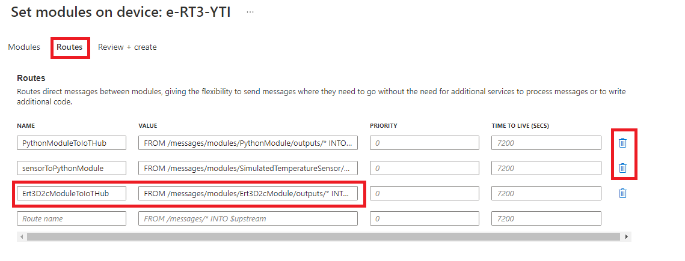
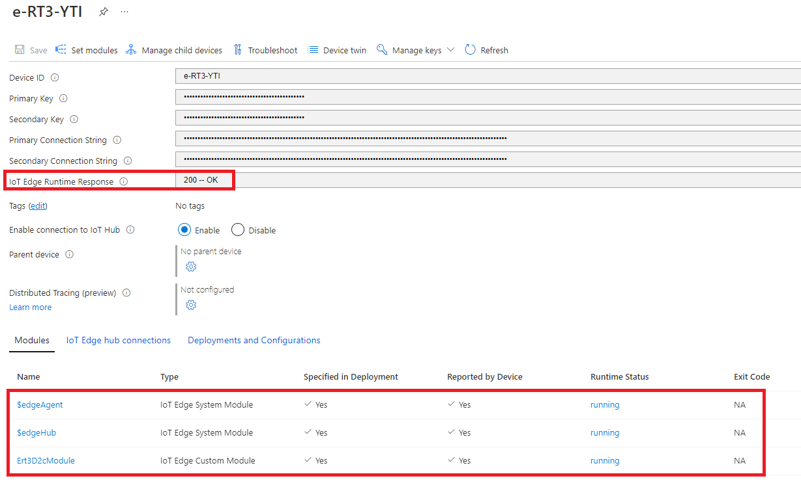
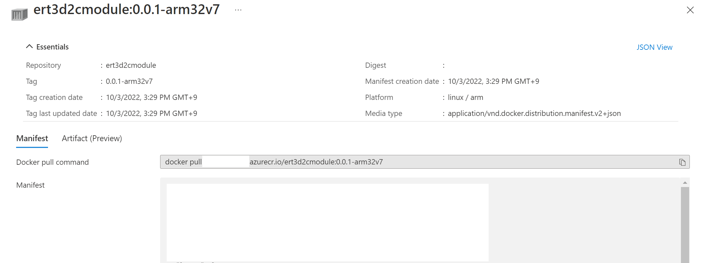

# Create an Azure IoT Edge Python module to gather data from an Edge device and transmit it to the IoT Hub

## Introduction

Azure IoT Runtime enables you to collect information and execute commands on Edge devices remotely. When installed on e-RT3 Plus, the features of both e-RT3 Plus and Azure Runtime Environment can be utilized to perform various operations.

This is part two of a five-part series that demonstrates how to use Azure Runtime Environment with e-RT3 Plus. In the [previous article](https://github.com/Yokogawa-Technologies-Solutions-India/e-RT3-docs/blob/master/Articles/AzureIoTRuntimeEnvironment/Deploying_sample_Python_module.md), we created a Python module that sends data to the IoT Hub from a Simulated Temperature sensor module. In this article, we create a Python IoT Edge data collection module that gathers data from the Analog Input module (F3AD08-6R) and uploads it to the IoT Hub.

The ultimate goal for this article series is to demonstrate how to:

1. Create a Python data collection module to gather data, process it and upload it to IoT Hub
2. Create a Python module for writing data to an Edge device
3. Visualize the collected data using Azure App Service and Power BI


## Hardware modules

The following figure shows the hardware modules used for this demonstration.


The following table describes the hardware modules used in this article.

| Module | Description |
|---|---|
|e-RT3 Plus F3RP70-2L (CPU module, Ubuntu 18.04 32-bit)| e-RT3 Plus controls the complete module set. It accesses each module from the CPU module to read and write data.  The `armhf` architecture package runs on this device. |
| F3AD08-6R (Analog Input module)| The Analog Input module converts the external analog data received to digital data. |
| F3BU05-0D (Base module)| This is the base for connecting each module. It takes care of the power supply and communication between the modules that are connected to it. |
| F3PU20-0S (Power module)|   Used for power supply, the Power module is connected on the Base module.|

For more information on the hardware modules, refer to [this page](https://www.yokogawa.com/solutions/products-and-services/control/control-devices/real-time-os-based-machine-controllers/#Overview).

> **Note**: The IoT Edge module development and device operations are performed on Windows 10.

## Prerequisites

The prerequisites to complete this article are the same as the prerequisites mentioned in the [previous article](https://github.com/Yokogawa-Technologies-Solutions-India/e-RT3-docs/blob/master/Articles/AzureIoTRuntimeEnvironment/Deploying_sample_Python_module.md#prerequisites). Additionally, you must meet the hardware requirements listed [here](#hardware-modules).

## Getting started

To send data from e-RT3 Plus to the IoT Hub and view the received data, we must complete the following steps:

1. [Create Python IoT Edge module](#module-creation)
2. [Deploy module on e-RT3 Plus](#deploy-module)
3. [Verify module operation](#verify-module-operation)

## Module creation

To create a module for collecting data from the Analog Input module and sending it to the IoT Hub, we create a new Python project using Visual Studio Code and then modify the code to suit our requirements.

The Python IoT Edge data collection module must collect data from all the channels of the Analog Input module and send the collected data to the IoT Hub. Additionally, you must be able to configure the data collection frequency from the module twin.

### Create new project

The steps for creating a new Python module in Visual Studio Code are the same as described in the steps 2 and 4 of [the previous article](https://github.com/Yokogawa-Technologies-Solutions-India/e-RT3-docs/blob/master/Articles/AzureIoTRuntimeEnvironment/Deploying_sample_Python_module.md#creating-and-deploying-a-module).

In this demonstration, we have created a project with the following details:

- Solution name : Ert3D2c
- Module template : Python Module
- Module name : Ert3D2cModule
- Target architecture : arm32v7

### Modify code

After creating the project, rewrite the contents of `main.py` as follows:

```python
import os
import json
import subprocess
import signal
import datetime
import ctypes
from azure.iot.device import IoTHubModuleClient
from azure.iot.device import Message

DESIRED_KEY = 'desired'
ERT3ADD2C_KEY = 'ert3add2c'
INTERVALSEC_KEY = 'interval_sec'
STATUS_KEY = 'status'
FAM3AD_CHNUM = {'AD04': 4, 'AD08': 8}
UNIT = 0
SLOT = 2
DEFAULT_INTERVAL_SEC = 2.0
LDCONFIGEXEC = 'ldconfig'
M3LIB_PATH = '/usr/local/lib/libm3.so.1'
DEVICE_ID = os.environ['IOTEDGE_DEVICEID']
OUTPUT_NAME = os.environ['IOTEDGE_MODULEID'] + 'ToIoTHub'


class AdD2C():
    """
    Class implemented by each function that collects data from the AD module.
    """
    def __init__(self, module_client, unit, slot):
        """
        Contructor.
        """
        self.__module_client = module_client
        self.__unit = unit
        self.__slot = slot
        self.__message_no = 1
        self.__libc = ctypes.cdll.LoadLibrary(M3LIB_PATH)
        self.__libc.getM3IoName.restype = ctypes.c_char_p
        self.__chnum = self.__get_m3ad_ch_num()
        signal.signal(signal.SIGALRM, self.__signal_handler)

    def __get_m3ad_ch_num(self):
        """
        Decide on either AD08 or  AD04.
        """
        namebytes = self.__libc.getM3IoName(
            ctypes.c_int(self.__unit), ctypes.c_int(self.__slot))
        num = 0
        if namebytes is not None:
            num = FAM3AD_CHNUM.get(namebytes.decode(), 0)
        return num

    def __read_m3ad_ch_datas(self):
        """
        Obtain data from all channels of AD module.
        """
        short_arr = ctypes.c_short * self.__chnum
        ch_datas = short_arr()
        self.__libc.readM3IoRegister(
            ctypes.c_int(self.__unit),
            ctypes.c_int(self.__slot),
            ctypes.c_int(1),
            ctypes.c_int(self.__chnum),
            ch_datas)
        return ch_datas

    def __signal_handler(self, signum, frame):
        """
        Create message and send to edgeHub module.
        """
        bodyDict = dict(
            messageID=self.__message_no,
            deviceID=DEVICE_ID,
            datetime=datetime.datetime.utcnow().isoformat() + 'Z'
            )

        ch_datas = self.__read_m3ad_ch_datas()
        for index, ch_value in enumerate(ch_datas):
            bodyDict['ch' + str(index + 1)] = ch_value

        bodyStr = json.dumps(bodyDict)
        msg = Message(bodyStr, output_name=OUTPUT_NAME)
        self.__module_client.send_message(msg)
        print(bodyStr)

        self.__message_no = self.__message_no + 1

    def set_condition(self, desired):
        """
        Configure the data collection frequency settings.
        """
        if ERT3ADD2C_KEY not in desired:
            return {STATUS_KEY: False}

        interval_sec = desired[ERT3ADD2C_KEY].get(INTERVALSEC_KEY,
                                                  DEFAULT_INTERVAL_SEC)
        reported = dict()
        reported[ERT3ADD2C_KEY] = desired[ERT3ADD2C_KEY]
        if interval_sec < 0.0:
            reported[ERT3ADD2C_KEY][STATUS_KEY] = False
        else:
            signal.setitimer(signal.ITIMER_REAL, interval_sec, interval_sec)
            reported[ERT3ADD2C_KEY][STATUS_KEY] = True

        return reported


def send_ad_data():
    """
    Call each function.
    Monitor the changes in the module twin.
    """
    module_client = IoTHubModuleClient.create_from_edge_environment()
    module_client.connect()
    twin = module_client.get_twin()

    add2c = AdD2C(module_client, UNIT, SLOT)
    reported = add2c.set_condition(twin.get(DESIRED_KEY, {}))
    module_client.patch_twin_reported_properties(reported)

    while True:
        reported = add2c.set_condition(
            module_client.receive_twin_desired_properties_patch()
        )
        module_client.patch_twin_reported_properties(reported)

    module_client.disconnect()


if __name__ == "__main__":
    subprocess.run([LDCONFIGEXEC])

    send_ad_data()

```

> **Note**: The code flow is explained as comments in the code. Additional information on the code is described in [Python code details](#python-code-details).

### Build and push modules

After rewriting the code in `main.py` and saving it, you must push the Python IoT Edge data collection module to the Container Registry.

Follow these steps to build and push the Python IoT Edge data collection module to the Container Registry:

1. On the left pane of the Visual Studio Code window, in the project folder, locate the `deployment.template.json` file.
2. Right-click the `deployment.template.json` file and select **Build and Push IoT Edge Solution**.

    The Python IoT Edge data collection module is built and pushed to the Container Registry. The progress of the command execution and the execution result is displayed on the Terminal pane at the bottom of the window.

> **Note**: Pushing the Python IoT Edge data collection module to Container Registry will fail if the proxy settings are not configured correctly. For more information about configuring the Visual Studio Code and Docker Desktop proxy settings refer [Proxy settings](https://github.com/Yokogawa-Technologies-Solutions-India/e-RT3-docs/blob/master/Articles/AzureIoTRuntimeEnvironment/Deploying_sample_Python_module.md#proxy-settings).

## Deploy module

After building the Python IoT Edge data collection module and pushing it to the Container Registry, we must deploy it on the e-RT3 Plus device.

Follow these steps to deploy the Python IoT Edge data collection module on e-RT3 Plus from Azure Portal:

1. Open [Azure Portal](https://portal.azure.com/).
2. Navigate to the IoT Hub that you created.
3. On the left pane, under the **Device management** section, click **IoT Edge**.
4. From the device IDs that are displayed, select the ID of the target device on which you want to deploy the module.

    The device information appears.
5. Click **Set modules**.

    

6. In the **Container Registry Credentials** section, ensure that the credentials are configured. For more information about configuring the credentials, refer to step 7 of [Creating a new project](https://github.com/Yokogawa-Technologies-Solutions-India/e-RT3-docs/blob/master/Articles/AzureIoTRuntimeEnvironment/Deploying_sample_Python_module.md#creating-a-new-project).
    >**Note**: If the `PythonModule` and `SimulatedTemperatureSensor` modules configured in the [previous article](https://github.com/Yokogawa-Technologies-Solutions-India/e-RT3-docs/blob/master/Articles/AzureIoTRuntimeEnvironment/Deploying_sample_Python_module.md#deploying-a-sample-python-module-on-an-edge-device-installed-with-azure-iot-edge-runtime) are displayed, remove them by clicking the **Delete** icon on the right.
7. To configure the settings of the Python IoT Edge data collection module, click **+Add** and then select **IoT Edge Module** from the drop-down list.

   

8. Configure the parameters of the IoT Edge module as described in the following table and click **Add**.

    | Setting |Information to be entered|
    |---|---|
    |Module name|The module name|
    |Image URI|Image URI obtained from the repository of Container Registry. For information about how to obtain the image URI, refer to [Image URI](#image-uri).|
    |Restart Policy| Always (retain default settings)|
    |Desired Status| Running (retain default settings)|
    |Image Pull Policy| Empty (retain default settings)|

9. Click the **Container Create Options** tab and specify the options in the editor as follows.

    ```json
    {
        "HostConfig": 
        {   
            "Binds": [
            "/usr/local/lib/libm3.so.1.0.1:/usr/local/lib/libm3.so.1.0.1"
            ],
            "Devices": [
            {
                "PathOnHost": "/dev/m3io",
                "PathInContainer": "/dev/m3io",
                "CgroupPermissions": "rwm"
            },
            {
                "PathOnHost": "/dev/m3sysctl",
                "PathInContainer": "/dev/m3sysctl",
                "CgroupPermissions": "rwm"
            },
            {
                "PathOnHost": "/dev/m3cpu",
                "PathInContainer": "/dev/m3cpu",
                "CgroupPermissions": "rwm"
            },
            {
                "PathOnHost": "/dev/m3mcom",
                "PathInContainer": "/dev/m3mcom",
                "CgroupPermissions": "rwm"
            },
            {
                "PathOnHost": "/dev/m3dev",
                "PathInContainer": "/dev/m3dev",
                "CgroupPermissions": "rwm"
            },
            {
                "PathOnHost": "/dev/m3ras",
                "PathInContainer": "/dev/m3ras",
                "CgroupPermissions": "rwm"
            },
            {
                "PathOnHost": "/dev/m3wdt",
                "PathInContainer": "/dev/m3wdt",
                "CgroupPermissions": "rwm"
            }
            ]
        }
    }
    ```

    

    For more information about Container Create Options, refer to the [official documentation](https://learn.microsoft.com/en-us/azure/iot-edge/how-to-use-create-options?view=iotedge-1.4).

    For information about the settings that can be configured, refer to the [Docker documentation](https://docs.docker.com/engine/api/v1.32/#tag/Container/operation/ContainerCreate).

    > **Note**: The library information is specified in the `Binds` tag and the device information is specified in the `Devices` tag.

10. Click the **Module Twin Settings** tab and specify the settings as follows:

    ```json
    {
        "ert3add2c": 
        {
            "interval_sec": 2
        }
    }
    ```

    

    Here, we configure an interval of 2 seconds. This configures the Python module to collect data from all the channels of the Analog Input module in a time interval of two seconds.

11. Click **Apply**.
12. Click the **Routes** tab and configure the details as described in the following table.

    |NAME|VALUE|
    |---|---|
    |yourModuleToIoTHub|FROM /messages/modules/`<yourModule>`/outputs/* INTO $upstream|

    

    Here, we configure the routes to send data from the Python IoT Edge data collection module to the IoT Hub.

    > **Note**: If the routes configured in the [previous article](https://github.com/Yokogawa-Technologies-Solutions-India/e-RT3-docs/blob/master/Articles/AzureIoTRuntimeEnvironment/Deploying_sample_Python_module.md#deploying-a-sample-python-module-on-an-edge-device-installed-with-azure-iot-edge-runtime) are displayed, remove them by clicking the **Delete** icon on the right.

13. Click **Review + create** and verify the configuration information.

    In the upper-left corner of the screen, the message "Validation passed" is displayed.

14. After verifying the configuration information, in the lower-left corner of the page, click **Create**.

    The *Device settings* page appears, and the module list with the status of each module is displayed.

    

15. Verify the following information:
    - The **IoT Edge Runtime Response** must be displayed as `200 - OK`.
    - The runtime status of all the modules ([edgeAgent], [edgeHub], and the module you deployed[yourModule]) must be displayed as `running`.
  
    > **Note**: It usually takes some time to view the status of the deployment. If any of the above conditions are not satisfied, click **Refresh** to view the latest information.

## Verify module operation

To verify the module operation we must observe the following outcomes:

1. [View telemetry data in IoT Hub](#view-telemetry-data)

    Verify that the telemetry data sent by the Python IoT Edge data collection module is received in the IoT Hub.
2. [View changes in operation corresponding to Module twin updates](#update-module-twin-and-verify-operation)

    To verify that updates to the module twin are reflected in the messages recieved at the IoT Hub we perform the following:
    1. Increase the frequency of data collection and observe the corresponding change at the IoT Hub.
    2. Set the frequency of data collection to zero. This stops data transmission.

### View telemetry data

You can verify the operation of the Python IoT Edge data collection module in the same way described in the [previous article](https://github.com/Yokogawa-Technologies-Solutions-India/e-RT3-docs/blob/master/Articles/AzureIoTRuntimeEnvironment/Deploying_sample_Python_module.md#verifying-module-operation).

If the format of the telemetry data received is as follows, the Python IoT Edge data collection module is running properly.

```json
    {
        "body": {
            "messageID": 2034,
            "deviceID": "test_ert3_f3rp70",
            "datetime": "2021-01-26T03:50:58.445146Z",
            "ch1": -1,
            "ch2": 8,
            "ch3": 1,
            "ch4": 2,
            "ch5": 0,
            "ch6": 1,
            "ch7": 3,
            "ch8": 1
        },
        "enqueuedTime": "2021-01-26T03:50:58.476Z",
        "properties": {}
    }
```

> **Note**: As an 8-channel F3AD08 is used, data from 8 channels is transmitted.

### Update module twin and verify operation

We can update the module twin from Azure portal and verify that the module operation changes accordingly.

Follow these steps to update the module twin:

1. Open [Azure portal](https://portal.azure.com/) and navigate to the IoT Hub that you created.
2. On the left pane, under the **Device management** section, click **IoT Edge**.
3. From the device IDs that are displayed, select the ID of the device on which you want to deploy the module.

    The device information appears.
4. Click **Set modules**, select the IoT Edge module that you want to modify.

    The IoT Edge module screen appears.
5. Click the **Module Twin Settings** tab.

   The module twin information is displayed.
6. Update the module twin information in the text box as necessary:
   - Modify the frequency of data collection

        Update the value of `interval_sec` to change the frequency of data collection. For example, we have updated the data collection frequency to 5 seconds as follows:

        ```json
        {
        "ert3add2c": {
            "interval_sec": 5
            }
        }
        ```

   - Stop data collection

        If the value of `interval_sec` is set to zero, then data collection is stopped and messages will not be sent to IoT Hub.

        ```json
        {
        "ert3add2c": {
            "interval_sec": 0
            }
        }
        ```

    > **Note** : If you want to restart data collection, change the value of `interval_sec` to any value greater than 1.

7. Verify the updated information and if there are no issues, click **Review + Create**.

   The module is created and deployed with the updates. After the deployment is complete, verify the operation as follows:
    1. If you increased or decreased the data collection frequency, the telemetry data received at the IoT Hub changes accordingly.
    2. If you stopped data collection, no messages are received at the IoT Hub.

## Conclusion

The data from the Analog Input module is received by the Python module deployed in the e-RT3 Plus device. Subsequently, the same data can be viewed in Azure IoT Hub, proving that the Python module created is functioning as expected. In the next article, we will create an IoT Edge module that writes data into an analog output module that is connected to the e-RT3 Plus device.

## Appendix

### Image URI

To obtain the image URI, follow these steps:

1. Open [Azure Portal](https://portal.azure.com/) and navigate to the Container Registry.
2. On the left pane, under the **Services** category, click **Repositories**.
3. From the list of repositories displayed, click the ID of the repository that you want to deploy.
4. From the tags that are displayed, click the tag that your want to deploy.
   > **Note**: The tags are displayed in the format `<version_number>-<target_device>`. Confirm that the target device in the tag is displayed as `arm32v7`.
5. The repository details are displayed. In the **Docker pull command** box, the content displayed after `docker pull` is the image URI.

    

    The image URI is in the format  `<registry name>.azurecr.io/<module name>:<tag>`.

### Python code details

The flow of the code is explained as comments in the Python code. Here, we describe additional details:

#### Libraries

The following libraries are imported:

1. **`ctypes`**

   The `ctypes`  library provides C compatible data types, and allows calling functions in DLLs or shared libraries. Since the functions of the e-RT3 Plus device run on C language, we import the `ctypes` library.

    ```python
        import ctypes
    ```

2. **`IoTHubModuleClient`**

   The `IoTHubModuleClient` library is part of the [Azure IoT Hub SDK](https://learn.microsoft.com/en-us/azure/iot-hub/iot-hub-devguide-sdks). It is a Synchronous module client that connects to an Azure IoT Hub or Azure IoT Edge instance. For more information on the `IoTHubModuleClient` library, click [here](https://learn.microsoft.com/en-us/python/api/azure-iot-device/azure.iot.device.iothubmoduleclient?view=azure-python).

    ```python
    from azure.iot.device import IoTHubModuleClient
    ```

3. **`Message`**

   The `Message` library is part of the [Azure IoT Hub SDK](https://learn.microsoft.com/en-us/azure/iot-hub/iot-hub-devguide-sdks). It represents a message to or from IoTHub. For more information on the `Message` library, click [here](https://learn.microsoft.com/en-us/python/api/azure-iot-device/azure.iot.device.message?view=azure-python)

    ```python
    from azure.iot.device import Message
    ```

4. The library to access the Analog Input module is not included in the Python IoT Edge data collection module, instead it is bound to the CPU module (host) library and used.

#### Definitions

The following definition, provides the value of the symbolic link of e-RT3 Plus within the Python IoT Edge data collection module.

```python
M3LIB_PATH = '/usr/local/lib/libm3.so.1'
```

#### e-RT3 Plus functions

The Python module uses the following e-RT3 Plus functions:

1. **`getM3IoName`**

   This function obtains the module ID by specifying the unit and slot ID.

   The function definition is as follows:

    ```c
    char* getM3IoName (int unit, int slot);
    ```

2. **`readM3IoRegister`**

    This function reads the data from an I/O register by specifying the unit, slot, channel from which you want to read data, number of channels from which you want to read, and data storage position.

    The function definition is as follows:

    ```c
    int readM3IoRegister(int unit, int slot, int pos, int num, unsigned short *data);
    ```

#### Other functions

**`subprocess.run([LDCONFIGEXEC])`**

This function is used for binding `/usr/local/lib/libm3.so.1.0.1` of F3RP70-2L to `/usr/local/lib/libm3.so.1.0.1` of Python IoT Edge data collection module.

It generates a symbolic link of the library and is invoked at the beginning of the main function to enable the usage of the library within e-RT3 Plus when deploying the Python IoT Edge data collection module.

#### Payload format

The payload for sending data is created in the following format:

```json
{
"body": {
    "messageID": 1,
    "deviceID": "{deviceID}",
    "datetime": "2020-01-01T00:00:00.000Z",
    "ch1": 123,
    "ch2": 234,
    "ch3": 345,
    "ch4": 456,
    "ch5": 567,
    "ch6": 678,
    "ch7": 789,
    "ch8": 890
    }
}
```

Here,

`messageID` is the ID of the message. The message ID is generated as a sequence of numbers starting from 1,

`deviceID` refers to the ID of the target device on which the Python IoT Edge data collection module is deployed,

`datetime` refers to the time at which the CPU module acquires the data,

`ch1` - `ch8` refers to the data acquired from each channel.


## References

1. [Real-time OS controller e-RT3 Plus F3RP70-2L](https://www.yokogawa.com/solutions/products-and-services/control/control-devices/real-time-os-based-machine-controllers/#Overview)
2. [Azure Certified Device catalog](https://devicecatalog.azure.com/)
3. [Visualize real-time sensor data from your Azure IoT hub in a web application](https://learn.microsoft.com/en-us/azure/iot-hub/iot-hub-live-data-visualization-in-web-apps)
4. [Tutorial: Visualize real-time sensor data from Azure IoT Hub using Power BI](https://learn.microsoft.com/en-us/azure/iot-hub/iot-hub-live-data-visualization-in-power-bi)
5. [Tutorial: Develop IoT Edge modules with Linux containers](https://learn.microsoft.com/en-us/azure/iot-edge/tutorial-develop-for-linux?view=iotedge-1.4)
6. [Tutorial: Develop and deploy a Python IoT Edge module using Linux containers](https://learn.microsoft.com/en-us/azure/iot-edge/tutorial-python-module?view=iotedge-1.4)
7. [Summary and usage methods of Azure IoT Hub SDK](https://learn.microsoft.com/en-us/azure/iot-hub/iot-hub-devguide-sdks)
