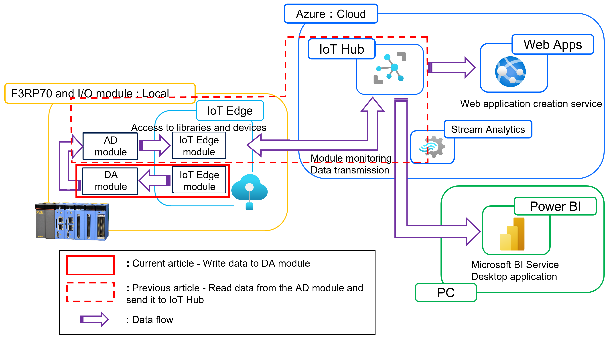
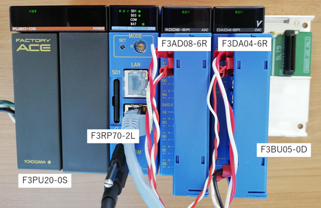
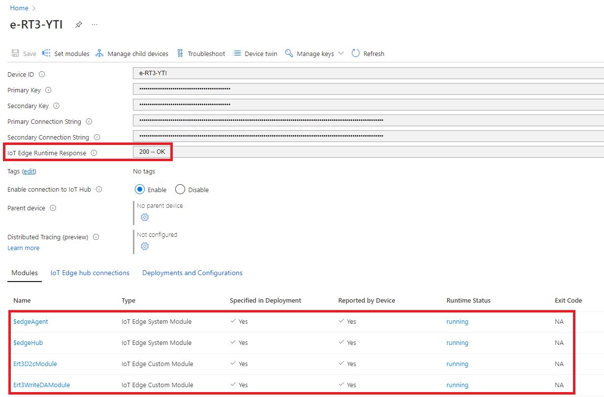

# Create an Azure IoT Edge Python module that writes data to an Edge device

## Introduction

Azure IoT Runtime enables you to collect information and execute commands on Edge devices remotely. When installed on e-RT3 Plus, the features of both e-RT3 Plus and Azure Runtime Environment can be utilized to perform various operations.

This is part three of a five-part series that demonstrates how to use Azure Runtime Environment with e-RT3 Plus. The first two parts describe how to create and deploy Azure IoT Edge Python modules that read and upload data to an IoT Hub. In the first part we read data from a sample temperature module, and in the second part we read data from an Analog Input Edge device.

1. [Deploying a sample Python module on an Edge Device installed with Azure IoT Edge Runtime](https://github.com/Yokogawa-Technologies-Solutions-India/e-RT3-docs/blob/master/Articles/AzureIoTRuntimeEnvironment/Deploying_sample_Python_module.md)
2. [Create an Azure IoT Edge Python module to gather data from an Edge device and transmit it to the IoT Hub](https://github.com/Yokogawa-Technologies-Solutions-India/e-RT3-docs/blob/master/Articles/AzureIoTRuntimeEnvironment/CreatePythonDataCollection_AzureIoT.md)

The aim of this article is to add a Azure IoT Edge Python writing module that generates waveform data according to the configuration received from the Module Twin and writes it to the Analog Output module. The Analog Input module which is connected to the Analog Output module receives the generated data. Subsequently, the Azure IoT Edge Python data collection module deployed in the [previous article](https://github.com/Yokogawa-Technologies-Solutions-India/e-RT3-docs/blob/master/Articles/AzureIoTRuntimeEnvironment/CreatePythonDataCollection_AzureIoT.md) collects data from all channels of the Analog Input module and sends the data to the IoT Hub.



The ultimate goal for this article series is to demonstrate how to:

1. Create an Azure IoT Edge Python module to gather data, process it and upload it to IoT Hub
2. Create a Azure IoT Edge Python module for writing data to an Edge device
3. Visualize the collected data using Azure App Service and Power BI.

For more information about installing and deploying Azure IoT Runtime environment, refer to [Deploying Azure Runtime Environment on e-RT3 Plus](https://github.com/Yokogawa-Technologies-Solutions-India/e-RT3-docs/blob/master/Articles/Local_blob_storage/Installing_Azure_Runtime_on_e-RT3.md).

## Hardware modules

The following figure shows the hardware modules used for this demonstration.



> **Note**: The image shows connections to channels 1 and 2 only. However, in the actual test, channels 1 to 4 are connected.

The following table describes the hardware modules used in this article.

| Module | Description |
|---|---|
|e-RT3 Plus F3RP70-2L (CPU module, Ubuntu 18.04 32-bit)| e-RT3 Plus controls the complete module set. It accesses each module from the CPU module to read and write data.  The `armhf` architecture package runs on this device. |
| F3AD08-6R (Analog Input module)| The Analog Input module (AD module) converts the external analog data received to digital data. |
| F3DA04-6R (Analog Output module)| The Analog Output  module (DA module) converts the digital data sent from the e-RT3 Plus to analog data. |
| F3BU05-0D (Base module)| This is the base for connecting each module. It takes care of the power supply and communication between the modules that are connected to it. |
| F3PU20-0S (Power module)| The Power module is connected on the Base module and is used for power supply.|

For more information on the hardware modules, refer to [this page](https://www.yokogawa.com/solutions/products-and-services/control/control-devices/real-time-os-based-machine-controllers/#Overview).

> **Note**: The IoT Edge module development and device operations are performed on Windows 10.

## Prerequisites

Before performing the steps described in this article, you must complete the steps mentioned in the [previous article](https://github.com/Yokogawa-Technologies-Solutions-India/e-RT3-docs/blob/master/Articles/AzureIoTRuntimeEnvironment/CreatePythonDataCollection_AzureIoT.md#prerequisites). Additionally, you must meet the hardware requirements listed [here](#hardware-modules).

Follow these steps to verify the versions of the installed software:

1. Run the following command to verify that Azure IoT Edge version 1.1.4 is installed.

    ```bash
    $ iotedge --version
    iotedge 1.1.4
    ```

    For information about installing Azure IoT Edge, refer to [Deploying Azure Runtime Environment on e-RT3 Plus](https://github.com/Yokogawa-Technologies-Solutions-India/e-RT3-docs/blob/master/Articles/Local_blob_storage/Installing_Azure_Runtime_on_e-RT3.md).

2. Run the following commands to verify that Docker Desktop version 20.10 is installed.

    ```bash
    $ docker --version
    Docker version 20.10.18+azure-1, build b40c2f6b5deeb11ac6c485c940865ee40664f0f0
    ```

    For information about installing Docker Desktop, refer to [Setting up the Container Engine](https://github.com/Yokogawa-Technologies-Solutions-India/e-RT3-docs/blob/master/Articles/AzureIoTRuntimeEnvironment/Deploying_sample_Python_module.md#setting-up-the-container-engine).

## Workflow

To write data from e-RT3 Plus to the Analog Output module, we must complete the following steps:

1. [Create Azure IoT Edge Python writing module](#module-creation)
2. [Deploy module on e-RT3 Plus](#deploy-module)
3. [Verify module operation](#verify-operation)

## Module creation

The Azure IoT Edge Python writing module writes data on channels 1 – 4 of the Analog Output module every 0.1 seconds. It can generate data for four types of waveforms.

1. Sine wave
2. Triangle wave
3. Square wave
4. Sawtooth wave

To create and push the Azure IoT Edge Python writing module module to Azure portal, you must complete the following steps:

1. [Create module project](#create-module-project)
2. [Modify module code](#modify-module-code)
3. [Build and push module](#build-and-push-modules)

### Create module project

The steps for creating a new Python module in Visual Studio Code are the same as described in the steps 2 - 4 of [the previous article](https://github.com/Yokogawa-Technologies-Solutions-India/e-RT3-docs/blob/master/Articles/AzureIoTRuntimeEnvironment/Deploying_sample_Python_module.md#creating-and-deploying-a-module).

In this demonstration, we have created a project with the following details:

- Solution name : Ert3WriteDA
- Module template : Python Module
- Module name : Ert3WriteDAModule
- Target architecture : arm32v7

### Modify module code

After creating the project, rewrite the contents of `main.py` as follows:

```python
import os
import json
import math
import subprocess
import signal
import datetime
import ctypes
from azure.iot.device import IoTHubModuleClient
from azure.iot.device import Message

DESIRED_KEY = 'desired'
ERT3DAOUT_KEY = 'ert3daout'
FORM_KEY = 'form'
FORM_SIN_TAG = 'sin'
FORM_TRIANGLE_TAG = 'triangle'
FORM_SQUARE_TAG = 'square'
FORM_SAWTOOTH_TAG = 'sawtooth'
CYCLE_SEC_KEY = 'cycle_sec'
AMPLITUDE_KEY = 'amplitude'
OFFSET_KEY = 'offset'
STATUS_KEY = 'status'
CYCLE_SEC_DEFAULT = 60
AMPLITUDE_DEFAULT = 2000
OFFSET_DEFAULT = 0
CHTAG_KEYS = ['ch1', 'ch2', 'ch3', 'ch4', 'ch5', 'ch6', 'ch7', 'ch8']
FAM3DA_CHNUM = {'DA04': 4, 'DA08': 8}
UNIT = 0
SLOT = 3
INTERVAL_SEC = 0.1
LDCONFIGEXEC = 'ldconfig'
M3LIB_PATH = '/usr/local/lib/libm3.so.1'


class DaOut():
    def __init__(self, unit, slot, interval_sec):
        self.__unit = unit
        self.__slot = slot
        self.__interval_sec = interval_sec
        self.__libc = ctypes.cdll.LoadLibrary(M3LIB_PATH)
        self.__libc.getM3IoName.restype = ctypes.c_char_p
        self.__chnum = self.__get_m3da_ch_num()
        self.__counters = [0 for x in range(self.__chnum)]
        self.__configs = {CHTAG_KEYS[x]: {} for x in range(self.__chnum)}
        signal.signal(signal.SIGALRM, self.__signal_handler)
        signal.setitimer(signal.ITIMER_REAL, interval_sec, interval_sec)

    def __get_m3da_ch_num(self):
        namebytes = self.__libc.getM3IoName(
            ctypes.c_int(self.__unit), ctypes.c_int(self.__slot))
        num = 0
        if namebytes is not None:
            num = FAM3DA_CHNUM.get(namebytes.decode(), 0)
        return num

    def __write_m3da_ch_data(self, ch, data):
        short_arr = ctypes.c_short * 1
        ch_data = short_arr(data)

        self.__libc.writeM3IoRegister(
            ctypes.c_int(self.__unit),
            ctypes.c_int(self.__slot),
            ctypes.c_int(ch),
            ctypes.c_int(1),
            ch_data)

    def __da_form_out(self, ch, form, interval, cycle, ampl, offset, count):
        data = 0.0
        count = count % (cycle / interval)

        if form == FORM_SIN_TAG:
            data = ampl * math.sin(math.pi * 2 * interval * count / cycle)

        elif form == FORM_TRIANGLE_TAG:
            data = count * interval * ampl * 4 / cycle
            if ampl * 3 < data:
                data = data - (ampl * 4)
            elif ampl < data:
                data = (ampl * 2) - data

        elif form == FORM_SQUARE_TAG:
            data = ampl
            if ((cycle / interval) / 2) < count:
                data = - data

        elif form == FORM_SAWTOOTH_TAG:
            data = (count * interval * ampl * 2 / cycle) - ampl

        data = data + offset

        self.__write_m3da_ch_data(ch, round(data))

    def __signal_handler(self, signum, frame):
        for id in range(self.__chnum):
            if FORM_KEY in self.__configs[CHTAG_KEYS[id]]:
                self.__da_form_out(
                    id + 1,
                    self.__configs[CHTAG_KEYS[id]][FORM_KEY],
                    INTERVAL_SEC,
                    self.__configs[CHTAG_KEYS[id]].get(CYCLE_SEC_KEY, CYCLE_SEC_DEFAULT),
                    self.__configs[CHTAG_KEYS[id]].get(AMPLITUDE_KEY, AMPLITUDE_DEFAULT),
                    self.__configs[CHTAG_KEYS[id]].get(OFFSET_KEY, OFFSET_DEFAULT),
                    self.__counters[id]
                    )
                self.__counters[id] = self.__counters[id] + 1

    def set_condition(self, desired):
        if ERT3DAOUT_KEY not in desired:
            return {STATUS_KEY: False}

        for id in range(self.__chnum):
            if CHTAG_KEYS[id] not in desired[ERT3DAOUT_KEY]:
                self.__configs[CHTAG_KEYS[id]] = {}
                self.__counters[id] = 0
            elif not self.__configs[CHTAG_KEYS[id]] == desired[ERT3DAOUT_KEY].get(CHTAG_KEYS[id], {}):
                self.__configs[CHTAG_KEYS[id]] = desired[ERT3DAOUT_KEY].get(CHTAG_KEYS[id], {})
                self.__counters[id] = 0

        reported = {STATUS_KEY: True}
        return reported


def da_out():
    module_client = IoTHubModuleClient.create_from_edge_environment()
    module_client.connect()
    twin = module_client.get_twin()

    daout = DaOut(UNIT, SLOT, INTERVAL_SEC)
    reported = daout.set_condition(twin.get(DESIRED_KEY, {}))
    module_client.patch_twin_reported_properties(reported)

    while True:
        reported = daout.set_condition(
            module_client.receive_twin_desired_properties_patch()
        )
        module_client.patch_twin_reported_properties(reported)

    module_client.disconnect()


if __name__ == "__main__":
    subprocess.run([LDCONFIGEXEC])

    da_out()
```

> **Note**:
>
>1. Data is written to the Analog Output module every 0.1 seconds.
>
>2. The library to access to Analog Output module is not included in the Azure IoT Edge Python writing module. Instead we bind the CPU module library for use.

### Build and push modules

After rewriting the code in `main.py` and saving it, you must push the Azure IoT Edge Python writing module to the Container Registry.

Follow these steps to build and push the Azure IoT Edge Python writing module to the Container Registry:

1. On the left pane of the Visual Studio Code window, in the project folder, locate the `deployment.template.json` file.
2. Right-click the `deployment.template.json` file and select **Build and Push IoT Edge Solution**.

    The Azure IoT Edge Python writing module is built and pushed to the Container Registry. The progress of the command execution and the execution result is displayed on the Terminal pane at the bottom of the window.

> **Note**: Pushing the Azure IoT Edge Python writing module to Container Registry will fail if the proxy settings are not configured correctly. For more information about configuring the Visual Studio Code and Docker Desktop proxy settings refer [Proxy settings](https://github.com/Yokogawa-Technologies-Solutions-India/e-RT3-docs/blob/master/Articles/AzureIoTRuntimeEnvironment/Deploying_sample_Python_module.md#proxy-settings)

## Deploy module

Except for the Module Twin settings, the deployment procedure for this module is the same as described in the [previous article](https://github.com/Yokogawa-Technologies-Solutions-India/e-RT3-docs/blob/master/Articles/AzureIoTRuntimeEnvironment/Deploying_sample_Python_module.md#deploying-python-module). You can configure the Module Twin settings according to the format described [here](#module-twin).



> **Note**: After deployment, verify that runtime status of the modules `$edgeAgent`, `$edgeHub`, `Ert3D2cModule` and the deployed `Ert3WriteDAModule` is displayed as  `running`. Additionally, the `IoT Edge Runtime Response` must be displayed as `200-OK`.

## Verify operation

The module operation can be verified by performing the following:

1. Verifying the channel data
2. Modifying the Module Twin and observing the changes

### Verifying channel data

You can verify the operation of the module by following the procedure described in the [previous article](https://github.com/Yokogawa-Technologies-Solutions-India/e-RT3-docs/blob/master/Articles/AzureIoTRuntimeEnvironment/Deploying_sample_Python_module.md#verifying-module-operation).

If the values of channels 1 - 4 are displayed in the following format, it means that the waveform data generated in the e-RT3 Plus device is sent to the Analog Output module.

```json
    {
        "body": {
            "messageID": 336,
            "deviceID": "test_ert3_f3rp70",
            "datetime": "2021-04-07T02:30:53.839398Z",
            "ch1": -358,
            "ch2": 827,
            "ch3": 501,
            "ch4": 413,
            "ch5": 0,
            "ch6": 2,
            "ch7": 5,
            "ch8": 1
        },
        "enqueuedTime": "2021-04-07T02:30:53.847Z",
        "properties": {}
    }
```

### Modifying Module Twin

By modifying the properties of the Module Twin on the Azure portal, you can control the type of waveform generated for each output channel of the Analog Output module. You can also modify the properties of the waveform such as amplitude, wave period, and offset.

Modify the properties of the Module Twin according to the format described [here](#module-twin). For more information about how to edit the Module Twin, refer to the [previous article](https://github.com/Yokogawa-Technologies-Solutions-India/e-RT3-docs/blob/master/Articles/AzureIoTRuntimeEnvironment/Deploying_sample_Python_module.md#editing-module-twin).

After configuring the Module Twin settings, you can verify the operation of the deployed Azure IoT Edge Python writing module by following the procedure described in the [previous article](https://github.com/Yokogawa-Technologies-Solutions-India/e-RT3-docs/blob/master/Articles/AzureIoTRuntimeEnvironment/Deploying_sample_Python_module.md#verifying-module-operation).

## Conclusion

The waveform data is sent by the Azure IoT Edge Python writing module to the Analog Output module according to the settings configured in Module Twin. In the next article, we will visualize the data sent to the IoT Hub.

## Appendix

## Module Twin

The following table describes the JSON parameters in the Module Twin that you can configure for generating waveforms with the Analog Output module.

|JSON parameter|Description|
|---|---|
|1ch - 4ch|Channel for which the waveform settings are configured|
|form|Wave form|
|cycle_sec|Wave period|
|amplitude|Wave amplitude|
|offset|Wave offset|

Let us consider a sample configuration for generating waveforms at the Analog Output module as shown in the following table.

|Channel number|Wave type| Wave period (seconds)| Wave amplitude | Wave offset|
|---|---|---|---|---|
|Channel 1|Sine wave| 60 | 2000| 100|
|Channel 2|Triangle wave| 120 | 1000| 100|
|Channel 3|Square wave| 30 | 500| 0|
|Channel 4|Sawtooth wave| 40 | 1500| 500|

The JSON code for configuring the Analog Output module to generate the waveforms as described in the table is as follows:

```json
{
    "ert3daout": {
        "ch1": {
            "form": "sin",
            "cycle_sec": 60,
            "amplitude": 2000,
            "offset": 100
        },
        "ch2": {
            "form": "triangle",
            "cycle_sec": 120,
            "amplitude": 1000,
            "offset": -100
        },
        "ch3": {
            "form": "square",
            "cycle_sec": 30,
            "amplitude": 500,
            "offset": 0
        },
        "ch4": {
            "form": "sawtooth",
            "cycle_sec": 40,
            "amplitude": 1500,
            "offset": -500
        }
    }
}
```

## References

1. [Real-time OS controller e-RT3 Plus F3RP70-2L](https://www.yokogawa.com/solutions/products-and-services/control/control-devices/real-time-os-based-machine-controllers/#Overview)
2. [Azure Certified Device catalog](https://devicecatalog.azure.com/)
3. [Visualize real-time sensor data from your Azure IoT hub in a web application](https://learn.microsoft.com/en-us/azure/iot-hub/iot-hub-live-data-visualization-in-web-apps)
4. [Tutorial: Visualize real-time sensor data from Azure IoT Hub using Power BI](https://learn.microsoft.com/en-us/azure/iot-hub/iot-hub-live-data-visualization-in-power-bi)
5. [Tutorial: Develop IoT Edge modules with Linux containers](https://learn.microsoft.com/en-us/azure/iot-edge/tutorial-develop-for-linux?view=iotedge-1.4)
6. [Tutorial: Develop and deploy a Python IoT Edge module using Linux containers](https://learn.microsoft.com/en-us/azure/iot-edge/tutorial-python-module?view=iotedge-1.4)
