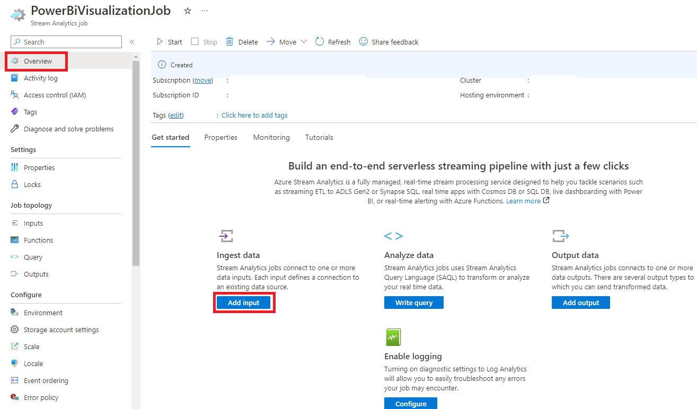

# Using Power BI to visualize Edge data sent to Azure IoT Hub

## Introduction

Azure IoT Runtime enables you to collect information and execute commands on Edge devices remotely. When installed on e-RT3 Plus, the features of both e-RT3 Plus and Azure Runtime Environment can be utilized to perform various operations.

This is the last part of a five-part series that demonstrates how to use Azure Runtime Environment with e-RT3 Plus. The first two parts describe how to use Azure IoT Runtime environment to create and deploy Azure IoT Edge Python modules that read and upload data to an IoT Hub. In the first part we read data from a sample temperature module, in the second part we read data from an Analog Input Edge device.

- [Deploying a sample Python module on an Edge Device installed with Azure IoT Edge Runtime](https://github.com/Yokogawa-Technologies-Solutions-India/e-RT3-docs/blob/master/Articles/AzureIoTRuntimeEnvironment/Deploying_sample_Python_module.md)
- [Create an Azure IoT Edge Python module to gather data from an Edge device and transmit it to the IoT Hub](https://github.com/Yokogawa-Technologies-Solutions-India/e-RT3-docs/blob/master/Articles/AzureIoTRuntimeEnvironment/CreatePythonDataCollection_AzureIoT.md)

The third part describes creating and deploying an Azure IoT Edge Python module that writes data to an Edge device.

- [Create an Azure IoT Edge Python module that writes data to an Edge device](https://github.com/Yokogawa-Technologies-Solutions-India/e-RT3-docs/blob/master/Articles/AzureIoTRuntimeEnvironment/PythonWriteModule_AzureIoTRuntime.md)

The fourth part describes visualizing the data received at the IoT Hub using a web application created by using Azure App Service.

- [Using Azure App Service to visualize Edge data sent to Azure IoT Hub](https://github.com/Yokogawa-Technologies-Solutions-India/e-RT3-docs/blob/master/Articles/AzureIoTRuntimeEnvironment/VisualizeData_WebApps.md)

In this article, we visualize the data received at the IoT Hub by using Power BI. To send the data to Power BI, an Azure Stream Analytics job is created which connects to the Power BI workspace. The data visualizations are then configured in the designer of Power BI.


The ultimate goal for this article series is to demonstrate how to:

1. Create a Python data collection module to gather data, process it and upload it to IoT Hub
2. Create a Python module for writing data to an Edge device
3. Visualize the collected data using Azure App Service and Power BI.

This article is based on the Microsoft tutorial [Visualize real-time sensor data from Azure IoT Hub using Power BI](https://learn.microsoft.com/en-us/azure/iot-hub/iot-hub-live-data-visualization-in-power-bi). For more information about installing and deploying Azure IoT Runtime environment, refer to [Deploying Azure Runtime Environment on e-RT3 Plus](https://github.com/Yokogawa-Technologies-Solutions-India/e-RT3-docs/blob/master/Articles/Local_blob_storage/Installing_Azure_Runtime_on_e-RT3.md).

## Hardware modules

The following table describes the hardware modules used in this article.

| Module | Description |
|---|---|
|e-RT3 Plus F3RP70-2L (CPU module, Ubuntu 18.04 32-bit)| e-RT3 Plus controls the complete module set. It accesses each module from the CPU module to read and write data.  The `armhf` architecture package runs on this device. |
| F3AD08-6R (Analog Input module)| The Analog Input module (AD module) converts the external analog data received to digital data. |
| F3DA04-6R (Analog Output module)| The Analog Output (DA module) module converts the digital data sent from the e-RT3 Plus to analog data. |
| F3BU05-0D (Base module)| This is the base for connecting each module. It takes care of the power supply and communication between the modules that are connected to it. |
| F3PU20-0S (Power module)| The Power module is connected on the Base module and is used for power supply.|

The module configuration and wiring is the same as described in the [previous article](https://github.com/Yokogawa-Technologies-Solutions-India/e-RT3-docs/blob/master/Articles/AzureIoTRuntimeEnvironment/PythonWriteModule_AzureIoTRuntime.md).

For more information on the hardware modules, refer to [this page](https://www.yokogawa.com/solutions/products-and-services/control/control-devices/real-time-os-based-machine-controllers/#Overview).

> **Note**: The IoT Edge module development and device operations are performed on Windows 10 using Google Chrome as the web browser.

## Prerequisites

Before trying to visualize the data in the IoT Hub using Power BI, you must complete the steps mentioned in the previous articles [Create an Azure IoT Edge Python module to gather data from an Edge device and transmit it to the IoT Hub](https://github.com/Yokogawa-Technologies-Solutions-India/e-RT3-docs/blob/master/Articles/AzureIoTRuntimeEnvironment/CreatePythonDataCollection_AzureIoT.md) and [Create an Azure IoT Edge Python module that writes data to an Edge device](https://github.com/Yokogawa-Technologies-Solutions-India/e-RT3-docs/blob/master/Articles/AzureIoTRuntimeEnvironment/PythonWriteModule_AzureIoTRuntime.md).

## Workflow

To visualize the data sent to the IoT Hub in Power BI, you must complete the following:

   1. [Install Power BI](#installing-power-bi-desktop)
   2. [Create IoT Hub consumer group](#creating-iot-hub-consumer-group)
   3. [Create Stream Analytics](#creating-stream-analytics)
   4. [Configure Stream Analytics settings](#configuring-stream-analytics-settings)
   5. [Configure and visualize data in Power BI](#configure-and-visualize-data-in-power-bi)


## Installing Power BI Desktop

Power BI is a data analytics and reporting tool from Microsoft that helps you to visualize data. You can use it as a desktop application with Power BI Desktop or as a web service with Power BI service. In this demonstration, we use Power BI Desktop which is signed into a personal account.

> **Note**: The steps described in this article are the same if you use Power BI Desktop with a corporate account.

Follow these steps to install Power BI Desktop on your computer:

1. Navigate to the [official website](https://powerbi.microsoft.com/en-us/desktop/) and click **Download free**.

    The *Open Microsoft Store* dialog box appears.
2. Click **Open Microsoft Store**.
3. In the Microsoft Store window that opens, click **Get** to download the installer.
4. Install Power BI and open it.
5. To sign in, in the upper-right corner, click **Sign-in** and follow the instructions displayed.
    

## Creating IoT Hub consumer group

To create a IoT Hub consumer group from Azure Portal, follow the steps mentioned in the [previous article](https://github.com/Yokogawa-Technologies-Solutions-India/e-RT3-docs/blob/master/Articles/AzureIoTRuntimeEnvironment/VisualizeData_WebApps.md#adding-a-consumer-group-to-the-iot-hub). For this demonstration, we have created a consumer group with the name `ert3-visualization-powerbi`.

> **Note**: Ensure that you save the name of the consumer group as you will need to use it later.

## Creating Stream Analytics

To send data from the IoT Hub to Power BI, we create a Steam Analytics job in Azure Portal.

Follow these steps to create a stream analytics job:

1. Navigate to [Azure Portal](https://portal.azure.com/).
2. In the upper left corner of the page, click **Create a resource**.
3. In the search box, type `Stream Analytics job` and select the same from the search results.

    
4. Click **Create**.
5. Configure the mandatory details as shown in the following table.

    | Parameter| Value |
    | --- | --- |
    | Project details - Subscription| Select any existing subscription |
    | Project details - Resource Group| Create a new Resource Group or select any existing Resource Group |
    | Instance details - Name| Specify any unique name |
    | Instance details - Region| Select any region as applicable |
    | Instance details - Hosting environment| Select **Cloud** |
    | Streaming unit details - Streaming unit| In this demonstration, as we are not using any special processing for the stream data, streaming unit 3 is sufficient. |

    

    > **Note**: Stream Analytics usage is billed based on the start time and the number of streaming units. For more information on pricing, click [here](https://azure.microsoft.com/en-us/pricing/details/stream-analytics/).

6. Click **Review + create**.
7. After verifying the configured information, click **Create**.

   A message is displayed indicating that the Stream Analytics job is deployed.

## Configuring Stream Analytics settings

Follow these steps to configure the settings for the Stream Analytics job:

1. Navigate to [Azure Portal](https://portal.azure.com/) and open the Stream Analytics job that you created.

    The overview page appears.

    
2. To add an input to the Stream Analytics job, perform these steps:

   1. Click **Add input** and select **IoT Hub** from the drop-down list.
        The *IoT Hub* pane appears.

        

   2. Configure the parameters as shown in the following table.

        | Parameter| Value |
        | --- | --- |
        | Input alias| Specify any name to use as an alias |
        | Subscription| Select the Azure subscription that you are using for the IoT Hub from which you want to visualize data |
        | IoT Hub| Select the IoT Hub from which you want to to visualize data|
        | Consumer group| Specify the consumer group created in [Creating IoT Hub consumer group](#creating-iot-hub-consumer-group) |

   3. Click **Save**.

        The IoT hub is added to the input list and a message is displayed indicating that the connection test is successful.

3. To add an output to the Stream Analytics job, perform these steps:
    1. From the overview page, click **Add output** and then select **Power BI** from the drop-down list.

        The *Power BI - New output* pane appears.

        

    2. Select **Authorize** and follow the instructions displayed to sign in to your Power BI account.

       

    3. After you sign in to Power BI, configure the parameters as shown in the following table.

        | Parameter| Value |
        | --- | --- |
        | Output alias| Specify any name to use as an alias |
        | Subscription| Select your target group workspace |
        | Dataset name| Specify a dataset name|
        | Table name| Specify a table name |

    4. Click **Save**.
        The Power BI settings are added to the ouput list and a message is displayed indicating that the connection test is successful.

4. To configure the query for the Stream Analytics job, perform these steps:
   1. On the left pane, under **Job topology**, select **Query**.

        

   2. In the editor that appears, type the query as follows:

        ```SQL
        SELECT
        messageID,
        deviceID,
        CAST([datetime] AS datetime) AS datetime,
        ch1, ch2, ch3, ch4, ch5, ch6, ch7, ch8
        INTO
        [<Set output alias>]
        FROM
        [<Set input alias>]
        ```

   3. Click **Save query**.

        A notification appears indicating that the settings are saved.

5. To start the Stream Analytics job, from the overview page, click **Start**.

    After the job is started successfully, the job status changes from `Stopped` to `Running`.

## Configure and visualize data in Power BI

Follow these steps to visualize the data in Power BI:

1. Open Power BI Desktop.
2. From the menu bar, select **Home > Get data >Power BI Datasets**.

    The *Data hub* page appears.

    

3. Select the dataset that you specified in step 3 of [Configuring Stream Analytics settings](#configuring-stream-analytics-settings).

    The data set is loaded and the designer appears. The **Filter**, **Visualizations**, and **Fields** panes appear on the right.

    

4. To design the visualization chart, perform these steps:

   1. To visualize the data in a particular channel, in the **Fields** pane, select the checkbox next to channel name.
   2. In the **Visualizations** pane, select the **Line graph** icon. You can resize the chart screen displayed in the centre as necessary.

        The sum of values is displayed, since the horizontal axis is not yet configured.

        

   3. On the **Fields** pane, select the **datetime** check box and drag it to the **X-axis** section in the **Visualizations** pane.  

        The date and time is displayed on the horizontal axis.

   4. In the **Filters pane**, expand **datetime**.
   5. From the **Filter type** drop-down list, select **Relative time**.
   6. From the **Show items when the value** drop-down list, select **is in the last**.
   7. In the value box, type `5`.
   8. From the drop-down list, select **minutes**

        The chart is updated to display data from the last five minutes.

        

5. To refresh the data displayed on the chart click **Update**.

    If the visualization is successful, the following chart is displayed.

    

6. To stop sending data, after the verification is complete, in Azure Portal, expand the Stream Analytics job summary and click **Stop**.

> **Note**: The Stream Analytics billing is calculated based on operation time and streaming units.

## Conclusion

The data that is sent to the IoT Hub is visualized in Power BI Desktop. This concludes the article series that demonstrates how to use Azure IoT Runtime to send data to IoT Hub from an Edge device, write data to an Edge device, and visualize the data in Power BI and Azure App Service.

## References

1. [Real-time OS controller e-RT3 Plus F3RP70-2L](https://www.yokogawa.com/solutions/products-and-services/control/control-devices/real-time-os-based-machine-controllers/#Overview)
2. [Azure Certified Device catalog](https://devicecatalog.azure.com/)
3. [Visualize real-time sensor data from your Azure IoT hub in a web application](https://learn.microsoft.com/en-us/azure/iot-hub/iot-hub-live-data-visualization-in-web-apps)
4. [Tutorial: Visualize real-time sensor data from Azure IoT Hub using Power BI](https://learn.microsoft.com/en-us/azure/iot-hub/iot-hub-live-data-visualization-in-power-bi)
