# Achieving zero-loss data transmission from e-RT3 Plus

## Introduction

Yokogawa's e-RT3 Plus is equipped to support zero-loss data transmission with the help of Azure's Blob storage solution. Zero-loss data transmission means complete transfer of data even in places with limited network connectivity. This can be achieved by enabling e-RT3 Plus to store data locally until it can be uploaded to the Cloud as and when the network connectivity is restored.

This article is the last part of a three-part series on using Azure Runtime Environment and e-RT3 Plus together to create bespoke solutions.

In this article, we will demonstrate how to use e-RT3 Plus for zero-loss data transmission.

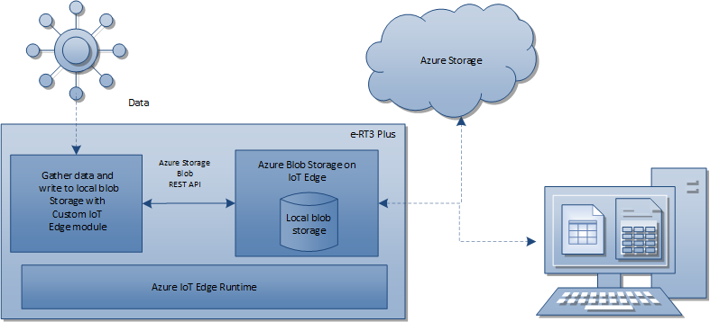

In the [previous article](https://github.com/Yokogawa-Technologies-Solutions-India/e-RT3-docs/blob/master/Articles/Local_blob_storage/Implementing_local_Blob_storage_on_e-RT3_Plus.md), we configured a local Blob storage in the e-RT3 Plus device by using a standard IoT module from Azure and verified whether the data written to the local storage was uploaded to the Cloud by using a Python script. In this article, we will further demonstrate, how we can use a custom Python IoT module to gather data from an external source and write it into the local Blob. Here, the Python IoT module gathers data from the AD module of the e-RT3 Plus device. However, you can modify it to collect data from an external source of your choice.

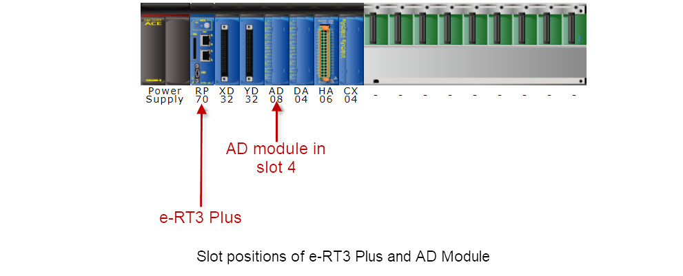

Adding the Python module completes the IoT setup, enabling the e-RT3 Plus to gather data in real time and upload it to the Cloud. Additionally, it ensures zero-loss data transmission in the event of poor network conditions by using the local Blob storage.

## Workflow

The following figure shows the workflow for creating a custom Python IoT module on e-RT3 Plus and verifying the zero-loss data transmission setup.

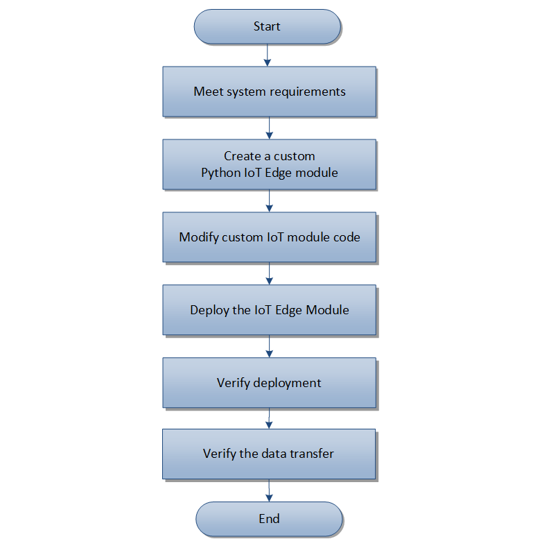

## Prerequisites

The following prerequisites must be met before creating a custom Python IoT module for zero-loss data transmission.

1. Azure IoT Edge Runtime environment is deployed on the e-RT3 Plus device.

   > **Note**: For more information on deploying Azure IoT Edge Runtime on e-RT3 Plus, refer to [Deploying Azure Runtime environment on e-RT3 Plus](https://github.com/Yokogawa-Technologies-Solutions-India/e-RT3-docs/blob/master/Articles/Local_blob_storage/Installing_Azure_Runtime_on_e-RT3.md).

2. Azure Blob Storage on IoT Edge module is deployed on the e-RT3 Plus device.
   > **Note**: For more information on deploying Azure Blob Storage on IoT Edge module on e-RT3 Plus, refer to [Implementing local Blob storage on e-RT3 Plus](https://github.com/Yokogawa-Technologies-Solutions-India/e-RT3-docs/blob/master/Articles/Local_blob_storage/Implementing_local_Blob_storage_on_e-RT3_Plus.md).

---

## Getting started

Once the system requirements are met, you can proceed to create the custom Python IoT module and then verify whether the data is received at the Cloud storage. Additionally, poor network conditions are simulated to verify that data is stored in the local Blob storage until network conditions are restored.

The following tasks must be performed in the same order to achieve zero-loss transmission by using e-RT3 Plus:

   1. [Creating a custom Python IoT Edge module](#creating-a-custom-python-iot-edge-module)
   2. [Updating the code in the custom IoT Edge module](#updating-the-code-in-the-custom-iot-edge-module)
   3. [Deploying the uploaded module](#deploying-the-iot-edge-module)
   4. [Verifying the IoT Edge module deployment](#verifying-the-iot-edge-module-deployment)
   5. [Verifying the data transfer between e-RT3 Plus and Azure Storage](#verifying-the-data-transfer-between-e-rt3-plus-and-azure-storage)

### Creating a custom Python IoT Edge module

>**Note**: Before creating the custom IoT module, you must create a container registry. To learn how to create a container registry, refer to [Create a container registry](https://docs.microsoft.com/en-us/azure/container-registry/container-registry-get-started-portal?view=iotedge-2018-06#create-a-container-registry).

Follow these steps to create a custom Python IoT Edge module:

1. Open Visual Studio Code.

2. Create a custom IoT module.

   To learn how to create a custom Python IoT module and complete the basic setup of creating a new project, adding registry credentials, and selecting the target architecture, refer to [Create a module project](https://docs.microsoft.com/en-us/azure/iot-edge/tutorial-python-module?view=iotedge-2018-06#create-a-module-project).

   When the "Provide Docker Image Repository for the Module" message appears in the Command Palette, specify your image repository in the following format:

   `<YOUR_CONTAINER_REGISTRY_NAME>.azurecr.io/<YOUR_PYTHON_MODULE_NAME>`

   Here:

   `YOUR_CONTAINER_REGISTRY_NAME` refers to the name of the container registry you just created

   `YOUR_PYTHON_MODULE_NAME` refers to the name of your Python module

   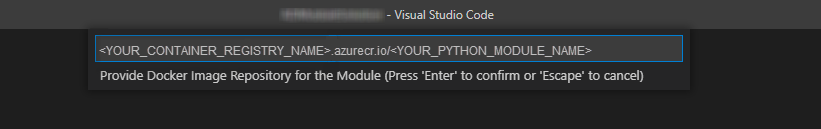

   To obtain the credentials for your container registry, navigate to your container registry, and then go to **Settings > Access keys**.
   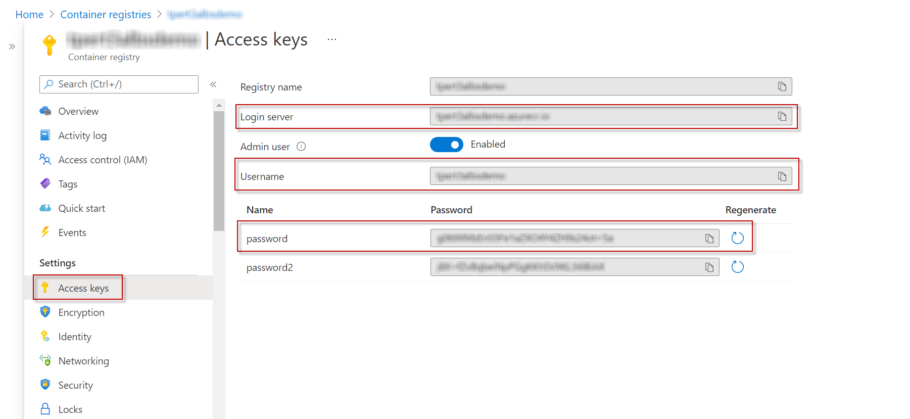

The custom IoT module is created and the associated files are displayed on the left pane.

### Updating the code in the custom IoT Edge module

The custom IoT module must be configured to gather data from the AD module and then write it into the local Blob storage.

Follow these steps to configure the custom IoT module:

1. On the left pane, locate the file `Dockerfile.arm32v7`.
2. Replace the code in `Dockerfile.arm32v7` with the following code:

   ```bash
   FROM arm32v7/python:3.7-slim-buster
   
   RUN mkdir /ad_blob_logs
   VOLUME /ad_blob_logs
   
   WORKDIR /app
   
   ENV CRYPTOGRAPHY_DONT_BUILD_RUST=1
   
   RUN apt-get update \
   && apt-get install -y --no-install-recommends gcc libc-dev libffi-dev build-essential libssl-dev
   
   # The --no-install-recommends enables you to be more explicit about what gets installed
   COPY requirements.txt ./
   RUN pip install -r requirements.txt
   
   COPY . .
   
   CMD [ "python3", "-u", "./main.py" ]
   ```

   >**Note**: Ensure that the indentation of the code is preserved while copying because even a minor change can cause errors in building the code.

3. On the left pane, locate the file `main.py`.
4. Replace the code in `main.py` with the following code:

   ```python
   import os
   import asyncio
   from azure.iot.device.aio import IoTHubModuleClient
   import subprocess

   import os
   import ctypes
   import signal
   import datetime
   import json
   from azure.iot.device import Message
   import logging
   from logging.handlers import RotatingFileHandler

   from azure.storage.blob import BlobClient, ContainerClient

   """
   Helper class to communacate with AD module
   """

   class ADD2C():
      __DEVICE_ID = os.environ['IOTEDGE_DEVICEID']
      __OUTPUT_NAME = os.environ['IOTEDGE_MODULEID'] + 'ToIoTHub'

      __M3LIB_PATH = '/usr/local/lib/libm3.so.1'
      __FAM3AD_CHNUM = {'AD04': 4, 'AD08': 8}

      __ERT3_AD_D2C_KEY = 'ert3_ad_d2c'
      __INTERVALSEC_KEY = 'interval_sec'
      __STATUS_KEY = 'status'

      __STORAGE_CONNECTION_STRING = os.environ['STORAGE_CONNECTION_STRING']
      __STORAGE_CONTAINER_NAME = "localblobstorage"
      __STORAGE_LOCAL_PATH = "./UploadBlob"

      """ constructor for AD D2C class. """

      def __init__(self, module_client, unit, slot, interval_seconds = None):
         self.__unit = unit
         self.__slot = slot
         self.__message_no = 1
         self.__libc = ctypes.cdll.LoadLibrary(self.__M3LIB_PATH)
         self.__libc.getM3IoName.restype = ctypes.c_char_p
         self.__chnum = self.__get_m3ad_ch_num()
         self.__interval_seconds = interval_seconds if interval_seconds != None else 2
         signal.signal(signal.SIGALRM, self.__signal_handler)

         # Logging configuration to write telemetry data to a file
         handlers = [
               RotatingFileHandler(
                  filename='/ad_blob_logs/ad_telemetry_blob.log', maxBytes=512000, backupCount=4)
         ]
         logging.basicConfig(handlers=handlers,
                              level=logging.CRITICAL, format='%(message)s')

         self.logger = logging.getLogger('ad_telemetry')

         # Create container

         os.makedirs(self.__STORAGE_LOCAL_PATH, exist_ok=True)

         container_client = ContainerClient.from_connection_string(
               conn_str=self.__STORAGE_CONNECTION_STRING, container_name=self.__STORAGE_CONTAINER_NAME)
         try:
               container_properties = container_client.get_container_properties()
               # Container exists. You can now use it.
               print(container_properties)

         except Exception as e:
               container_client.create_container()
               # Container does not exist. You can now create it.
               print(e)

      """ Determine AD08 or AD04. """

      def __get_m3ad_ch_num(self):
         namebytes = self.__libc.getM3IoName(
               ctypes.c_int(self.__unit), ctypes.c_int(self.__slot))
         num = 0
         if namebytes is not None:
               num = self.__FAM3AD_CHNUM.get(namebytes.decode(), 0)
         return num

      """ Collect data from all channels of the AD module. """

      def __read_m3ad_ch_data(self):
         short_arr = ctypes.c_short * self.__chnum
         ch_data = short_arr()
         self.__libc.readM3IoRegister(
               ctypes.c_int(self.__unit),
               ctypes.c_int(self.__slot),
               ctypes.c_int(1),
               ctypes.c_int(self.__chnum),
               ch_data)
         return ch_data

      """ Create message and send it to the edgeHub module. """

      def __signal_handler(self, signalnum, frame):
         body_dict = dict(
               messageID=self.__message_no,
               deviceID=self.__DEVICE_ID,
               datetime=datetime.datetime.utcnow().isoformat() + 'Z'
         )

         ch_data = self.__read_m3ad_ch_data()
         for index, ch_value in enumerate(ch_data):
               body_dict['ch' + str(index + 1)] = ch_value

         body_str = json.dumps(body_dict)
         loop = asyncio.get_event_loop()

         async def send(body_str, output_name):
               msg = Message(body_str)
               self.logger.critical(body_str)
               try:
                  local_filename = "MessageContents_" + str(datetime.datetime.now().strftime("%Y-%m-%dT%f")) + ".txt"
                  upload_file_path = os.path.join(self.__STORAGE_LOCAL_PATH, local_filename)
                  # Open the file and write the input message to it
                  input_message = body_str
                  file = open(upload_file_path, 'w')
                  file.write(input_message)
                  file.close()
                  blob = BlobClient.from_connection_string( conn_str=self.__STORAGE_CONNECTION_STRING, container_name=self.__STORAGE_CONTAINER_NAME, blob_name=local_filename)
                  with open(upload_file_path, "rb") as data:
                     blob.upload_blob(data)
                     print('Upload Success')
               except Exception as e:
                  print('Upload Failed')
                  print(e)

               print(msg)
         asyncio.run_coroutine_threadsafe(
               send(body_str, output_name=self.__OUTPUT_NAME), loop)

         self.__message_no = self.__message_no + 1

      def set_condition(self, desired):
         if self.__ERT3_AD_D2C_KEY not in desired:
               return {self.__STATUS_KEY: False}

         interval_sec = desired[self.__ERT3_AD_D2C_KEY].get(
               self.__INTERVALSEC_KEY, self.__interval_seconds)
         reported = dict()
         reported[self.__ERT3_AD_D2C_KEY] = desired[self.__ERT3_AD_D2C_KEY]
         if interval_sec < 0.0:
               reported[self.__ERT3_AD_D2C_KEY][self.__STATUS_KEY] = False
         else:
               signal.setitimer(signal.ITIMER_REAL, interval_sec, interval_sec)
               reported[self.__ERT3_AD_D2C_KEY][self.__STATUS_KEY] = True

         return reported


   LDCONFIGEXEC = 'ldconfig'
   DESIRED_KEY = 'desired'

   async def main():
      try:
         print("Start")

         # The client object is used to interact with your Azure IoT hub.
         module_client = IoTHubModuleClient.create_from_edge_environment()

         ad_d2c = ADD2C(module_client, unit=0, slot=4, interval_seconds=2)

         # connect the client.
         await module_client.connect()

         twin = await module_client.get_twin()

         reported = ad_d2c.set_condition(twin.get(DESIRED_KEY, {}))
         await module_client.patch_twin_reported_properties(reported)

         while True:
               reported = ad_d2c.set_condition(await module_client.receive_twin_desired_properties_patch())
               await module_client.patch_twin_reported_properties(reported)
         # Finally, disconnect
         await module_client.disconnect()

      except Exception as e:
         print("Unexpected error %s " % e)
         raise

   if __name__ == "__main__":
      subprocess.run([LDCONFIGEXEC])
      loop = asyncio.get_event_loop()
      loop.run_until_complete(main())
      loop.close()
   ```

   >**Note**: The slot position in the `main()` function is specified according to the setup created for this article. Confirm the slot position of your AD module and specify the value accordingly. The slot position can be determined from the Web Maintenance Tool.

5. In the `requirements.txt` file, add the following line.

   ```bash
   azure-storage-blob~=12.8.0
   ```

6. To configure the target platform, press **F1** on your keyboard to open the Command Palette.

7. In the **Command** box, type *Azure IoT Edge: Set Default Target Platform for Edge Solution*, and select `arm32v7` from the search results.

   Alternatively, you can select the shortcut icon on the bottom ribbon and set the Target Platform as `arm32v7`. By default, the target platform is set as `amd64`.

   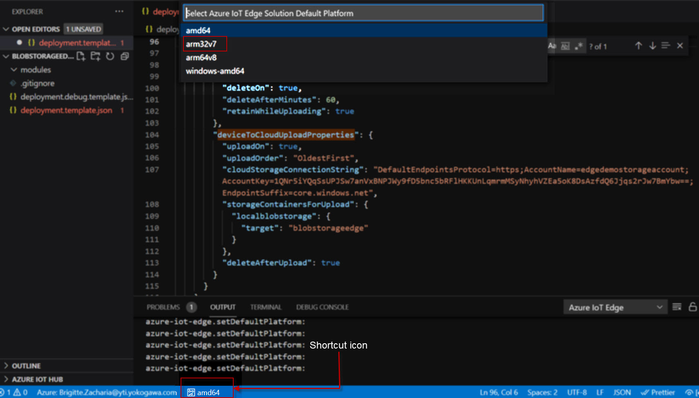

8. On the left pane, right-click the file `deployment.template.json`, and select **Build and Push IoT Edge Solution**.

   The  IoT Edge solution is built and pushed to the Azure portal.

   - If this is the first time you are building the IoT module, you must login to Azure CLI. Run the following commands to login to Azure CLI.

      ```bash
      az login
      az acr login --name <YOUR_CONTAINER_REGISTRY_NAME>
      ```

   >**Note**: If you are using a proxy, refer to the steps described in [Appendix](#proxy-settings-for-azure-cli).

### Deploying the IoT Edge module

Follow these steps to configure and deploy the IoT Edge module on e-RT3 Plus:

1. Log on to [Azure Portal](https://portal.azure.com/#home).
2. In the **Azure services** section, click **IoT Hub**.

   The *IoT Hub* page appears, displaying the list of created IoT hubs.

3. Select the IoT hub that you have just created.

   The *IoT Hub Overview* page appears, displaying the details of the selected IoT hub.
4. On the left pane, in the **Automatic Device Management** section, select **IoT Edge**.

   The *IoT Edge devices* page appears, displaying the list IoT Edge devices.

5. Click the **Device ID** of the e-RT3 Plus Edge device.
   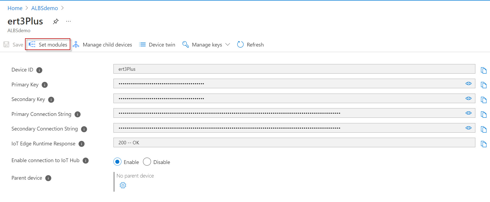

6. On the menu bar, click **Set modules**.

   The *Set modules on device: ert3Plus* page appears, displaying the details of the Modules tab.

   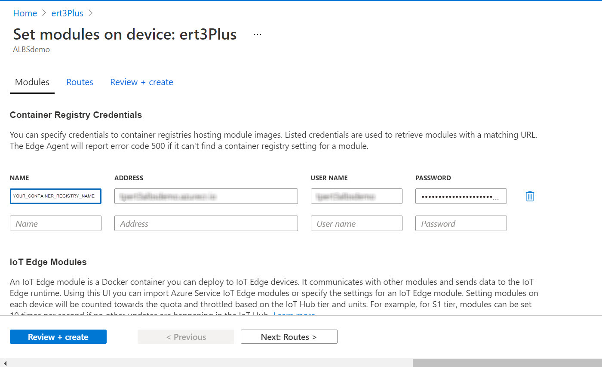

7. In the **Container Registry Credentials** section, specify the following details:

   a. In the **NAME** box, specify the name of the container registry that was created while [Creating a custom Python IoT Edge module](#creating-a-custom-python-iot-edge-module) .

   b. In the **ADDRESS** box, specify the login server URL of the container registry.

   c. In the **USER NAME** and **PASSWORD** boxes, specify the user credentials to access the container registry.
      >**Note**: The container registry details to be specified here can be found on the *Access keys*  page of your container registry. Navigate to your container registry, and then go to **Settings > Access keys**.

8. In the **IoT Edge Modules** section, click **Add > IoT Edge Module**.

   The *Add IoT Edge Module* page appears.
   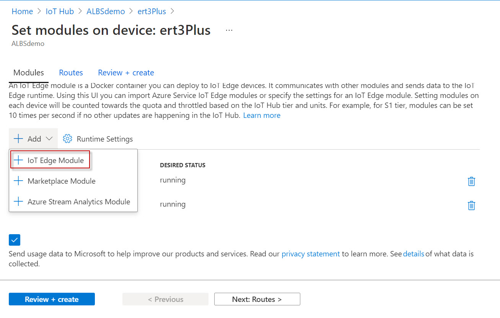

9. On the Add IoT Edge Module page, perform these steps:

   1. Click the **Module Settings** tab and configure the following details:

      a. In the **Image URI** box, specify the URI of the module.

      b. From the Restart Policy drop-down list, select **always**.

      c. From the Desired status drop-down list, select **running**.

      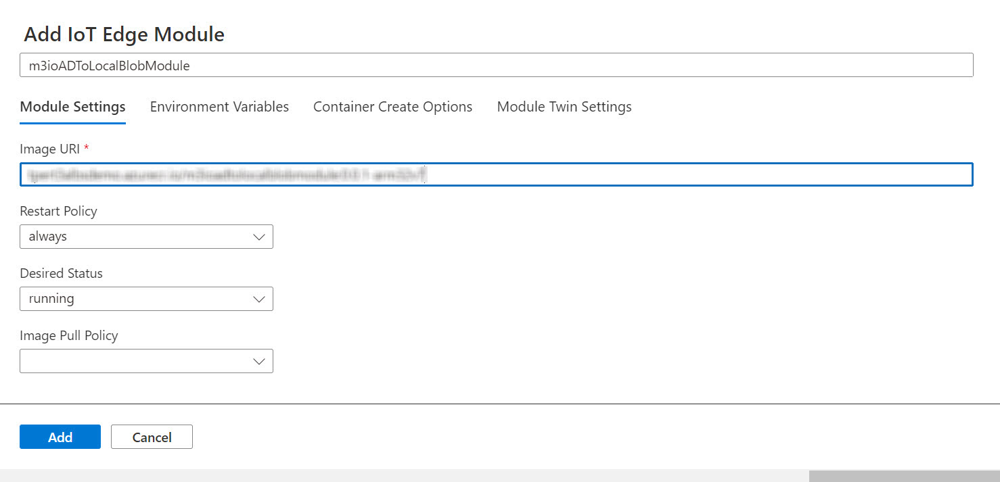

      >**Note**: The URI of the module can be found in the repository information of `<YOUR_PYTHON_MODULE_NAME>`. Navigate to **Container registries > {YOUR_CONTAINER_REGISTRY_NAME} > Repositories > {YOUR_PYTHON_MODULE_NAME} > {TARGET_PLATFORM_DEPLOYMENT}**. In the **Docker pull command** box, the docker pull command along with the URI is displayed.

   2. Click the **Environment Variables** tab and configure the following details:

      a. In the **NAME** box, type `STORAGE_CONNECTION_STRING`.

      b. In the **VALUE** box, specify the `<YOUR_LOCAL_BLOB_CONNECTION_STRING>` that you configured in the [previous article](https://github.com/Yokogawa-Technologies-Solutions-India/e-RT3-docs/blob/master/Articles/Local_blob_storage/Implementing_local_Blob_storage_on_e-RT3_Plus.md#sending-sample-data-to-local-blob-storage-by-using-python-script).

      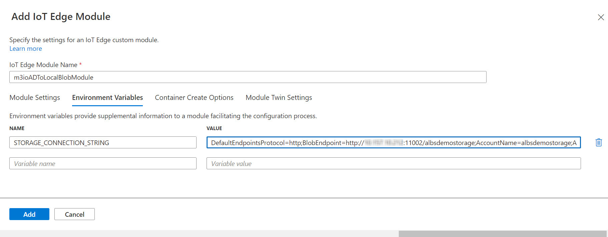

   3. Click the **Container Create Options** tab and specify the following JSON code in the editor:

      ```json
      {
         "HostConfig": {
            "Binds": [
               "/home/ert3/ad_blob_logs:/ad_blob_logs",
               "/usr/local/lib/libm3.so.1.0.1:/usr/local/lib/libm3.so.1"
            ],
            "Devices": [
               {
                  "PathOnHost": "/dev/m3io",
                  "PathInContainer": "/dev/m3io",
                  "CgroupPermissions": "rwm"
               },
               {
                  "PathOnHost": "/dev/m3sysctl",
                  "PathInContainer": "/dev/m3sysctl",
                  "CgroupPermissions": "rwm"
               },
               {
                  "PathOnHost": "/dev/m3cpu",
                  "PathInContainer": "/dev/m3cpu",
                  "CgroupPermissions": "rwm"
               },
               {
                  "PathOnHost": "/dev/m3mcom",
                  "PathInContainer": "/dev/m3mcom",
                  "CgroupPermissions": "rwm"
               },
               {
                  "PathOnHost": "/dev/m3dev",
                  "PathInContainer": "/dev/m3dev",
                  "CgroupPermissions": "rwm"
               },
               {
                  "PathOnHost": "/dev/m3ras",
                  "PathInContainer": "/dev/m3ras",
                  "CgroupPermissions": "rwm"
               },
               {
                  "PathOnHost": "/dev/m3wdt",
                  "PathInContainer": "/dev/m3wdt",
                  "CgroupPermissions": "rwm"
               }
            ]
         }
      }
      ```

   4. Click the **Module Twin Settings** tab and configure the following:

      In the editor that appears, specify the following JSON code:

      ```json
      {
         "ert3_ad_d2c": {
            "interval_sec": 10
         }
      }
      ```

   5. In the lower-left corner, click **Add**.

10. Click the **Routes** tab, and configure the following details:

    a. In the **NAME** box, specify a route name for your python module.

    b. In the **VALUE** box, type the following code:

      ```bash
      FROM /messages/modules/<YOUR_PYTHON_MODULE_NAME>/outputs/* INTO $upstream
      ```

11. Click **Review + create**.

    The specified details are validated.
12. On the page that appears, click **Create**.

The module settings are configured and the IoT module is deployed to the e-RT3 Plus.

### Verifying the IoT Edge module deployment

To verify whether  `<YOUR_PYTHON_MODULE_NAME>` is deployed and running, refer to [Verify deployment of IoT Edge module](https://github.com/Yokogawa-Technologies-Solutions-India/e-RT3-docs/blob/master/Articles/Local_blob_storage/Implementing_local_Blob_storage_on_e-RT3_Plus.md#verifying-the-deployment-of-iot-edge-module).

>**Note:** The status of `<YOUR_PYTHON_MODULE_NAME>` must be displayed as **running**.

### Verifying the data transfer between e-RT3 Plus and Azure Storage

Once the Python module is successfully deployed, the setup is complete. Now, we can test the real-time performance of the local Blob storage.

To simulate poor network conditions, the `uploadOn` parameter of the Module Identity Twin settings is set to `false`. To simulate restoration of network conditions, it is set to `true`.

To verify the data transfer in both these scenarios, perform the following tasks:

1. [Toggle the upload condition in Module Identity twin](#toggle-the-upload-condition-in-module-identity-twin)
2. [Verifying data storage in e-RT3 Plus](#verifying-data-storage-in-e-rt3-plus)
3. [Verifying the data availability in Cloud storage](#verifying-the-data-availability-in-cloud-storage)

#### Toggle the upload condition in Module Identity twin

Follow these steps to toggle the upload condition in the Module Identity twin:

1. Log on to [Azure Portal](https://portal.azure.com/#home).
2. In the **Azure services** section, click **IoT Hub**.

   The *IoT Hub* page appears, displaying the list of created IoT hubs.

3. Select the IoT hub that you created in [Create an IoT Hub on Azure Portal](https://github.com/Yokogawa-Technologies-Solutions-India/e-RT3-docs/blob/master/Articles/Local_blob_storage/Installing_Azure_Runtime_on_e-RT3.md#create-an-iot-hub-on-azure-portal).

   The *IoT Hub Overview* page appears, displaying the details of the selected IoT hub.
4. On the left pane, in the **Automatic Device Management** section, select **IoT Edge**.

   The *IoT Edge devices* page appears, displaying the list IoT Edge devices.

5. Select the device ID of the e-RT3 Plus device.

   The device page appears.
6. From the list of modules that are displayed at the bottom of the page, select  `BlobStorageEdge` .

   The *IoT Edge Module details* page appears.
7. From the menu bar, select **Module Identity Twin**.

      The *Module Identity Twin* page appears, displaying the JSON code in an editor.
   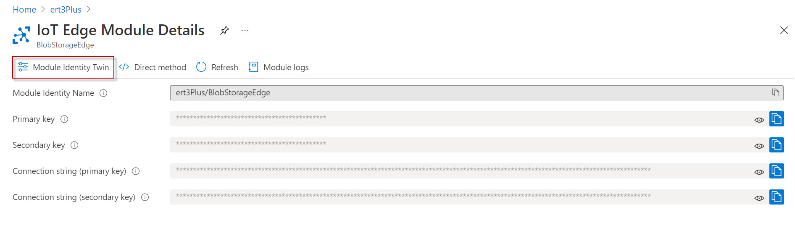

8. In the editor, locate the `uploadOn` parameter under `deviceToCloudUploadProperties`.
9. Depending on the network condition that you want to simulate, perform one of these steps:

   - To simulate poor network connection, and stop the upload of data, set the `uploadOn` parameter to `false`.
   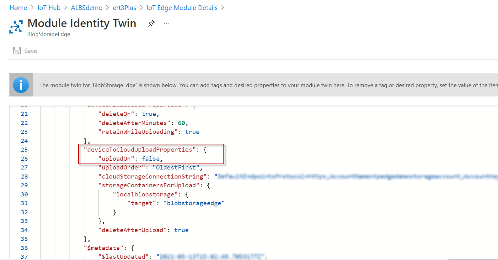
   - To simulate strong network connection, and start the upload of data, set the `uploadOn` parameter to `true`.
10. In the upper-left corner of the page, click **Save**.

#### Verifying data storage in e-RT3 Plus

To verify if the data is available in the local Blob storage of e-RT3 Plus, perform these steps:

1. Open an SSH terminal to the e-RT3 Plus device.
2. Run the following command to enable `sudo` permissions.

   ```bash
   sudo bash
   ```

3. Run the following commands to navigate to the local Blob storage folder and view its contents.

   ```bash
   cd /srv/containerdata/BlockBlob/localblobstorage
   ls -a
   ```

4. Verify the contents of the storage depending on the network simulation configured:

   - If the `uploadOn` parameter is set to `false`, a new text file appears in the storage every ten seconds.
   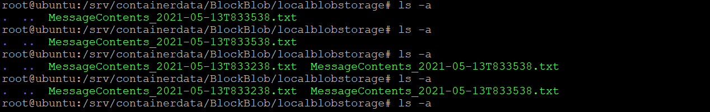

   - If the `uploadOn` parameter is set to `true`, the storage contents are empty.

#### Verifying the data availability in Cloud storage

1. Log on to [Azure Portal](https://portal.azure.com/#home).
2. In the **Azure Services** section, click **Storage Accounts**.

   The *Storage accounts* page appears, displaying the list of created storage accounts.
3. Select the Storage Account associated with the `BlobStorageEdge` module.
4. On the left pane, in the  **Data storage** section, select **Containers**.

   The list of containers appears.
   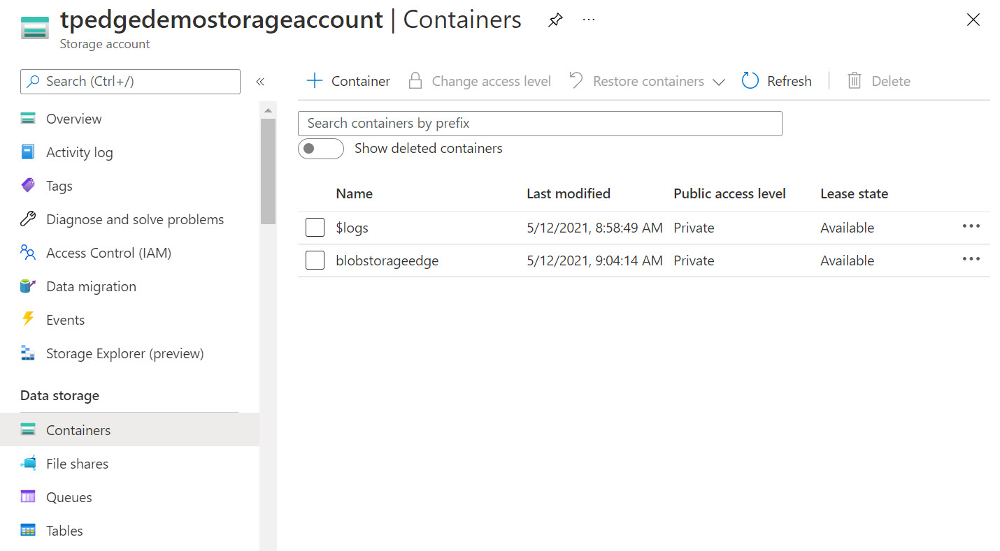
5. Select the check box next to the container in which the messages from the e-RT3 Plus device are saved.

   The *Container* page appears, displaying the list of messages received from the e-RT3 Plus device.
   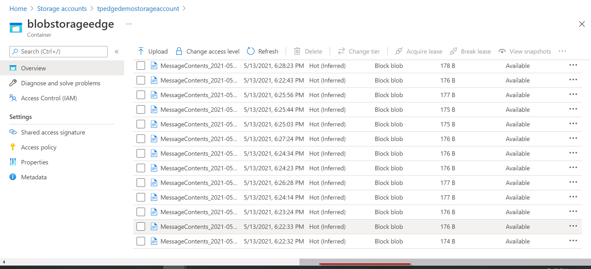

6. Click **Refresh** to view the latest messages.

7. Verify the data received based on the value of the `uploadOn` parameter.

   - If the `uploadOn` parameter is set to `false`, new messages do not appear in the storage.

   - If the `uploadOn` parameter is set to `true`, a new text file appears in the storage every ten seconds.

>**Note**: The messages in the container are displayed with the most recent messages being displayed first. Messages can also be located by specifying the file name in the **Search** box.

## Conclusion

In this article, we demonstrated how to achieve zero-loss data transmission on e-RT3 Plus, thus showcasing its capability to offer extremely reliable data transfer services. Since the basis for any analysis is a reliable source of data, this implementation on e-RT3 Plus provides a significant advantage to deliver high-quality analytics.

---

## Appendix

### Proxy settings for Azure CLI

Follow these steps to configure the proxy settings for Azure CLI in Windows:

1. Open the Command Prompt window.
2. Run the following command to set the environment variable `REQUESTS_CA_BUNDLE` to the location of the certificate authority bundle certificate file `cacert.pem`.

   ```bash
   set REQUESTS_CA_BUNDLE="C:\Program Files (x86)\Microsoft SDKs\Azure\CLI2\Lib\site-packages\certifi\cacert.pem"
   ```

3. Run the following commands to set the proxy URL for Azure CLI.

   ```bash
   set HTTP_PROXY=USERNAME:PASSWORD@YOUR_PROXY_SERVER:PORT
   set HTTPS_PROXY=USERNAME:PASSWORD@YOUR_PROXY_SERVER:PORT
   set NO_PROXY=localhost,127.0.0.1,*.my.lan.domain
   az login
   az acr login --name <YOUR_CONTAINER_REGISTRY_NAME>
   ```

   Here:

   `USERNAME` and `PASSWORD` refers to the credentials required to authenticate access to the server computer

   `YOUR_PROXY_SERVER` refers to the IP address of the server PC

   `PORT` refers to the port number of the server computer

   `YOUR_CONTAINER_REGISTRY_NAME` refers to the name of your container registry.

   >**Note:**
   >
   > - If the error `Certificate verification failed...` appears, run the following command to set the `AZURE_CLI_DISABLE_CONNECTION_VERIFICATION` variable.
   >
   >   ```bash
   >   set AZURE_CLI_DISABLE_CONNECTION_VERIFICATION=1
   >   ```
   >
   > - If you want to remove the proxy, run the following commands.
   >
   >   ```bash
   >   set HTTP_PROXY=
   >   set HTTPS_PROXY=
   >   set NO_PROXY=
   >   set REQUESTS_CA_BUNDLE=
   >   ```

For more information about proxy settings for Azure CLI, refer to the [official documentation](https://docs.microsoft.com/en-us/cli/azure/use-cli-effectively#work-behind-a-proxy).

---

## References

1. [Store data at the edge with Azure Blob Storage on IoT Edge](https://docs.microsoft.com/en-us/azure/iot-edge/how-to-store-data-blob?view=iotedge-2020-11)
2. [Deploy the Azure Blob Storage on IoT Edge module to your device](https://docs.microsoft.com/en-us/azure/iot-edge/how-to-deploy-blob?view=iotedge-2020-11)
3. [Image](https://techcommunity.microsoft.com/t5/internet-of-things/azure-blob-storage-on-iot-edge-is-now-generally-available/ba-p/786161)
4. [Create a Container on Azure Portal](https://docs.microsoft.com/en-us/azure/storage/common/storage-account-create?tabs=azure-portal)
5. [Configure Azure Storage connection strings](https://docs.microsoft.com/en-us/azure/storage/common/storage-configure-connection-string?view=iotedge-2020-11#create-a-connection-string-for-an-explicit-storage-endpoint)
6. [Develop and deploy a Python IoT Edge module using Linux containers](https://docs.microsoft.com/en-us/azure/iot-edge/tutorial-python-module?view=iotedge-2018-06)
7. [Deploy from Visual Studio Code](https://docs.microsoft.com/en-us/azure/iot-edge/how-to-deploy-blob?view=iotedge-2020-11#deploy-from-visual-studio-code)

---
