# Implementing local Blob storage on e-RT3 Plus

## Introduction

e-RT3 Plus is a high-performance IoT Edge device that delivers advanced computing power and services in an industrial environment.

Data loss due to transient network conditions is one of the major concerns when it comes to Edge devices. However, in case of the e-RT3 Plus device, we have a solution to overcome this setback. By using Azure Local Blob storage, we can store the data in the device locally to avoid data loss due to network connectivity issues. When the network conditions are restored, the data is automatically uploaded to the Cloud.

This article is part two of a three-part series on using Azure Runtime Environment and e-RT3 Plus together to create bespoke solutions. In this article, we will demonstrate how to deploy the Azure Local Blob IoT module on e-RT3 Plus. The IoT module is readily available on Azure Marketplace. When it is deployed, a local storage space is created in the e-RT3 Plus device to store data temporarily. Any data that is written to this storage space is automatically uploaded to the Cloud.

The following figure shows the positioning of the local Blob storage.

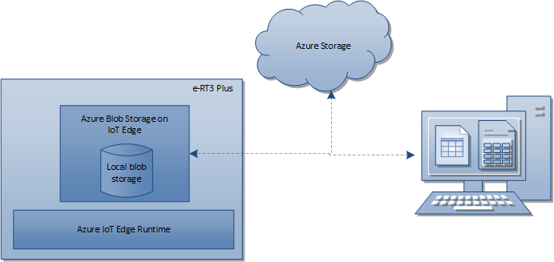

The Azure Blob storage on IoT Edge module is imported from Azure Marketplace and deployed on the e-RT3 Plus device. The Azure IoT Edge Runtime environment enables the use of the IoT module. A storage account is created on Azure portal and a container is set up inside this storage account. The data transmitted by e-RT3 Plus is stored in this container. Finally, a Python script is used to verify if the data written to Blob storage is uploaded to the storage container.

## Workflow

The following figure shows the workflow for deploying the Azure local Blob IoT module to e-RT3 Plus and verifying the deployment.

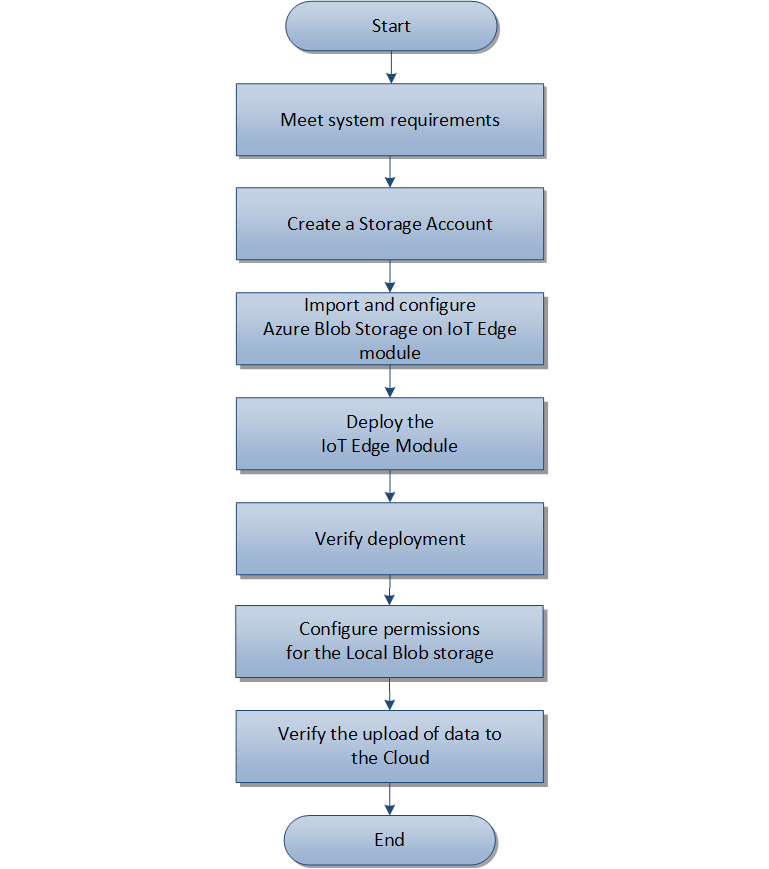

## Prerequisites

The following prerequisites must be met, before deploying Azure local Blob IoT module on e-RT3 Plus.

1. Azure IoT Edge Runtime environment is deployed on the e-RT3 Plus device.
   > **Note**: For more information on deploying Azure IoT Edge Runtime on e-RT3 Plus, refer to [Deploying Azure Runtime environment on e-RT3 Plus](https://github.com/Yokogawa-Technologies-Solutions-India/e-RT3-docs/blob/master/Articles/Local_blob_storage/Installing_Azure_Runtime_on_e-RT3.md).
2. [Visual Studio Code](https://code.visualstudio.com/download) is installed.
3. [Azure IoT Tools](https://marketplace.visualstudio.com/items?itemName=vsciot-vscode.azure-iot-tools) is installed and configured for Visual Studio Code.
4. [Azure CLI](https://docs.microsoft.com/en-us/cli/azure/install-azure-cli-windows?tabs=azure-cli) for Windows is installed.
5. [Docker Desktop](https://www.docker.com/products/docker-desktop) is installed and running to create a custom IoT Edge module in Windows.

---

## Getting started

The following steps describe how to deploy Azure Local Blob IoT module on e-RT3 Plus and verify the data transfer.

 1. [Creating a storage account](#creating-a-storage-account)
 2. [Importing and configuring Azure Blob storage on IoT Edge module](#importing-and-configuring-azure-blob-storage-on-iot-edge-module)
 3. [Deploying the IoT Edge module for Azure Blob storage](#deploying-the-iot-edge-module-for-azure-blob-storage)
 4. [Verifying the deployment of IoT Edge module](#verifying-the-deployment-of-iot-edge-module)
 5. [Configuring permissions for the local Blob storage repository](#configuring-permissions-for-the-local-blob-storage-repository)
 6. [Verifying the data transfer](#verifying-transmission-of-local-blob-storage-data-to-the-cloud)

### Creating a storage account

Setting up a storage account on Azure is required to access the storage space. In this section, we will set up an Azure storage account and create a container inside the storage space. In this container, the data received from e-RT3 Plus is stored.

Follow these steps to set up a storage account and container on Azure:

1. Log on to [Azure Portal](https://portal.azure.com/#home).
2. Create a storage account on Azure.

   To learn how to create a storage account on Azure, refer to the [official documentation](https://docs.microsoft.com/en-us/azure/storage/common/storage-account-create?tabs=azure-portal).

   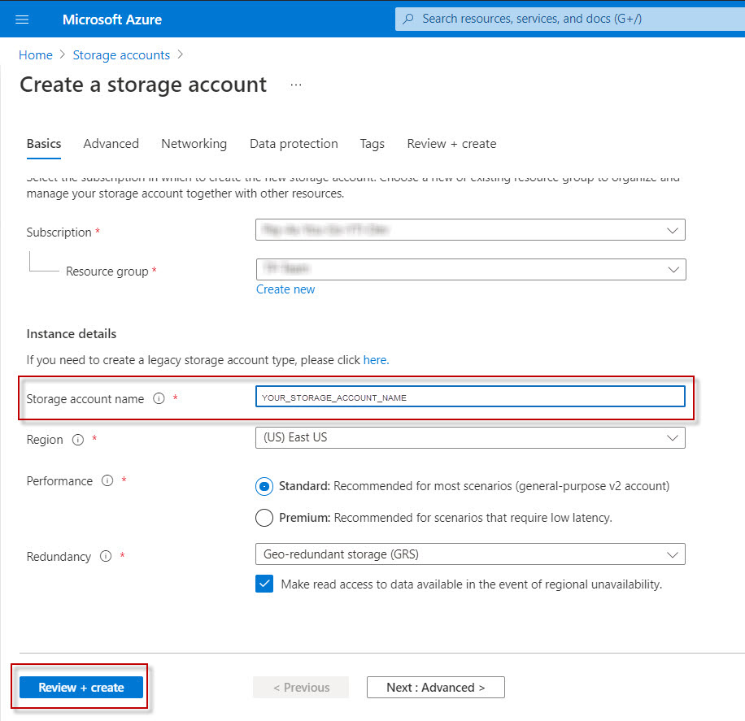

3. Create a container in the storage account.

   To learn how to create a container, refer to the [official documentation](https://docs.microsoft.com/en-us/azure/storage/blobs/storage-quickstart-blobs-portal#create-a-container).

   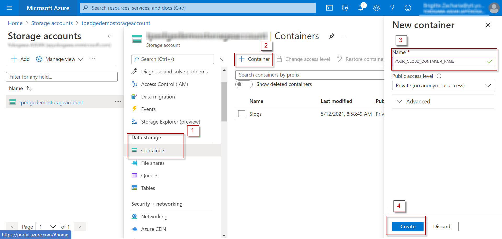

4. Configure the cloud connection string and save it for further use. This string is used to connect to the Blob storage on the Cloud.

   Ensure that the connection string is in the following format:

   ```json
   DefaultEndpointsProtocol=https;AccountName=<Azure_Storage_Account_Name>;
   AccountKey=<Azure_Storage_Account_Key>;
   EndpointSuffix=<end_point_suffix>
   ```

   Here:

   `end_point_suffix` refers to the URL of the storage account set up on Azure portal

   `Azure_Storage_Account_Name` refers to the name of your storage account

   `Azure_Storage_Account_Key` refers to the account access key.

   > **Note**: You can locate the access key of your storage account on the Azure portal. To view the access key and connection string, navigate to **Security + networking > Access keys** in your storage account menu.

   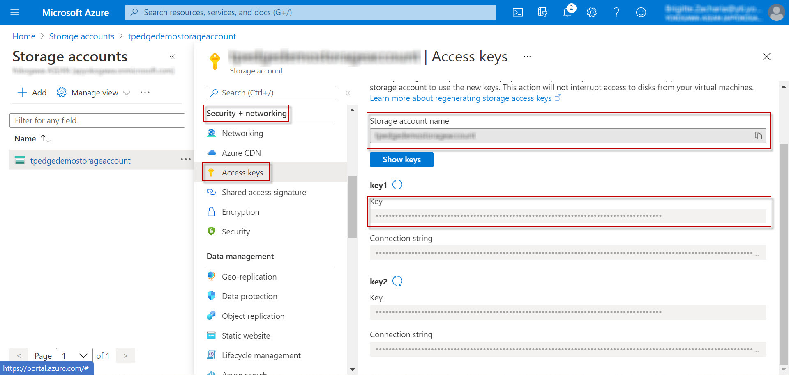

   For more information on configuring storage connection strings, refer to [Create a connection string with an endpoint suffix](https://docs.microsoft.com/en-us/azure/storage/common/storage-configure-connection-string#create-a-connection-string-with-an-endpoint-suffix).

### Importing and configuring Azure Blob storage on IoT Edge module

After creating the storage account, we will create an IoT Edge module to enable data transmission from the local storage to the Cloud storage account.

The Azure Marketplace provides a ready-to-use IoT module that creates a local Blob storage on the Edge device. This module can be imported and configured according to the e-RT3 Plus device.

> **Note**: If you are using a proxy, refer to [Visual Studio Code settings](https://code.visualstudio.com/docs/getstarted/settings).

Follow these steps to import and configure Azure Blob storage on IoT Edge module:

1. Open Visual Studio Code.
2. Press **F1** on the keyboard to open the Command Palette.

   The *Command Palette* box appears.
3. In the **Command Palette** box, type *Azure: Sign In*, and select the same from the search results.
   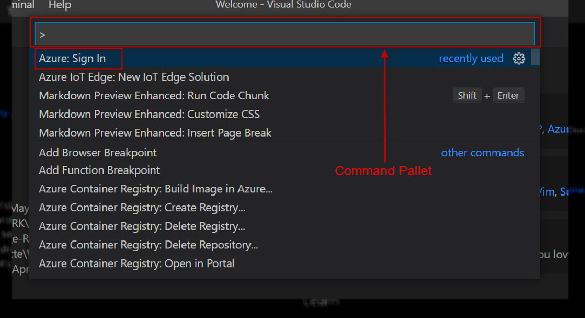
4. On the page that appears, enter your credentials to sign in to Azure Cloud.
5. After signing in successfully, close the page.
6. In the **Command Palette** box, type *Azure IoT Edge: New IoT Edge Solution*, and select the same from the search results.
   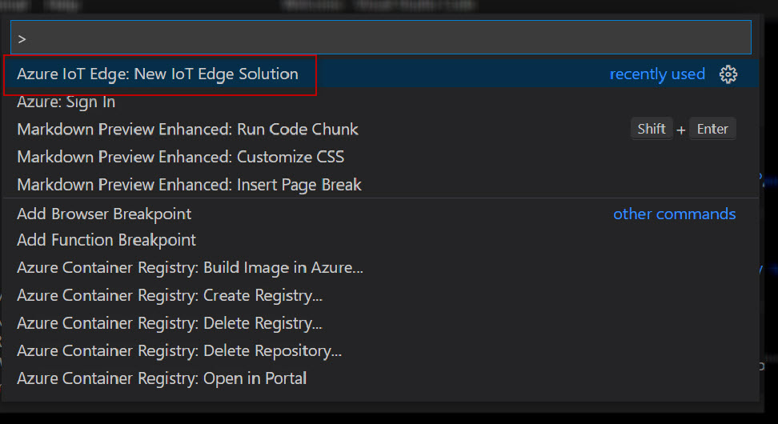

7. In the **Command Palette** box, specify the name of the New IoT Edge Solution.

   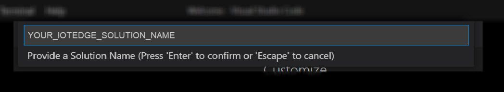

8. From the **Select Module Template** drop-down list, select **Module from Azure Marketplace**.

   The *IoT Edge Marketplace* page appears, displaying the available Module Templates.
   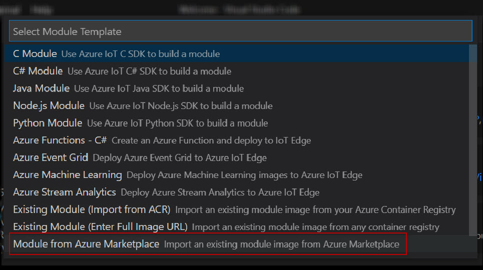

9. In the upper-right corner of the window, type *Azure Blob Storage on IoT Edge* in the **Search** box, and select the same from the search results.
    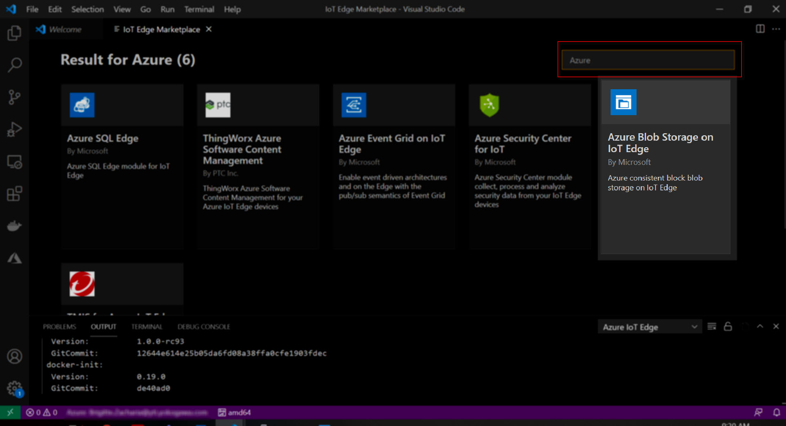

10. In the **Module Name** box, specify the module name.
   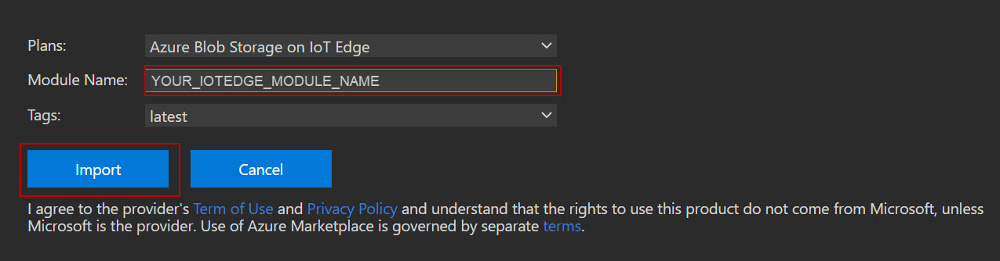

11. Click **Import**.

      The IoT Edge module is created and the project workspace appears.
12. On the left pane, select the `deployment.template.json` file.

      The file contents are displayed on the right pane.

13. To configure the local storage details and upload conditions, perform these steps:

    a. Configure the environment variables for the e-RT3 Plus local storage. These details will be used to access the storage space on the e-RT3 Plus device.

      In the file, search for `LOCAL_STORAGE_ACCOUNT_NAME` and modify the `env` properties as follows:

      ```json
      "env": {
               "LOCAL_STORAGE_ACCOUNT_NAME": {
                  "value": "STORAGE_ACCOUNT_NAME"
               },
               "LOCAL_STORAGE_ACCOUNT_KEY": {
                  "value": "STORAGE_ACCOUNT_KEY"
               }
            }               
      ```

      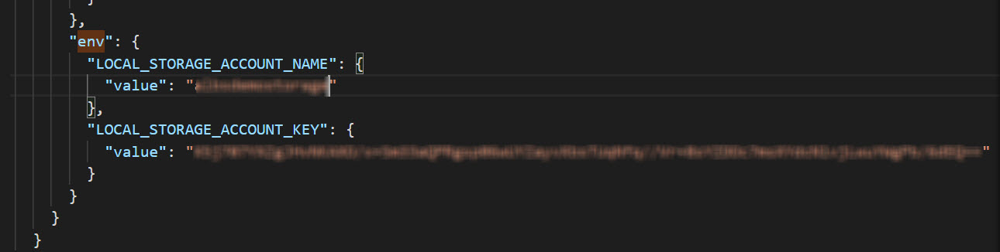
      Here:

      `STORAGE_ACCOUNT_NAME` must be replaced with an account name of your choice.

      `STORAGE_ACCOUNT_KEY` is  a 64-byte base64 key. You can generate the key with freely available tools such as [GeneratePlus](https://generate.plus/en/base64).

      >**Note**: Account names must contain 3-24 characters. Only lowercase letters and numbers can be used. Space is not allowed.

    b. Configure the directory where you want to store the Blob data in the e-RT3 Plus device.
      - In the file, locate `<YOUR_IOTEDGE_MODULE_NAME>` that you specified in **step 10**. In the `HostConfig` section, add the following line:

         `"Binds":["<storage_mount>"]`

         After adding the line:

         ```json
         "HostConfig": {
                        "Binds":["<storage_mount>"],
                        "PortBindings": {
                           "11002/tcp": [
                              {
                                 "HostPort": "11002"
                              }
                           ]
                        }
                     }    
         ```

      Here, `storage_mount` refers to the absolute path of the local storage directory in the e-RT3 Plus device. For example, `/srv/containerdata:/blobroot`. This is the location in the e-RT3 Plus device where the Blob data is stored.

    c. Add the `deviceToCloudUploadProperties` and `deviceAutoDeleteProperties` section.

     - In the file, locate the `$edgeHub` section. Add the following JSON code after the `$edgeHub` section and configure the properties as necessary.

     ```json
     "<YOUR_IOTEDGE_MODULE_NAME>":{
        "properties.desired": {
           "deviceAutoDeleteProperties": {
              "deleteOn": <true, false>,
              "deleteAfterMinutes": <timeToLiveInMinutes>,
              "retainWhileUploading": <true, false>
           },
           "deviceToCloudUploadProperties": {
              "uploadOn": <true, false>,
              "uploadOrder": "<NewestFirst, OldestFirst>",
              "cloudStorageConnectionString": "<YOUR_CLOUD_CONNECTION_STRING>",
              "storageContainersForUpload": {
                 "<YOUR_LOCAL_CONTAINER_NAME>": {
                    "target": "<YOUR_CLOUD_CONTAINER_NAME>"
                 }
              },
              "deleteAfterUpload": <true, false>
           }
        }
     }
     ```

     Here:

     `YOUR_IOTEDGE_MODULE_NAME` refers to the module name specified in **step 10**

     `YOUR_CLOUD_CONNECTION_STRING` refers to the connection string configured in **step 4** of [Creating a storage account](#creating-a-storage-account)

     `YOUR_LOCAL_CONTAINER_NAME` refers to the name of the local container

     `YOUR_CLOUD_CONTAINER_NAME` refers to the container name specified in **step 3** of [Creating a storage account](#creating-a-storage-account).

     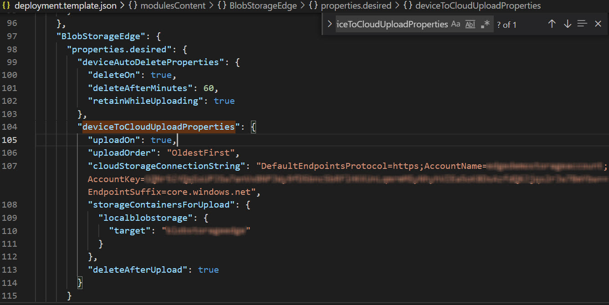

     >**Note**: For more information on configuring `deviceToCloudUploadProperties` and `deviceAutoDeleteProperties`, refer to [deviceToCloudUpload and deviceAutoDelete properties](https://docs.microsoft.com/en-us/azure/iot-edge/how-to-store-data-blob?view=iotedge-2020-11#devicetocloudupload-and-deviceautodelete-properties).
14. Save the file.

The Azure Blob Storage on IoT Edge module is created and customized for the e-RT3 Plus device.

### Deploying the IoT Edge module for Azure Blob storage

After successfully importing and configuring the Azure Blob storage on IoT Edge module, it must be deployed on e-RT3 Plus.

>**Note**: If you are using a proxy, refer to [Configure proxy support](https://docs.microsoft.com/en-us/azure/iot-edge/how-to-deploy-blob?view=iotedge-2018-06#configure-proxy-support) and then continue.

Follow these steps to deploy the created IoT module on e-RT3 Plus:

1. To configure the target platform, open the Command Palette.
2. In the **Command** box, type  *Azure IoT Edge: Set Default Target Platform for Edge Solution*, and select `arm32v7` from the search results.

    Alternatively, you can select the shortcut icon on the bottom ribbon and set the Target Platform as `arm32v7`. By default, the target platform is set as `amd64`.

    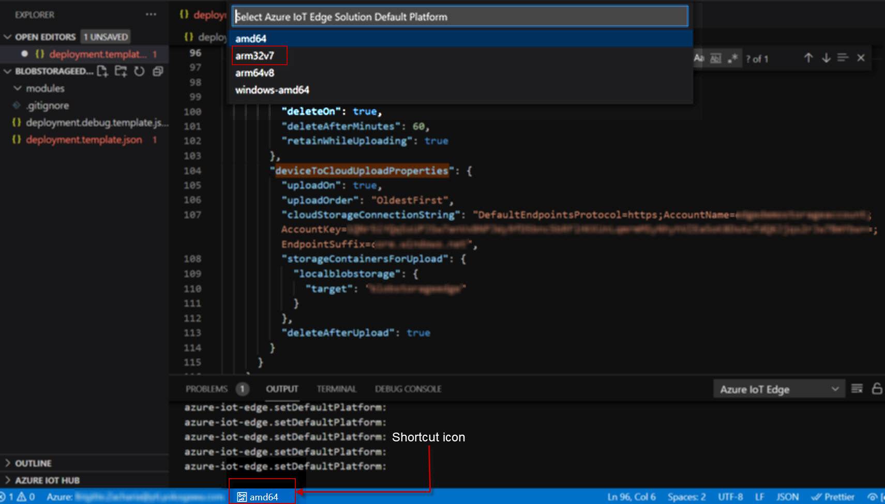

3. On the left pane, right-click  `deployment.template.json` and select **Build IoT Edge Solution**.

      The IoT Edge module is built and a `config` folder is created under the project.
      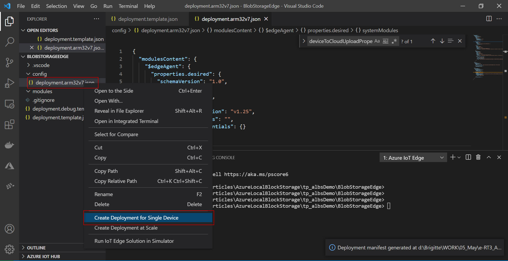
4. On the left pane, expand `config`, right-click `deployment.arm32v7.json`, and select **Create Deployment for Single Device**.

   The target IoT Edge device name appears in the Command Palette.

5. From the **Select an IoT Hub device** drop-down list, select `<YOUR_ERT3_DEVICE>`.
   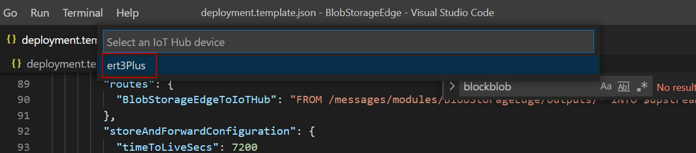

   Here, `YOUR_ERT3_DEVICE` refers to the e-RT3 Plus device name.

   The `<YOUR_IOTEDGE_MODULE_NAME>` module is deployed to the e-RT3 Plus device.

   >**Note**: For e-RT3 Plus to be displayed in the drop-down list, you may need to provide the connection string on the first attempt. After the specified details are successfully validated, the target device name appears in the drop-down list of the Command Palette.

### Verifying the deployment of IoT Edge module

Follow these steps to verify the deployment of the IoT Edge module:

1. Open an SSH terminal to the e-RT3 Plus device.

   > **Note**: To learn how to open an SSH terminal and communicate with e-RT3 Plus, refer to [Communicating with e-RT3 Plus by SSH](https://github.com/Yokogawa-Technologies-Solutions-India/e-RT3-docs/blob/master/Articles/e-RT3/Communication-with-e-RT3-Plus.md#communicating--with-e-rt3-plus-by-ssh).

2. Run the following command to view the list of IoT Edge modules that are installed.

   ```bash
   iotedge list
   ```

   The status of the `<YOUR_IOTEDGE_MODULE_NAME>` module is displayed as **running**. This indicates that the deployment is successful.

To verify the deployment by using the Azure portal, follow the steps in [Verify Deployment](https://github.com/Yokogawa-Technologies-Solutions-India/e-RT3-docs/blob/master/Articles/Local_blob_storage/Installing_Azure_Runtime_on_e-RT3.md#verify-deployment) and check the status of the `<YOUR_IOTEDGE_MODULE_NAME>` module.

### Configuring permissions for the local Blob storage repository

Now that we have created and deployed the Azure Blob storage on IoT Edge module, access permissions must be set for the local storage directory.

Follow these steps to configure access permissions:

1. Run the following commands to change the permissions for accessing the container directory.

   ```bash
   sudo chown -R 11000:11000 /srv/containerdata
   sudo chmod -R 700 /srv/containerdata
   ```

2. Run the following command to restart the IoT Edge module.

   ```bash
   iotedge restart <YOUR_IOTEDGE_MODULE_NAME>   
   ```

### Verifying transmission of local Blob storage data to the Cloud

To verify whether data in the local Blob storage is being uploaded to the Cloud, we will use a Python script. The Python script creates a file in the local storage folder. If the Azure Blob storage on IoT Edge module deployment is successful, the file is uploaded to the container created in the storage account.

Verifying the data transfer involves the following steps:

1. Send sample data to the local Blob storage by using Python script
2. Verify the uploaded data in Azure storage account

#### Sending sample data to local Blob storage by using Python script

Follow these steps to send sample data to the local Blob storage:

1. Log on to Windows.
2. To create the Python script, create a text file, and specify the name as `<VERIFICATION_SCRIPT_NAME>.py`.
3. Open the file and specify the following Python code:

   ```python

   from azure.storage.blob import BlobClient
   from azure.storage.blob import ContainerClient
   import os
   from datetime import datetime

   STORAGE_CONNECTION_STRING = "YOUR_LOCAL_BLOB_CONNECTION_STRING"
   STORAGE_CONTAINER_NAME = "YOUR_LOCAL_CONTAINER_NAME"
   STORAGE_LOCAL_PATH = "./UploadBlob"

   os.makedirs(STORAGE_LOCAL_PATH, exist_ok=True)
   # %%

   container_client = ContainerClient.from_connection_string(
      conn_str=STORAGE_CONNECTION_STRING, container_name=STORAGE_CONTAINER_NAME)
   try:
      container_properties = container_client.get_container_properties()
      # Container foo exists. You can now use it.
      print(container_properties)

   except Exception as e:
      container_client.create_container()
      # Container foo does not exist. You can now create it.
      print(e)
   # container_client.create_container()


   # %% upload blob
   try:
      local_filename = "MessageContents_" + \
         str(datetime.now().strftime("%Y-%m-%dT%f")) + ".txt"
      upload_file_path = os.path.join(STORAGE_LOCAL_PATH, local_filename)
      # Open the file and write the input message to it
      input_message = 'Hello:'+str(datetime.now().strftime("%Y-%m-%dT%f"))
      file = open(upload_file_path, 'w')
      file.write(input_message)
      file.close()
      blob = BlobClient.from_connection_string(
         conn_str=STORAGE_CONNECTION_STRING, container_name=STORAGE_CONTAINER_NAME, blob_name=local_filename)
      with open(upload_file_path, "rb") as data:
         blob.upload_blob(data)
         print('Upload Success')
   except Exception as e:
      print('Upload Failed')
      print(e)

   # %%

   ```

   Here:

   `YOUR_LOCAL_CONTAINER_NAME` refers to the name of the local container specified in **step 13.c** of [Importing and configuring Azure Blob storage on IoT Edge module](#importing-and-configuring-azure-blob-storage-on-iot-edge-module),

   `YOUR_LOCAL_BLOB_CONNECTION_STRING` refers to the following connection string:

      ```json
      DefaultEndpointsProtocol=http;BlobEndpoint=<http://<ERT3_IP_ADDRESS>:11002/<STORAGE_ACCOUNT_NAME>;AccountName=<STORAGE_ACCOUNT_NAME>;AccountKey=<STORAGE_ACCOUNT_KEY>>;
      ```

   >**Note**: `STORAGE_ACCOUNT_NAME` and `STORAGE_ACCOUNT_KEY` refers to the name and key of the storage account specified in **step 13.a** of [Importing and configuring Azure Blob storage on IoT Edge module](#importing-and-configuring-azure-blob-storage-on-iot-edge-module).

4. Save the file and close it.
5. Open an SSH terminal to the e-RT3 Plus device.
   > **Note**: To learn how to open an SSH terminal and communicate with e-RT3 Plus, refer to [Communicating with e-RT3 Plus by SSH](https://github.com/Yokogawa-Technologies-Solutions-India/e-RT3-docs/blob/master/Articles/e-RT3/Communication-with-e-RT3-Plus.md#communicating--with-e-rt3-plus-by-ssh).

6. Run the following command to create a new directory.

   ```bash
   mkdir <BLOB_ENV_DIRECTORY_NAME>
   ```

   Here, `BLOB_ENV_DIRECTORY_NAME` refers to the name of the new directory.

7. Run the following commands to create and activate a Python virtual environment inside the new directory.

   ```bash
   cd <BLOB_ENV_DIRECTORY_NAME>
   python3 -m venv <ENVIRONMENT_NAME>
   source <ENVIRONMENT_NAME>/bin/activate
   ```

   Here, `ENVIRONMENT_NAME` refers to the name of the virtual environment.

8. Run the following commands to update pip and install the libraries required for azure-storage-blob package.

   ```bash
   pip install --upgrade pip
   sudo apt install libffi-dev libssl-dev
   ```

9. Run the following commands to install the `azure-storage-blob` package that is required for executing the local blob storage.

   ```bash
   export CRYPTOGRAPHY_DONT_BUILD_RUST=1
   pip install azure-storage-blob
   ```

10. Upload the Python script to   `<BLOB_ENV_DIRECTORY_NAME>` directory  by using WinSCP.

      For more information about transferring files to e-RT3 Plus using WinSCP, refer to [Using WinSCP to transfer files to e-RT3 Plus](https://github.com/Yokogawa-Technologies-Solutions-India/e-RT3-docs/blob/master/Articles/AI/Sample_AI_Application.md#using-winscp-to-transfer-files-to-e-rt3-plus).

11. Execute the Python script by running the following command in the SSH terminal.

    ```bash
    python3 <VERIFICATION_SCRIPT_NAME>.py  
    ```
  
    A message is displayed, indicating that the upload is successful.
12. In the WinSCP window, navigate to the `<BLOB_ENV_DIRECTORY_NAME>` directory.

    The newly created folder, `UploadBlob` is displayed. This folder contains the message that is uploaded to the Cloud.

13. To identify the name of the file uploaded to the Cloud, open the folder `UploadBlob`.

    The folder contents appear, displaying the file that is uploaded to the Cloud. Open the file to verify its contents,
   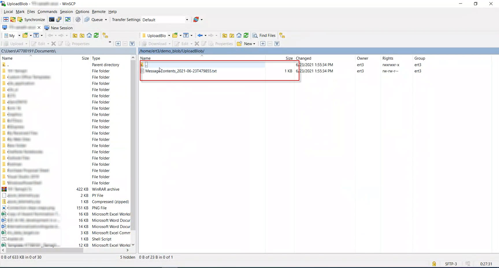

#### Verifying the uploaded file on the Azure storage account

Follow these steps to verify the uploaded file on Azure storage account:

1. Navigate to [Azure Portal](https://portal.azure.com/#home).
2. In the **Azure Services** section, click **Storage Accounts**.

   The *Storage accounts* page appears, displaying the list of storage accounts created.
3. Select the storage account to which `<YOUR_CLOUD_CONTAINER_NAME>` belongs.
4. On the left pane, in the **Data storage** section, select **Containers**.

   The list of existing containers is displayed.
   
5. Select  `<YOUR_CLOUD_CONTAINER_NAME>`.

   Here, `YOUR_CLOUD_CONTAINER_NAME` refers to the container name specified in **step 3** of [Creating a storage account](#creating-a-storage-account).

   The *Container* page appears, displaying the list of messages received from the e-RT3 Plus device.
   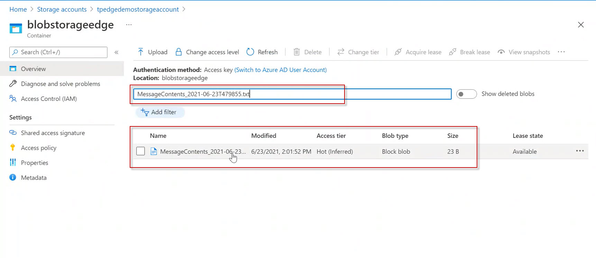

6. In the **Search** box, specify the name of the file as determined in **step 13** of [Sending sample data to local Blob storage by using Python script](#sending-sample-data-to-local-blob-storage-by-using-python-script), and select the same from the search results.

   The message Blob page appears, displaying the overview of the file.

7. On the left pane, click the **Menu** icon, and select **View/edit**.

   The contents of the file appear on the right pane.
   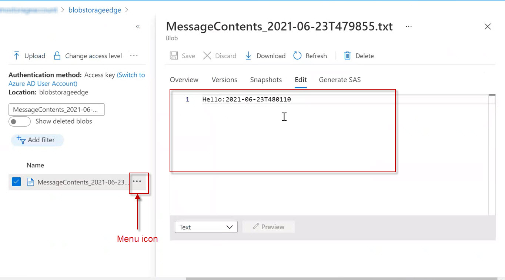

8. Verify the contents of the message to determine if the upload is successful.

If the contents of both files match, the implementation of local Blob storage is successful.

## Conclusion

Azure Blob storage IoT module is deployed on e-RT3 Plus and automatic data transfer from local Blob storage to Azure Cloud is verified.

In the next article, we will create a solution that temporarily stores data on e-RT3 Plus in the event of network failure to demonstrate zero-loss data transmission from e-RT3 Plus.

---

## References

1. [Store data at the edge with Azure Blob storage on IoT Edge](https://docs.microsoft.com/en-us/azure/iot-edge/how-to-store-data-blob?view=iotedge-2020-11)
2. [Deploy the Azure Blob storage on IoT Edge module to your device](https://docs.microsoft.com/en-us/azure/iot-edge/how-to-deploy-blob?view=iotedge-2020-11)
3. [Image](https://techcommunity.microsoft.com/t5/internet-of-things/azure-blob-storage-on-iot-edge-is-now-generally-available/ba-p/786161)
4. [Create a Container on Azure Portal](https://docs.microsoft.com/en-us/azure/storage/common/storage-account-create?tabs=azure-portal)
5. [Configure Azure Storage connection strings](https://docs.microsoft.com/en-us/azure/storage/common/storage-configure-connection-string?view=iotedge-2020-11#create-a-connection-string-for-an-explicit-storage-endpoint)
7. [Deploy from Visual Studio Code](https://docs.microsoft.com/en-us/azure/iot-edge/how-to-deploy-blob?view=iotedge-2020-11#deploy-from-visual-studio-code)

---
