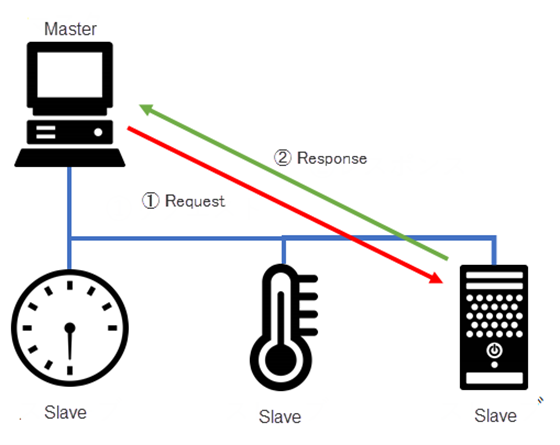
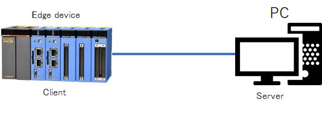

# Modbus TCP communication with Edge devices in Python

## Introduction

This is the first article of a 3-part series, where we explore how e-RT3 Plus can be configured to communicate over Modbus TCP communication protocol.

The Modbus TCP protocol is widely used as a standard in the industrial automation sector. Since the e-RT3 Plus must be able to communicate with a variety of devices, it is equipped to handle multiple communication protocols. In this article, we explore how to communicate with the e-RT3 Plus device, or any other Edge device by using the Modbus TCP communication protocol.

The [Modbus protocol](https://modbus.org/) is designed to enable communication between devices over serial lines. It follows a Master-Slave architecture where the Slave sends a response based on the request from the Master.



Today, the Modbus protocol has evolved to support TCP/IP communication. With this feature, Modbus messages can be exchanged over the internet. Modbus TCP communication uses a Client/Server architecture, in which the client is the Modbus Master, and the server is the Modbus Slave.
Additionally, for devices that support Python programming, you can use the services in the PyModbus Python package to manage Modbus TCP communication.

For more information on Modbus, refer to the [official website](#https://modbus.org/).

## System positioning

The following diagram shows the positioning of the systems for Modbus communication.
For this demonstration, the e-RT3 Plus device (Client) reads the data from the Server computer. Here, the Server computer simulates the surrounding devices.



## Supported devices

Modbus TCP communication is verified on the following devices.

- e-RT3 Plus F3RP70-2L  （Ubuntu 18.04 32-bit）
- Raspberry Pi 4 Model B （Ubuntu Server 20.04 32-bit）

The `armhf` architecture packages run on these devices.

## Prerequisites

To establish Modbus TCP communication between two devices that support Python, the PyModbus package must be installed on both the Edge device (Client) and the computer (Server).

To install the PyModbus package, run the following command:

```bash
python3 -m pip install pymodbus
```

>**Note:** By default, the PyModbus package is installed on e-RT3 Plus.

To verify the installation, run the following command:

```bash
python3 -m pip show pymodbus
```

If the package is installed, the following information is displayed.

```bash
Name: pymodbus
Version: 1.3.2
...
```

## Communicating with devices by using Modbus TCP 

Communication through Modbus takes place using specific registers.
The following table describes the details of the Modbus registers in which you can store data.

|Object type|Unit|Access rights|
|---|---|---|
|Coil|1-bit|Read/Write|
|Discreet input|1-bit|Read only|
|Holding register|16-bit|Read/Write|
|Input register|16-bit|Read only|

In this section, we describe how to perform the following operations:

  1. [Establishing Modbus TCP communication](#establishing-modbus-tcp-communication)
  2. [Read/Write operations on a coil](#readwrite-operations-on-a-coil)
  3. [Read operations on discrete inputs](#read-operations-on-discrete-inputs)
  4. [Read/Write operations on holding registers](#readwrite-operations-on-holding-registers)
  5. [Read operations on input registers](#read-operations-on-input-registers)

### Establishing Modbus TCP communication

After you have installed the PyModbus package on both the client and server, you must start the server and access the coils and registers.

Follow these steps to establish Modbus TCP communication:

1. To start the server, run the sample server program (synchronous_server.py) from the PyModbus package in the server as follows:

    ```bash
    python3 synchronous_server.py
    ```

    >**Note:**
    >
    >- The sample server program is available [here](https://github.com/riptideio/pymodbus/blob/v2.5.2/examples/common/synchronous_server.py). This article uses the version v2.5.2 of the code.
    >- For more information about the license of the sample code, click [here](https://github.com/riptideio/pymodbus/blob/v2.5.2/LICENSE).

2. To access the coils and registers, run the client program on the client edge device. Ensure that you replace <IP_ADDRESS_OF_SERVER_PC> with the IP address of the computer on which the server is running in the program code.

    ```bash
    python3 <client_program_name>.py
    ```

    Here, `client_program_name` is name of the client program of your choice.

    >**Note:**
    >
    >    - In this article, the client programs have been created from scratch to perform the read/write operations. You can use the `synchronous_client.py` program as a reference to create your own client programs. The `synchronous_client.py` program is available [here](https://github.com/riptideio/pymodbus/blob/v2.5.2/examples/common/synchronous_client.py).
    >    - For more information about the functions that you can use in the PyModbus package, refer to this [document](https://pymodbus.readthedocs.io/en/latest/source/library/modules.html).

### Read/Write operations on a coil

The following sample program reads and writes a 1-bit (True/False) value on one or more coils.

``` python
#!/usr/bin/env python
from pymodbus.client.sync import ModbusTcpClient as ModbusClient

# connect to server
client = ModbusClient('<IP_ADDRESS_OF_SERVER_PC>', port=5020)
client.connect()

# Read/write to one coil
print("Write to a coil and read back")

# Write True to the coil in address 1
rq = client.write_coil(1, True)

# Read
rr = client.read_coils(1, 1)

# Since return value is in units of 8 bits, read only the first 1 bit
print(rr.bits[0])

# Read/write to multiple coils
print("Write to multiple coils and read back")

# Write True to coils from address 3 to 9
rq = client.write_coils(3, [True]*9)

# Read
rr = client.read_coils(3, 9)

# Since the return value is 8 bit, 16 bit is returned
# Except for the first 9 bits, all the other bits are padded with False
print(rr.bits)

# Disconnect
client.close()
```

If the program is executed successfully, the following output is displayed.

```bash
Write to a coil and read back
True
Write to multiple coils and read back
[True, True, True, True, True, True, True, True, True, False, False, False, False, False, False, False]
```

### Read operations on discrete inputs

The following sample program reads a 1-bit (True/False) value from multiple discrete inputs.

```python
#!/usr/bin/env python
from pymodbus.client.sync import ModbusTcpClient as ModbusClient

# Connect to server
client = ModbusClient('<IP_ADDRESS_OF_SERVER_PC>', port=5020)
client.connect()

# Read from multiple discrete inputs
print("Read discrete inputs")

# Read from discrete inputs from address 0 to 3
rr = client.read_discrete_inputs(0, 3)

# Since the return value is 8 bit, returns 8 bits
# Except for the first 3 bits, all the other bits are padded with False
print(rr.bits)

# Disconnect
client.close()
```

If the program is executed successfully, the following output is displayed.

```bash
Read discrete inputs
[True, True, True, False, False, False, False, False]
```

### Read/Write operations on holding registers

The following sample program reads and writes 16-bit values to one or more holding registers.

```python
#!/usr/bin/env python
from pymodbus.client.sync import ModbusTcpClient as ModbusClient

# Connect to server
client = ModbusClient('<IP_ADDRESS_OF_SERVER_PC>', port=5020)
client.connect()

# Read/write to single holding register
print("Write to a holding register and read back")

# Write 10 to holding register in address 1
rq = client.write_register(1, 10)

# Read
rr = client.read_holding_registers(1, 1)
print(rr.registers)

# Read/write to multiple holding registers
print("Write to multiple holding registers and read back")

# Write values to holding registers in address 2 to 10
values = [i for i in range(10)]
rq = client.write_registers(2, values)

# Read from address 2 to 10
rr = client.read_holding_registers(2, 10)
print(rr.registers)

# Disconnect
client.close()
```

If the program is executed successfully, the following output is displayed.

```bash
Write to a holding register and read back
[10]
Write to multiple holding registers and read back
[0, 1, 2, 3, 4, 5, 6, 7, 8, 9]
```

### Read operations on input registers

The following sample program reads 16-bit values from multiple input registers.

```python
#!/usr/bin/env python
from pymodbus.client.sync import ModbusTcpClient as ModbusClient

# Connect to server
client = ModbusClient('<IP_ADDRESS_OF_SERVER_PC>', port=5020)
client.connect()

# Read from multiple input registers
print("Read input registers")

# Read from input registers in addresses from 1 to 8
rr = client.read_input_registers(1, 8)
print(rr.registers)

# Disconnect
client.close()
```

If the program is executed successfully, the following output is displayed.

```bash
Read input registers
[17, 17, 17, 17, 17, 17, 17, 17]
```

## Conclusion

e-RT3 Plus can easily communicate with devices using the Modbus TCP Protocol and the PyModbus package. In the next article, we will explore a data collection application using Modbus communication.

## References

1. [AI Platform for industries | Yokogawa Electric](https://www.yokogawa.co.jp/solutions/products-platforms/control-system/real-time-os-controller/ert3-ai-platform/)
2. [The Modbus Organization](https://modbus.org/)
3. [GitHub - riptideio/pymodbus: A full modbus protocol written in python](https://github.com/riptideio/pymodbus) 
4. [Pymodbus - PyModbus 2.5.0 documentation](https://pymodbus.readthedocs.io/en/latest/source/library/modules.html) 
