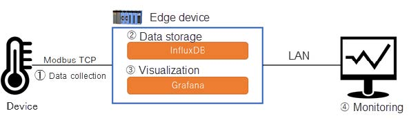
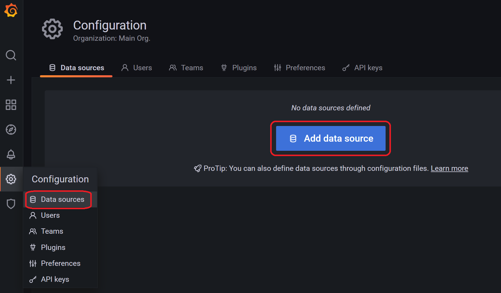
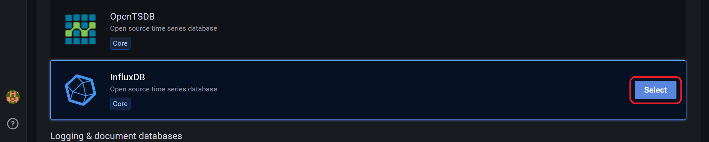
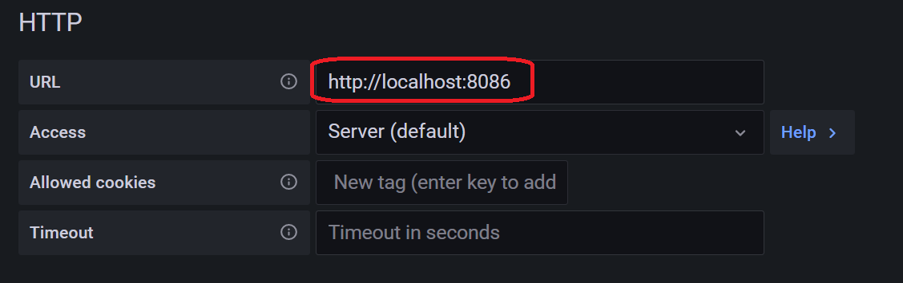
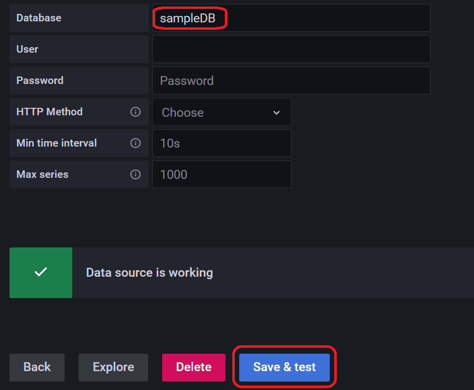
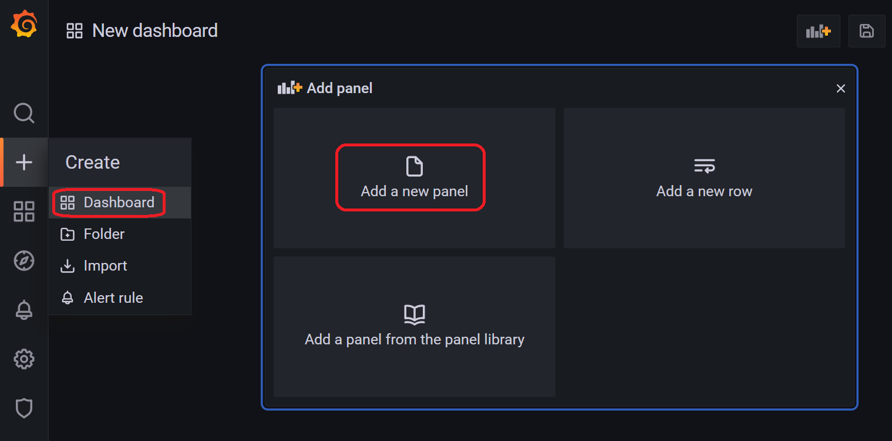
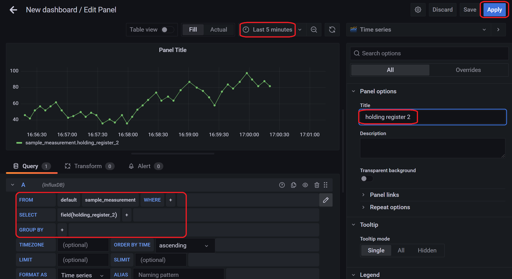
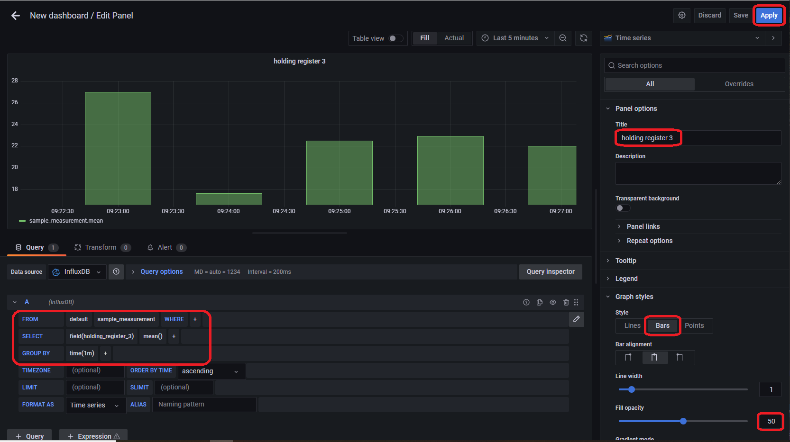
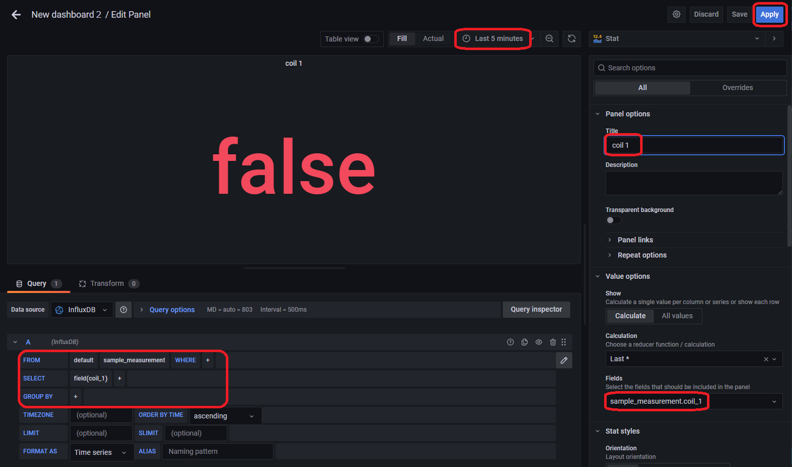
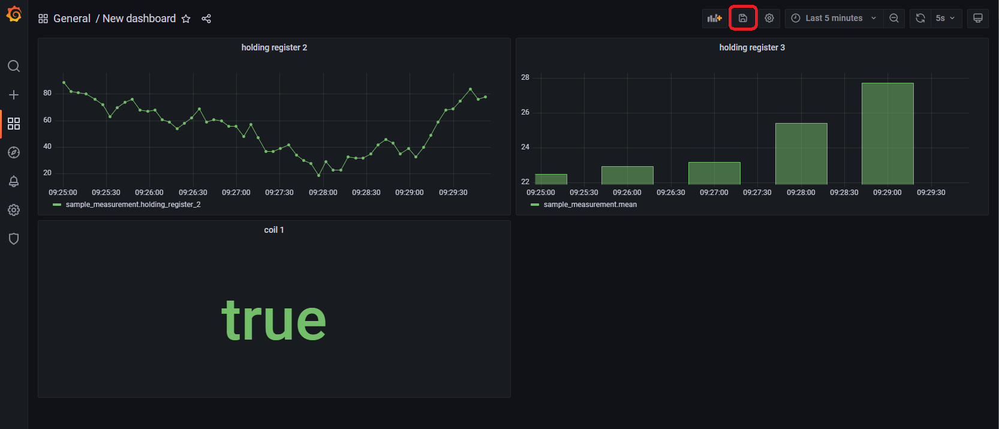

# Using Python to store collected data in InfluxDB and visualizing data in Grafana

## Introduction

In the [previous article](https://github.com/Yokogawa-Technologies-Solutions-India/e-RT3-docs/blob/master/Articles/Modbus-TCP-Connection/Modbus%20TCP%20communication%20with%20Edge%20dev.md), we learnt how to collect data with Modbus TCP communication using Python. This is the 2nd article of the 3-part series, where we explore how to store collected data in InfluxDB and visualize the data in Grafana.

## Supported devices

The steps in this demonstration can be performed on the following devices.

- e-RT3 Plus F3RP70-2L1 (Ubuntu 18.04 32-bit)
- Raspberry Pi 4 Model B (Ubuntu Server 20.04 32-bit)

The `armhf` architecture packages run on these devices.

## System positioning

The following figure shows the setup required to collect, store, and visualize data on the Edge device over the Modbus TCP communication.



The flow involves four events:

1. Data collection

   Data is collected from an external device by using Modbus TCP communication.
2. Data storage

   The collected data is stored in Influx DB on the Edge device.
3. Visualization

   The data stored in InfluxDB is visualized using Grafana.
4. Monitoring

   The results are monitored in a computer by accessing Grafana in the Edge device.

## Prerequisites

To achieve the objective of this article, you must install Grafana and InfluxDB on the Edge device.

### Installing Grafana

Follow these steps to install Grafana on the Edge device.

1. Install the required packages.

    ```bash
    sudo apt install -y apt-transport-https
    sudo apt install -y software-properties-common wget
    wget -q -O - https://packages.grafana.com/gpg.key | sudo apt-key add -
    ```

2. Add repositories and install Grafana.

   ```bash
   echo "deb https://packages.grafana.com/oss/deb stable main" | sudo tee -a /etc/apt/sources.list.d/grafana.list
   sudo apt update
   sudo apt install grafana
   ```

   For more information on installing Grafana, refer to [Install on Debian/Ubuntu | Grafana Labs](https://grafana.com/docs/grafana/latest/installation/debian/).
3. Start the service and verify the status.

   ```bash
   sudo systemctl daemon-reload
   sudo systemctl start grafana-server
   sudo systemctl status grafana-server
   ```

   If the program is executed successfully, the following output is displayed.

   ```bash
   * grafana-server.service - Grafana instance
    Loaded: loaded (/usr/lib/systemd/system/grafana-server.service; disabled; ven
    Active: active (running) since Fri 2021-12-24 07:38:20 UTC; 14s ago
    Docs: http://docs.grafana.org
    Main PID: 2756 (grafana-server)
    Tasks: 12 (limit: 2366)
    CGroup: /system.slice/grafana-server.service
    `-2756 /usr/sbin/grafana-server --config=/etc/grafana/grafana.ini --p
    Dec 24 07:38:32 ubuntu grafana-server[2756]: t=2021-12-24T07:38:32+0000 lvl=info
    Dec 24 07:38:32 ubuntu grafana-server[2756]: t=2021-12-24T07:38:32+0000 lvl=info
   ```

> **Note**: If the Edge device is in a proxy environment, [configuring proxy settings](https://github.com/Yokogawa-Technologies-Solutions-India/e-RT3-docs/blob/master/Articles/Azure/Send-telemetry-data-from-e-RT3-to-azure-IoT-hub.md#proxy-settings) is mandatory.

### Installing InfluxDB

Follow these steps to install InfluxDB on an Edge device.

1. Install the package that is used to operate InfluxDB from Python.

   ```bash
   python3 -m pip install influxdb
   ```

2. Add repositories and install InfluxDB.

   ```bash
   curl -s https://repos.influxdata.com/influxdb.key | gpg --dearmor | sudo tee /etc/apt/trusted.gpg.d/influxdb.gpg
   export DISTRIB_ID=$(lsb_release -si); export DISTRIB_CODENAME=$(lsb_release -sc)
   echo "deb [signed-by=/etc/apt/trusted.gpg.d/influxdb.gpg] https://repos.influxdata.com/${DISTRIB_ID,,} ${DISTRIB_CODENAME} stable" | sudo tee /etc/apt/sources.list.d/influxdb.list
   sudo apt update
   sudo apt install influxdb
   ```

3. Start the service and verify the status.

   ```bash
   sudo systemctl unmask influxdb.service
   sudo systemctl start influxdb
   sudo systemctl status influxdb
   ```

   If the program is executed successfully, the following output is displayed.

   ```bash
   * influxdb.service - InfluxDB is an open-source, distributed, time series databa
   Loaded: loaded (/lib/systemd/system/influxdb.service; enabled; vendor preset:
   Active: active (running) since Fri 2021-12-24 07:51:02 UTC; 6s ago
   Docs: https://docs.influxdata.com/influxdb/Process: 4191 ExecStart=/usr/lib/influxdb/scripts/influxd-systemd-start.sh (co
   Main PID: 4192 (influxd)
   Tasks: 9 (limit: 2366)
   CGroup: /system.slice/influxdb.service `-4192 /usr/bin/influxd -config /etc/influxdb/influxdb.conf`
   Dec 24 07:51:01 ubuntu influxd-systemd-start.sh[4191]: ts=2021-12-24T07:51:01.75
   Dec 24 07:51:01 ubuntu influxd-systemd-start.sh[4191]: ts=2021-12-24T07:51:01.75
   ```

For more information about installing InfluxDB, refer to the [official documentation](https://docs.influxdata.com/influxdb/v1.8/introduction/install/).

## Data Collection

Collect data from the device with a Python program that uses PyModbus. In this example, start the Modbus server on the computer instead of the device.

> **Note**: For more details about data collection using PyModubs, refer to the [previous article](https://github.com/Yokogawa-Technologies-Solutions-India/e-RT3-docs/blob/master/Articles/Modbus-TCP-Connection/Modbus%20TCP%20communication%20with%20Edge%20dev.md).

### Configuring Modbus server

Follow these steps to configure Modbus server:

1. Start the Modbus server on the computer.
2. To rewrite the values periodically, modify the program [updating_server.py](https://github.com/riptideio/pymodbus/blob/v2.5.2/examples/common/updating_server.py) (You can access the license [here](https://github.com/riptideio/pymodbus/blob/v2.5.2/LICENSE)).

   In this example, we store two time-series data values in the holding register and Boolean data in the coil.
   1. Modify the following code in the `updating_write` function.

      ```bash
      import random
      def updating_writer(a):
      context = a[0]
      slave_id = 0x00
      
      # Write to coil 1
      fx = 1
      address = 0x01
      values = [bool(random.getrandbits(1))]
      log.debug("coil1: " + str(bool(random.getrandbits(1))))
      context[slave_id].setValues(fx, address, values)
     
      # Writing to holding register 2
      fx = 3
      address = 0x02
      values = context[slave_id].getValues(fx, address, count=1)
      values[0] += random.randint(-10, 10)
      if values[0] > 100:
       values[0] = 100
      elif values[0] < 0:
       values[0] = 0
      log.debug("holding2: " + str(values[0]))
      context[slave_id].setValues(fx, address, values)
      
      # Writing to holding register 3
      fx = 3
      address = 0x03
      values = context[slave_id].getValues(fx, address, count=1)
      values[0] += random.randint(-5, 5)
      if values[0] > 50:
       values[0] = 50
      elif values[0] < 0:
       values[0] = 0
      log.debug("holding3: " + str(values[0]))
      context[slave_id].setValues(fx, address, values)
      ```

   2. Rewrite the following code at the end of the [updating_server.py](https://github.com/riptideio/pymodbus/blob/v2.5.2/examples/common/updating_server.py) program.

      ```bash
      # Before change
       StartTcpServer(context, identity=identity, address=("localhost", 5020))
       # After change
       StartTcpServer(context, identity=identity, address=("", 5020))
      ```

3. Install the following package and start the program.

   ```bash
   python -m pip install twisted pymodbus
   python updating_server.py
   ```

### Data collection in Edge device

Follow these steps to collect data in the Edge device:

1. Run the following `client.py` program in the Edge device to collect the server data every 5 seconds.
   
   Ensure that you replace the <IP_ADDRESS_OF_SERVER_PC> with the IP address of the computer on which the Modbus server is running.

   ```bash
   client.py
   
   #!/usr/bin/env python
   from pymodbus.client.sync import ModbusTcpClient as ModbusClient
   import time
   
   # Connect to Modbus server
   mbclient = ModbusClient('<IP_ADDRESS_OF_SERVER_PC>', port=5020)
   mbclient.connect()
   while True:
    try:
        # Read value of coil 1
        rr = mbclient.read_coils(1, 1)
        co1 = rr.bits[0]
        
        # Read values from holding registers 2 and 3
        rr = mbclient.read_holding_registers(2, 2)
        hr2 = rr.registers[0]
        hr3 = rr.registers[1]
        
        print("coil1: {0}, holding2: {1}, holding3: {2}".format(co1, hr2, hr3))
        
        #Sleep for 5 seconds
        time.sleep(5)

    except KeyboardInterrupt:
        # disconnect
        mbclient.close()
        break

    except Exception as e:
        print(e)
   ```

   If the program is executed successfully, the following output is displayed.

   ```bash
   username@ubuntu:~$ python3 client.py
   coil1: False, holding2: 89, holding3: 12
   coil1: True, holding2: 85, holding3: 13
   coil1: True, holding2: 78, holding3: 14
   ...
   # Close with Ctrl+C
   ```

> **Note**: Although this program enables easier collection of periodic data, the period in which the data is collected is not accurate. If you want to collect data in more accurate periods, check other methods of data collection.

## Data storage

Store the data that is collected from Edge device in InfluxDB.

### Configuring the database

Follow these steps to configure the database:

1. Start InfluxDB

   ```bash
   sudo systemctl start influxdb
   ```

2. Create a database with the name as `sampleDB`.

   ```bash
   username@ubuntu:~$ influx
   Connected to http://localhost:8086 version 1.8.10
   InfluxDB shell version: 1.8.10
   > CREATE DATABASE sampleDB
   > exit
   ```

### Storage in database

Follow these steps to store the collected data in the database that you created.

1. Refer to the [InfluxDB sample program](https://influxdb-python.readthedocs.io/en/latest/examples.html) and add the code to store data to the `client.py` program that was created in the step [Data collection in Edge device](#data-collection-in-edge-device).

   After adding, the code is updated as follows.

   ```bash
   client.py
   
   #!/usr/bin/env python
   from pymodbus.client.sync import ModbusTcpClient as ModbusClient
   from influxdb import InfluxDBClient
   from datetime import datetime
   import time
   
   # Connect to Modbus server
   mbclient = ModbusClient('<IP_ADDRESS_OF_SERVER_PC>', port=5020)
   mbclient.connect()
   
   # Connect to database
   dbclient = InfluxDBClient(host='localhost', port=8086, database='sampleDB')
   while True:
    try:
        # Read value from coil 1
        rr = mbclient.read_coils(1, 1)
        co1 = rr.bits[0]
   
        # Read values from holding registers 2 and 3
        rr = mbclient.read_holding_registers(2, 2)
        hr2 = rr.registers[0]
        hr3 = rr.registers[1]
        
        print("coil1: {0}, holding2: {1}, holding3: {2}".format(co1, hr2, hr3))
        
        # Write to database
        json_body = [
            {
                "measurement": "sample_measurement",
                "time": datetime.utcnow(),
                "fields": {
                    "coil_1": co1,
                    "holding_register_2": hr2,
                    "holding_register_3": hr3
                    }
            }
        ]
        
        print("Write points: {0}".format(json_body))
        dbclient.write_points(json_body)
        
        # Skip for 5 seconds
        time.sleep(5)
        except KeyboardInterrupt:
        
        #Disconnect
        mbclient.close()
        dbclient.close()
        break
        
        except Exception as e:
        print(e)
   ```

    > **Note**: Data is written to the SD card everytime data is stored in the database. If you want to reduce the frequency with which data is written to the SD card, use an appropriate storage medium such as RAM disk or network disk, and specify them as storage destinations in the InfluxDB settings.

2. Start the program and wait for a few seconds.

   ```bash
   python3 client.py
   # Close with Ctrl+C
   ```

3. Run the following commands in the Edge device and display the contents of the table.

   1. Launch InfluxDB.

        ```bash
        ~/modbus$ influx
        ```

        The following output is displayed if InfluxDB is launched successfully.

        ```bash
        Connected to http://localhost:8086 version 1.8.10
        InfluxDB shell version: 1.8.10
        ```

   2. Run the following command to select the `sampleDB` database.

        ```bash
        > USE sampleDB
        ```

        If the database selection is successful, the following output is displayed.

        ```bash
        Using database sampleDB
        ```

   3. Run the following command to view the stored data.

        ```bash
        > SELECT * FROM "sample_measurement" LIMIT 3
        ```

        Storage is successful if data is stored as shown below.

        ```bash
        name: sample_measurement
        time coil_1 holding_register_2 
        olding_register_3
        ---- ------ ------------------ ------------------
        1641876882000000000 false 23 13
        1641876887000000000 false 16 14
        1641876892000000000 true 15 13
        ```

## Visualization and monitoring

Use Grafana to visualize the data that is stored in InfluxDB.

1. Run the following command in Edge device and start Grafana.

   ```bash
   sudo systemctl start grafana-server
   ```

2. In the address bar of your Internet browser, specify the following URL:

    `<IP address of the device>:3000`

    
3. In the **Username** and **Password** boxes, type `admin`, and click **Log in**.

   Both the username and password has been configured to admin. You can change them as necessary.

### Database registration

Follow these steps to register the `sampleDB` database that was created in the step [Configuring the database](#configuring-the-database), in Grafana.

1. On the left pane, click the gear icon, navigate to **Configuration > Data Sources**, and then click **Add data source**.

   

2. Select InfluxDB.

   

   The settings page appears.


3. Enter the following details and click **Save & test**.

   | Setting name | Setting value|
   |--|--|
   | URL | http://localhost:8086/|
   | Database | sampleDB |

   
   

### Visualizing time-series data

In this example, we show you how to create a dashboard and display the collected time-series data in graphs such that:

- Values of holding register 2 are displayed in line graphs as raw data
- Values of holding register 3 are displayed as the average of values every minute
  
Follow these steps to create the dashboard:

1. On the left pane, click the **+** icon, select **Create > Dashboard**, and then click **Add a new panel**.
   

2. Configure the graph settings for the holding register 2 as shown in the screen below, and click **Apply**.
   

    > **Note**: You can click the **Edit** icon and enter following query to configure query settings.
    > `SELECT "holding_register_2" FROM "sample_measurement" WHERE $timeFilter`

3. Repeat steps 1-2 to create a bar graph for holding register 3 (holding_register_3) and configure the settings as shown in the image below.

   

   >**Note**: You can also configure the query settings with the following query command.
   >`SELECT mean("holding_register_3") FROM "sample_measurement" WHERE $timeFilter GROUP BY time(1m)`

### Visualizing Boolean data

Follow these steps to display the latest status of coil 1.

1. Click **Add panel** to add a panel.

2. Select **Stat** from the right-side menu and configure the settings as shown in the image below.
   

   >**Note**: You can also configure query settings with the following query command.
   >`SELECT "coil_1" FROM "sample_measurement" WHERE $timeFilter`

   When all the operations are completed, the following screen is displayed.
   

3. Click **Save dashboard** to save the dashboard.

## Conclusion

This article described how to collect data through Modbus communication using Python, store the data in InfluxDB, and visualize data in Grafana on the Edge device.

This article is useful when you want to visualize data locally, without having to save the data in external systems.

## References

1. [AI platform for industries | Yokogawa Electric Corporation](https://www.yokogawa.com/solutions/products-platforms/control-system/ert3-embedded-controller/#Overview)
2. [Install on Debian/Ubuntu | Grafana Labs](https://grafana.com/docs/grafana/latest/installation/debian/)
3. [Install InfluxDB OSS | InfluxDB OSS 1.8 Documentation](https://docs.influxdata.com/influxdb/v1.8/introduction/install/)
4. [GitHub - riptideio/pymodbus: A full modbus protocol written in python](https://github.com/riptideio/pymodbus)
