# Communicating over Modbus TCP with Node-RED and storing data in InfluxDB

## Introduction

In the [previous article](https://github.com/Yokogawa-Technologies-Solutions-India/e-RT3-docs/blob/master/Articles/Modbus-TCP-Connection/Modbus_InfluxDB_Grafana.md), we learnt how to establish Modbus communication using Python and store the data in InfluxDB. 
This is the last article of the 3-part series, where we explore how to establish Modbus communication using Node-RED and store the data in InfluxDB. As Node-RED contains a flow-based editor, it enables visual programming to connect and configure various nodes to establish Modbus  communication easily.

## System positioning

The following figure shows the setup required to establish Modbus connection with e-RT3 Plus.

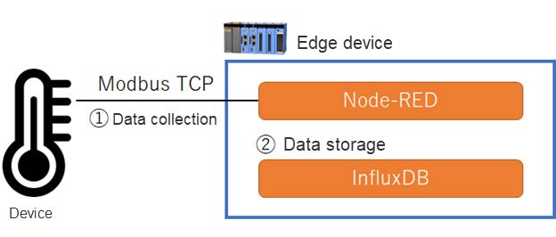

The flow involves 2 events:

1. Data collection

   Edge device collects data from the external device over Modbus TCP using Node-RED.
2. Data storage

   Edge device stores the collected data in InfluxDB.


## Supported devices

This example can be performed on the following devices:

- e-RT3 Plus F3RP70-2L1 (Ubuntu 18.04 32-bit)
- Raspberry Pi 4 Model B (Ubuntu Server 20.04 32-bit)

The `armhf` architecture package runs on these devices.

## Getting started

To get started, you must follow these steps to retrieve and store data in the Edge device over Modbus TCP communication.

   1. [Installing Node.js and Node-RED](#installing-nodejs-and-node-red)
   2. [Installing custom nodes on Node-RED](#installing-custom-nodes-on-node-red)
   3. [Configuring InfluxDB settings](#configuring-influxdb-settings)
   4. [Configuring Modbus server](#configuring-modbus-server)
   5. [Creating data collection flow](#creating-data-collection-flow)
   6. [Creating data storage flow](#creating-data-storage-flow)
  
### Installing Node.js and Node-RED

> **Note**: If the Edge device is in proxy environment, configuring proxy settings for [Linux](https://github.com/Yokogawa-Technologies-Solutions-India/e-RT3-docs/blob/master/Articles/Azure/Send-telemetry-data-from-e-RT3-to-azure-IoT-hub.md#proxy-settings) and [npm](#npm-proxy-settings) is mandatory.

Follow these steps to install Node.js and Node-RED on the Edge device:

1. To install Node.js run the following command.

    ```bash
    curl -fsSL https://deb.nodesource.com/setup_14.x | sudo -E bash - 
    sudo apt-get install -y nodejs
    ```

2. You can verify installation of Node.js by using the following command.

    ```bash
    node -v
    ```

   If Node. js is installed successfully then the version of the Node will be displayed as shown below.

    ```bash
    v14.17.1
    ```

3. Run the following command and install Node-RED.

    ```bash
    sudo npm install -g --unsafe-perm node-red
    ```

   If the command is executed successfully, the following output is displayed.

    ```bash
    + node-red@2.2.0
    added 286 packages from 375 contributors in 142.031s
    ```

### Installing custom nodes on Node-RED

To communicate via Modbus TCP protocol, the following custom nodes must be installed on Node-RED:

- `node-red-contrib-influxdb`
- `node-red-contrib-modbus`

Follow these steps to install the custom nodes on Node-RED:

1. Run the following command in the Edge device and start Node-RED.

    ```bash
    node-red
    ```

2. After starting Node-RED, in the address bar of your Internet browser, specify the following URL, `<IP_ADDRESS_OF_EDGE_DEVICE>:1880` and open Node-RED.

3. In the upper-right corner of the screen, click the **Menu** icon and select **Manage palette**.
    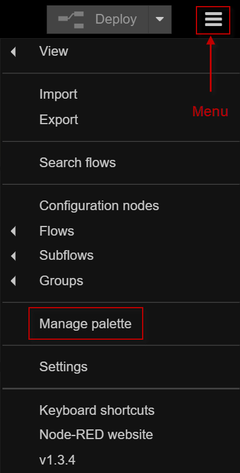

   The *User Settings* dialog box appears.

4. On the **Install** tab, in the search box, type `node-red-contrib-influxdb`.

    The search results appear.
    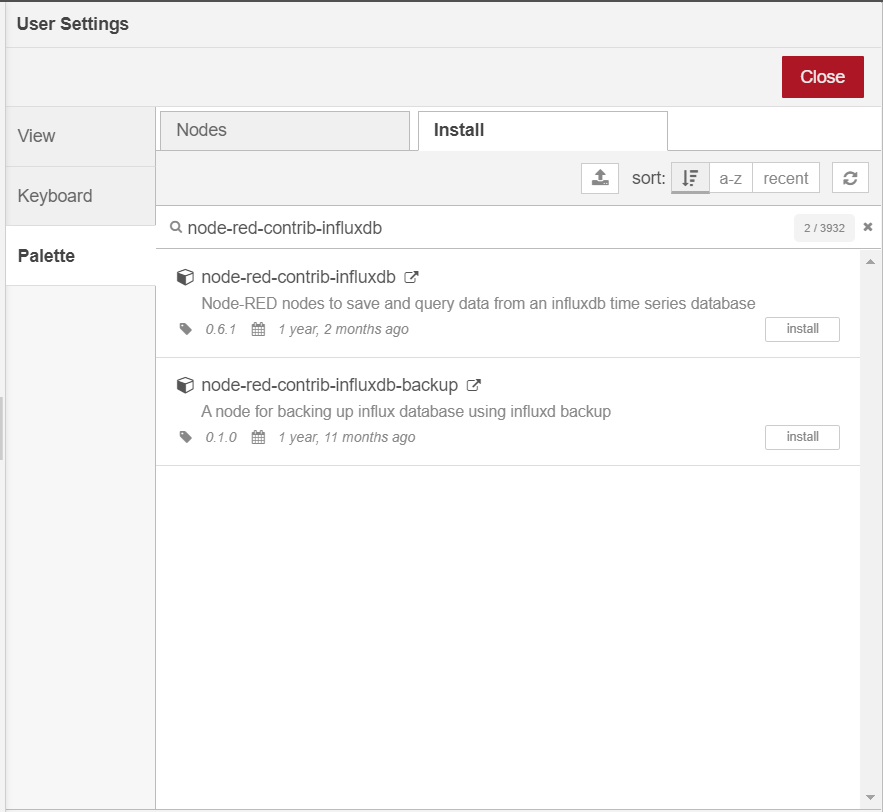

5. Click **Install** to  install the corresponding node.

    > **Note**: Perform steps 4-5 to install the `node-red-contrib-modbus node`.

    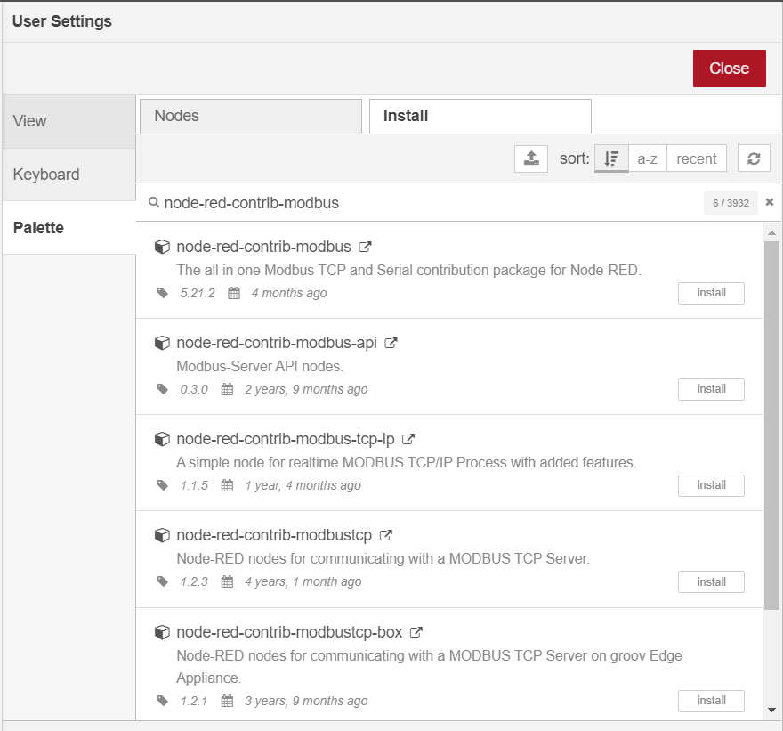

### Configuring InfluxDB settings

You can follow the steps described in this [article](https://github.com/Yokogawa-Technologies-Solutions-India/e-RT3-docs/blob/master/Articles/Modbus-TCP-Connection/Modbus_InfluxDB_Grafana.md#installing-influxdb) to install InfluxDB. (Installation of Python package is not required.) And then, follow the steps described in this [section](https://github.com/Yokogawa-Technologies-Solutions-India/e-RT3-docs/blob/master/Articles/Modbus-TCP-Connection/Modbus_InfluxDB_Grafana.md#configuring-the-database) to create a database with its name as `noderedDB`.

### Configuring Modbus server

In this article, we will start the Modbus server on the computer to simulate a device such as a sensor that sends data to the Edge device. To do so, start the program described in this [link](https://github.com/Yokogawa-Technologies-Solutions-India/e-RT3-docs/blob/master/Articles/Modbus-TCP-Connection/Modbus_InfluxDB_Grafana.md#configuring-modbus-server).

### Creating data collection flow

Let us create a flow to collect data from the Modbus server every 5 seconds. In this example, we collect two time-series data values stored in the holding register of the server.


Follow these steps to create the data collection flow:

1. From the left menu, drag-and-drop **Modbus-Read** node and double-click it to configure its properties.
   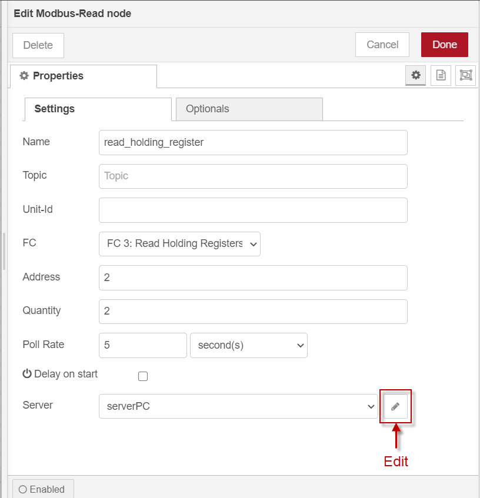
2. Configure the properties of the node as follows.


   | Setting name | Setting value |
   |---|:---|
   |Name|read_holding_register|
   |FC|FC 3: Read Holding Registers|
   |Address|2|
   |Quantity|2|
   |Poll Rate|5 seconds|

3. Next to the **Server** box, click the **Edit** icon.
   
   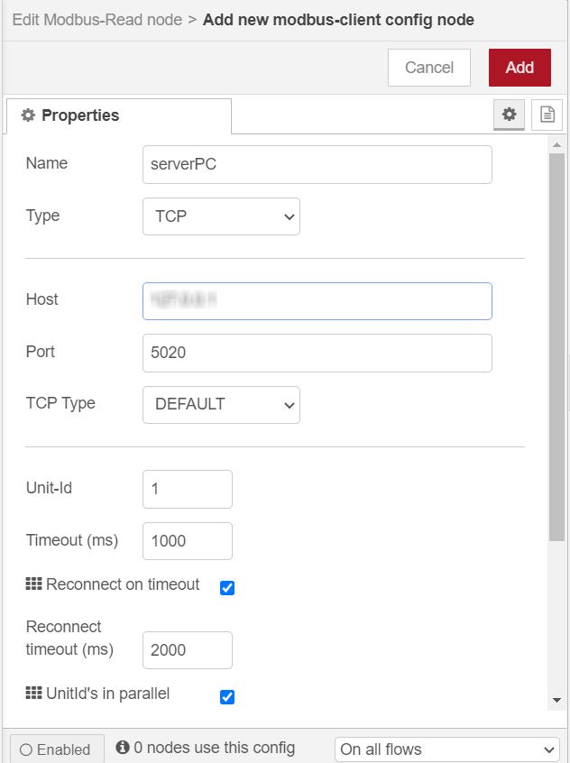
4. Configure the properties of the Modbus server as follows and then click **Add**.


   | Setting name | Setting value |
   |---|:---|
   |Name|serverPC|
   |Type|TCP|
   |Host|IP address of the computer on which Modbus server is running|
   |Port|5020|

5. After configuring the settings, click **Done**.
6. To check if the data is collected successfully, perform these steps:
   1. Drag-and-drop the **debug** node.
    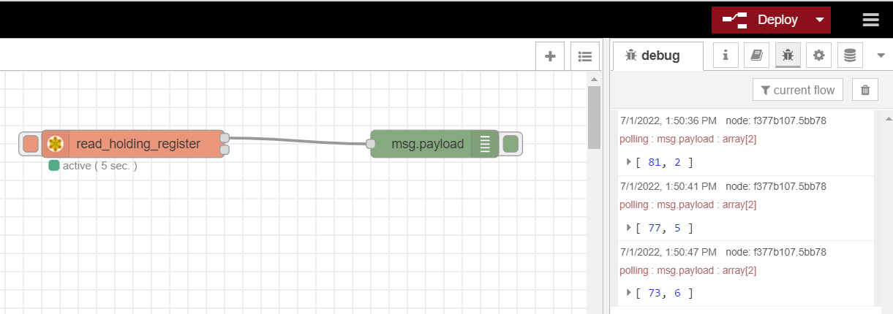
   2. Connect the debug node to the upper connection of the  **read_holding_register**, and then click **Deploy**.
   3. Click the **debug** tab on the right pane.
   If the collected data is displayed as shown in the image below, it is successful.
      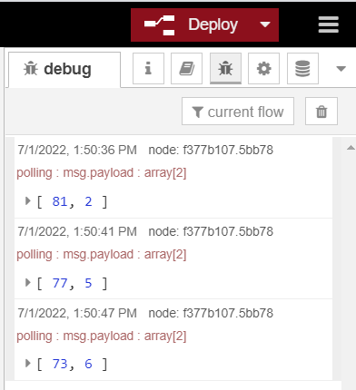

### Creating data storage flow

Now that we are able to collect data through the Modbus server, we proceed to configure a data storage flow to store the collected data in InfluxDB.

Follow these steps to create the data storage flow:

1. From the left menu, drag-and-drop the **function** node and double-click it to configure its properties.
   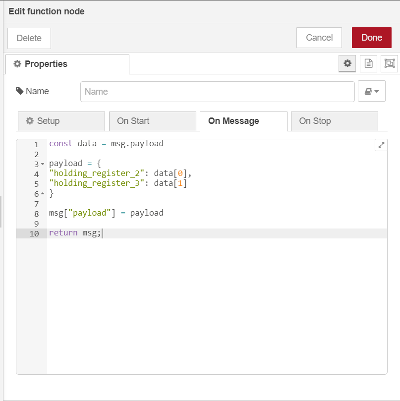
2. Select the **On Message** tab and write the following program to process the array of collected data into the standard JSON format.

    ```bash
    const data = msg.payload
    payload = {
    "holding_register_2": data[0],
    "holding_register_3": data[1]
    }
    msg["payload"] = payload
    return msg;
    ```

3. Click **Done**.
4. Drag-and-drop the **influxdb out** node to store data in InfluxDB and double-click it to configure its settings.

   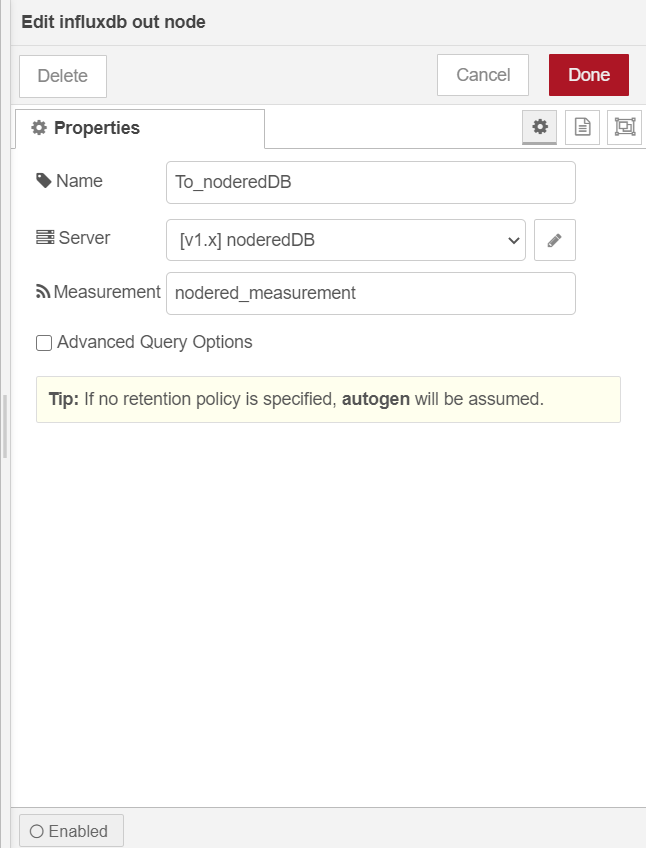
5. Configure the properties of the node as follows.

   | Setting name | Setting value |
   |---|:---|
   |Name|To_noderedDB|
   |Measurement|nodered_measurement|

6. Next to the **Server** box, click the **Edit** icon.

   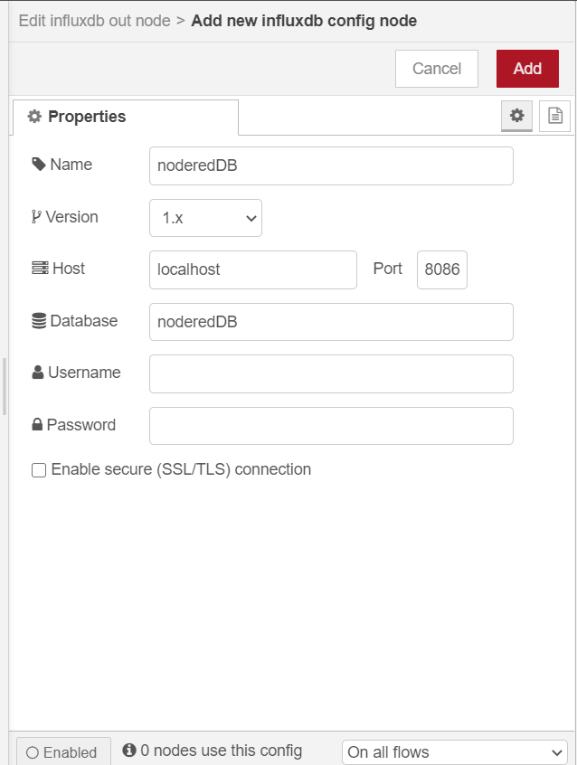
7. Configure the properties of the InfluxDB server as follows and then click **Add**.

   | Setting name | Setting value |
   |---|:---|
   |Name|noderedDB|
   |Host|localhost|
   |Port|8086|
   |Database|noderedDB|
8. After configuring the settings, and click **Done**.
9. Connect the nodes as shown below and click **Deploy**.
   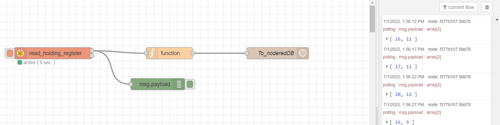

10. After waiting for a while, run the following commands in the Edge device and verify the contents of the database:
    1. Launch InfluxDB.

        ```bash
        influx 
        ```

        The following output is displayed if InfluxDB is launched successfully.

        ```bash
        Connected to http://localhost:8086 version 1.8.10
        InfluxDB shell version: 1.8.10
        ```

    2. Run the following command to select the `noderedDB` database.

        ```bash
        > USE noderedDB
        ```

        If the database selection is successful, the following output is displayed.

        ```bash
        Using database noderedDB
        ```

    3. Run the following command to view the stored data.

        ```bash
        > SELECT * FROM "nodered_measurement" LIMIT 3
        ```

        Storage is successful if data is stored as shown below.

        ```bash
        name: nodered_measurement
        time holding_register_2 holding_register_3
        ---- ------------------ ------------------
        1643782593448526154 93 24
        1643782598683263519 99 22
        1643782603803351763 100 20
        ```

## Conclusion

As demonstrated in the article, it is possible to create visual data applications with minimal programs. In conjunction with Node-RED and InfluxDB, e-RT3 Plus is able to collect and store data from external data sources by using Modbus TCP communication.
You can learn more about visualizing the collected data on Grafana from our [previous article](https://github.com/Yokogawa-Technologies-Solutions-India/e-RT3-docs/blob/master/Articles/Modbus-TCP-Connection/Modbus_InfluxDB_Grafana.md).

## Additional information

### npm proxy settings

If the device is in proxy environment, run the following command to configure the proxy settings of npm.

```bash
sudo npm -g config set proxy http://{username}:{password}@{proxy-server-url}:{port}
sudo npm -g config set https-proxy https://{username}:{password}@{proxy-server-url}:{port}
```

## References

1. [AI platform for industries | Yokogawa Electric Corporation](https://www.yokogawa.com/solutions/products-platforms/control-system/ert3-embedded-controller/#Overview)
2. [distributions/README.md at master · nodesource/distributions · GitHub](https://github.com/nodesource/distributions/blob/master/README.md)
3. [Running Node-RED locally](https://nodered.org/docs/getting-started/local)