# Achieving AI Prediction using e-RT3 Plus

## Introduction

Artificial Intelligence (AI) has fundamentally revolutionized the way we work and communicate. The intensifying global competition has led to widescale adoption of AI in industrial processes and manufacturing. Anticipating the changing market trends, e-RT3 Plus was designed to cater to the rising demand for smart edge devices. Apart from being a versatile device that can be utilized for multiple use-cases, the e-RT3 Plus device provides a platform for AI applications. The device is equipped to fulfill the elementary purpose of AI, which aims to predict future outcomes and deliver data-driven solutions.

The aim of this article is to demonstrate how to use AI applications on e-RT3 Plus. To do this, we take one of the most well-known machine learning examples - the classification of Iris flowers based on its sepal and petal dimensions, and use the AI abilities of e-RT3 Plus to correctly predict the variety of an Iris flower.

The simulation and prediction is achieved by using open source tools and free software, such as Node-RED, InfluxDB, Grafana, and Modbus. Modbus is a communication protocol used for transmitting information between electronic devices over serial lines or Ethernet, and is commonly used in process and factory automation.

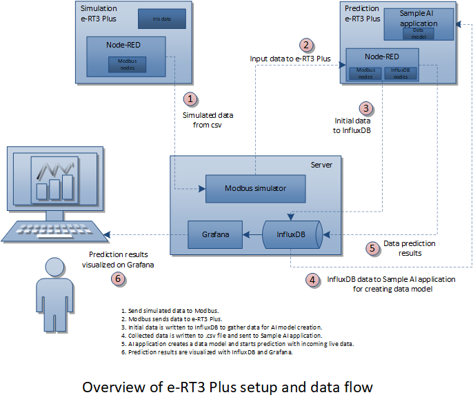

The above figure displays two e-RT3 Plus devices. The first e-RT3 Plus has been referred to as simulation e-RT3 Plus and the second has been referred to as prediction e-RT3 Plus. In addition, it shows the Server PC on which InfluxDB, Grafana, and the Modbus Slave Simulator are installed.

The simulation e-RT3 Plus hosts a .csv file, containing the Iris dataset for simulation. This is a sample dataset used for demonstration purposes only. You can replace this dataset with any other dataset based on your requirements.

The simulation e-RT3 Plus sends the Iris data to the prediction e-RT3 plus by using the Modbus Slave Simulator.

The prediction data model is created by using the [Sample AI application](https://github.com/Yokogawa-Technologies-Solutions-India/e-RT3-docs/blob/master/Articles/AI/Sample_AI_Application.md). This application is run on the prediction e-RT3 Plus.

In the prediction e-RT3 Plus, a Node-RED flow is configured to read the incoming data. A prediction algorithm in the sample AI application is used to predict the class of the Iris flower. The predicted values are then written into InfluxDB.

The Iris dataset can be replaced with any other dataset, or you can do away with the dataset completely, and instead connect it to a sensor setup to stream live data. Similarly, the AI application can also be modified according to your requirements. Basically, the setup must include an AI application and a data source.

## Workflow

The following figure shows the workflow for collecting and visualizing data by using InfluxDB and Grafana with Node-RED.

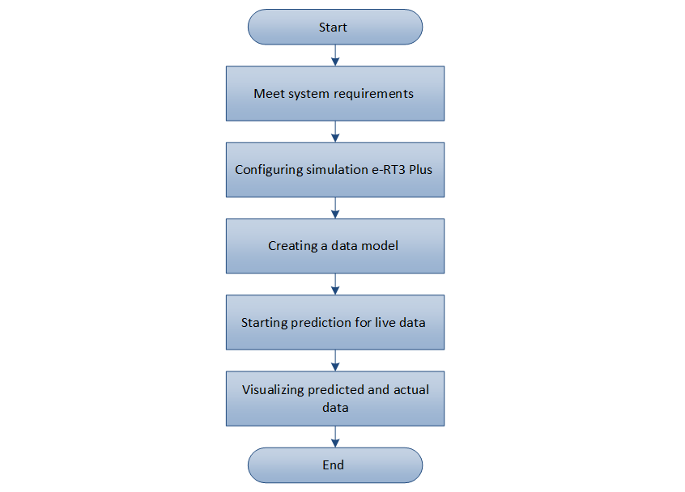

---

## Prerequisites

You must have a working knowledge of the e-RT3 Plus components and its setup. You must also be aware of how to use InfluxDB, Grafana, and Node-RED.

Before you start creating a Node-RED flow, the following requirements must be met:

1. Complete the necessary hardware connections.
2. A processed dataset for AI prediction must be available in .csv format. Here, we use the [Iris dataset](https://archive.ics.uci.edu/ml/datasets/iris), however, any other dataset can be used in its place. The intention is to have valid data to enable prediction.
    > **NOTE**: The processed dataset file must not have any null, strings, objects, or any categorical data.
3. A sample AI application must be available for use.
     > **NOTE**: For more information about the Sample AI application, refer to [Deploying a sample AI application on e-RT3 Plus](https://github.com/Yokogawa-Technologies-Solutions-India/e-RT3-docs/blob/master/Articles/AI/Sample_AI_Application.md).

4. [Node-RED and modbus nodes](#installing-node-red-and-modbus-nodes) must be installed on both e-RT3 Plus devices.
5. [Modbus Slave Simulator, InfluxDB, and Grafana](#installing-modbus-slave-simulator-influxdb-and-grafana-on-the-server), must be installed on the server.
6. [InfluxDB nodes](#installing-influxdb-nodes) must be installed on the prediction e-RT3 Plus.

### Installing Node-RED and Modbus nodes

Both the simulation e-RT3 Plus and prediction e-RT3 Plus are configured using Node-RED flows. Therefore, Node-RED must be installed on both devices.

For more information about how to install Node-RED on the e-RT3 Plus device, refer to [Leveraging e-RT3 Plus capabilities using Node-RED](https://github.com/Yokogawa-Technologies-Solutions-India/e-RT3-docs/blob/master/Articles/Node-RED/Leveraging-e-RT3-Plus-capabilities-using-Node-RED.md#install-node-red-and-m3io-nodes).

Since Modbus is used for both sending and receiving the simulated data, the Modbus nodes must be installed on both the e-RT3 Plus devices.

Follow these steps to install Modbus nodes in Node-RED:

1. Open an SSH terminal to the e-RT3 Plus device.

    For more information about connecting to e-RT3 Plus using SSH, refer to [Remote Communication with e-RT3 Plus](https://github.com/Yokogawa-Technologies-Solutions-India/e-RT3-docs/blob/master/Articles/e-RT3/Communication-with-e-RT3-Plus.md#communicating--with-e-rt3-plus-by-ssh).

2. Run the following command in the terminal to install the Modbus nodes.

    ```bash
    cd /node_red
    sudo npm install --force serialport@8.0.8 node-red-contrib-modbus@5.13.3
    ```

    The Modbus nodes are installed.

### Installing Modbus Slave Simulator, InfluxDB, and Grafana on the server

#### Installing Modbus Slave Simulator

Follow these steps to install and run Modbus Slave Simulator on the server PC:

1. Download and install the Modbus Slave Simulator from the [Modbus website](https://www.modbusdriver.com/diagslave.html).

2. Open Command Prompt.

3. Use the `cd` command to navigate to the directory where you installed the Modbus Slave Simulator.

4. Run the following command to start the Modbus/TCP server.

    ```bash
    diagslave -m tcp 
    ```

The Modbus Slave Simulator server is started and begins listening to the network.

#### Installing Grafana and Influx DB

To learn how to install InfluxDB and Grafana, refer to [Install InfluxDB and Grafana on the server PC](https://github.com/Yokogawa-Technologies-Solutions-India/e-RT3-docs/blob/master/Articles/Node-RED/Leveraging-e-RT3-Plus-capabilities-using-Node-RED.md#install-influxdb-and-grafana-on-the-server-pc).

### Installing InfluxDB nodes

InfluxDB nodes must be installed in Node-RED of the prediction e-RT3 Plus. The prediction e-RT3 Plus device writes data to InfluxDB.

For more information about how to install InfluxDB nodes in Node-RED, refer to [Install InfluxDB nodes](https://github.com/Yokogawa-Technologies-Solutions-India/e-RT3-docs/blob/master/Articles/Node-RED/Leveraging-e-RT3-Plus-capabilities-using-Node-RED.md#install-influxdb-nodes).

## Getting started

Now that the setup is ready, let us start creating the flows in Node-RED to send simulated data using Modbus simulator. We will use this data to predict the class of the Iris flower. The prediction data along with actual data can be visualized in Grafana.

This can be achieved by completing the following steps:

1. [Configuring simulation e-RT3 Plus](#configuring-simulation-e-rt3-plus)
2. [Creating data model](#creating-data-model)
3. [Starting live data prediction](#starting-live-data-prediction)
4. [Visualizing the predicted and actual data using Grafana](#visualizing-predicted-and-actual-data-using-grafana).

### Configuring simulation e-RT3 Plus

The simulation e-RT3 Plus must be configured to send random data at regular intervals. Data is sent from the dataset in the .csv file to Modbus simulator.

Configuring the simulator involves the following steps:

1. [Read data from the .csv file](#read-data-from-the-csv-file).
2. [Periodically send sample Iris data to Modbus](#send-sample-iris-data-to-modbus-periodically).

These two steps are implemented as two Node-RED flows in the simulation e-RT3 Plus.

#### Read data from the .csv file

We will first create a Node-RED flow to convert .csv data into a format that the Modbus can read. The Modbus reads the data from the .csv file and transmits the same to the prediction e-RT3 Plus.

Follow these steps to create the flow:

1. Copy the sample Iris data set `iris_data_target.csv` to the following location in the simulator e-RT3 Plus by using WinSCP:

    ```bash
    /home/ert3/datasets/
    ```

    > **NOTE**: You can upload your own dataset here instead of the Iris dataset.

    For more information about how to use WinSCP for file transfer, refer to [Using WinSCP to transfer files to e-RT3 Plus](https://github.com/Yokogawa-Technologies-Solutions-India/e-RT3-docs/blob/master/Articles/AI/Sample_AI_Application.md#appendix).

2. Specify the following URL in the address bar of your web browser:

    ```bash
    {SIMULATOR_ERT3_IP_ADDRESS}:{NODE_RED_PORT_NUMBER}
    ```

    > **NOTE**: The default port number is 1880.

    The *Node-RED login* page appears.
3. Log on to the editor by using your user credentials.

    The Node-RED editor appears.
4. To inject data from the .csv file into the flow, perform these steps:

    a. On the left pane, expand **common**, select the **inject** node, and drag it to the work area.

    b. Double-click the created node.

    The properties of the selected node are displayed on the right pane.
    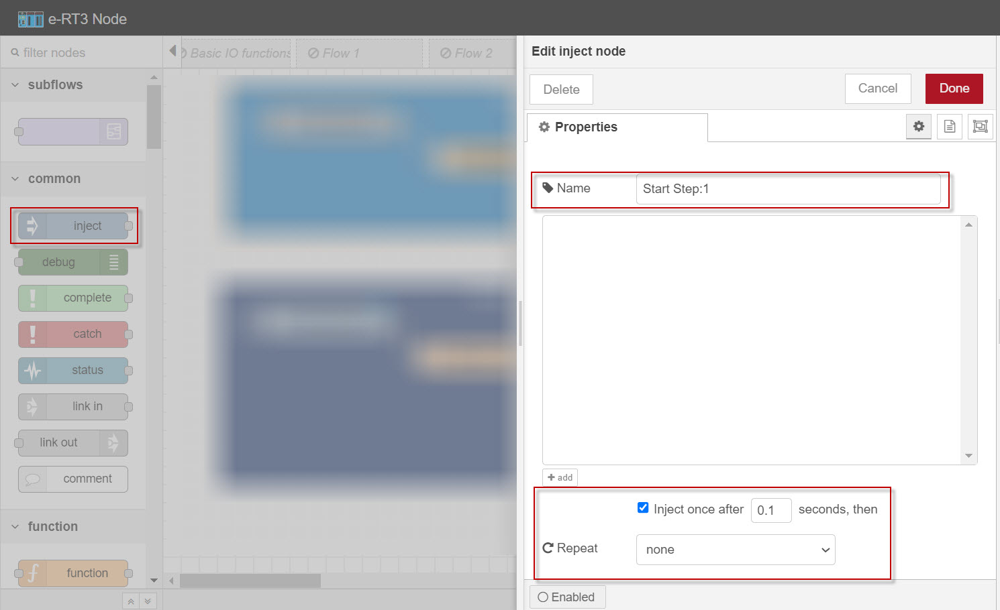

    c. In the **Name** box, specify the name of the node.

    d. Select the **inject once after** check box and specify the interval as 0.1 seconds for the data to be injected automatically.

    e. From the Repeat drop-down list, select **none**.

    f. In the upper-right corner of the page, click **Done** to save the changes.

5. To read the contents of the .csv file, perform these steps:

    a. On the left pane, expand **storage**, select the **file in**  node, and drag it to the work area.

    b. Double-click the created node.

    The properties of the selected node are displayed on the right pane.
    

    c. In the **Filename** box, specify the absolute path of the Iris dataset in the simulation e-RT3 Plus.

    d. From the Output drop-down list, select **a single utf8 string**.

    e. From the Encoding drop-down list, select **default**.

    f. In the **Name** box, specify the name of the node.

    g. In the upper-right corner of the page, click **Done** to save the changes.

6. To convert the csv data string into an object, perform these steps:

    a. On the left pane, expand **parser**, select the **csv** node, and drag it to the work area.

    b. Double-click the created node.

    The properties of the selected node are displayed on the right pane.
    

    c. In the **Name** box, specify the name of the node.

    d. From the Separator drop-down list, select **comma**.

    e. Select the **first row contains column names** check box.

    f. Select the **parse numerical values** check box.

    g. From the Output drop-down list, select **a single message [array]**.

    h. In the upper-right corner of the page, click **Done** to save the changes.

7. To make the converted .csv data available for reading in the current flow context, perform these steps:

    a. On the left pane, expand **function**, select the **function** node, and drag it to the work area.

    b. Double-click the created node.

    The properties of the selected node are displayed on the right pane.
    
    c. In the **Name** box, specify the name of the node.

    d. Click the **Function** tab and type the following code in the editor.

    ```bash
    flow.set("all_csv_data", msg.payload);
    msg = {}
    return msg;
    ```

    e. In the upper-right corner of the page, click **Done** to save the changes.

8. Use connectors to connect all the nodes. The final flow should look something like this:

    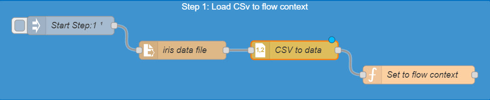
9. On the menu bar, click **Deploy** to activate the flow.

    The data from the dataset is set to the flow context.

#### Send sample Iris data to Modbus periodically

Now, we will create another Node-RED flow to send sample Iris data to the Modbus node periodically.

Follow these steps to create the Node-RED flow:

1. To inject data at a specified time interval, perform these steps:

    a. On the left pane, expand **common**, select the **inject** node, and drag it to the work area.

    b. Double-click the created node.

    The properties of the selected node are displayed on the right pane.

    

    c. In the **Name** box, specify the name of the node.

    d. Select the **inject once after** check box and specify the interval as 10 seconds.

    e.  From the Repeat drop-down list, select **interval** and set the interval as 10 seconds.

    f. In the upper-right corner of the page, click **Done** to save the changes.

2. To create a function that randomly selects a row of the Iris data, transforms it into an array and sends it to the Modbus Write node, perform these steps:

    a. On the left pane, expand **function**, select the **function** node and drag it to the work area.

    b. Double-click the created node.

    The properties of the selected node are displayed on the right pane.

    c. In the **Name** box, specify the name of the node.

    d. Click the **Function** tab, and type the following code in the editor to create an array of the dataset, which will be sent to Modbus Write node.

    ```bash
    const csvAsArray = flow.get("all_csv_data");
    /* get random index value */
    const randomIndex = Math.floor(Math.random() * csvAsArray.length);
    /* get random item */
    const item = csvAsArray[randomIndex];
    const values = Object.keys(item || {}).map(function (key) {
        const value = item[key]
        return key == "Target"?value : Math.floor(value * 100);
    });
    msg = {
        topic: "Iris Dataset",
        payload: values
    }
    return msg;
    ```

    > **NOTE**: Since Modbus only accepts integers, the values are multiplied by 100 to convert float values to integers.

    e. In the upper-right corner of the page, click **Done** to save the changes.

3. To write the data received at the node input to the Modbus Slave, perform these steps:

    > **Note**: This node is configured with the IP address of the Modbus Slave to indicate where the data must be sent. The address of the registers, as well as the size of data being sent, is specified in the node.

    a. On the left pane, expand **modbus**, select the **Modbus Write** node, and drag it to the work area.

    b. Double-click the created node.

    The properties of the selected node are displayed on the right pane.

    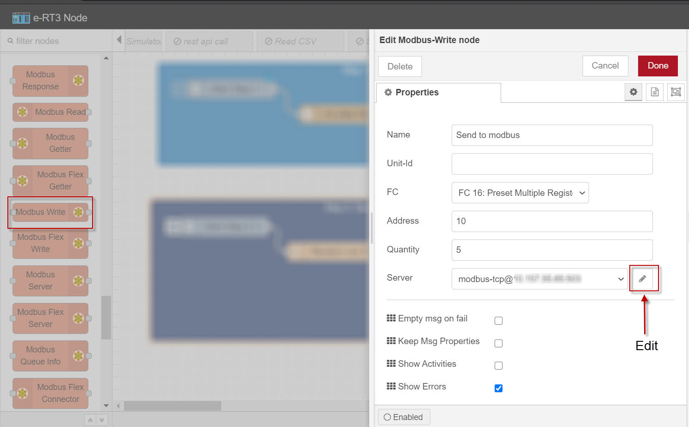

    c. In the **Name** box, specify the name of the node.

    d.  From the FC drop-down list, select **FC 16: Preset multiple Registers**.

    e. In the **Address** box, specify any address greater than zero.

    f. In the **Quantity** box, specify 5 since the dataset has four independent variables and one target variable.

    g. Next to the **Server** drop-down list, click the **Edit** icon and specify the following:

        Type:   TCP
        Host:   {SERVER_PC_IP_ADDRESS}
        Port:   Specify the Modbus Slave Simulator port number. The default port number is 502.

    h. Select the **Show Errors** check box.

    i. In the upper-right corner of the page, click **Done** to save the changes.

4. To get the output message, on the left pane, select the **debug** node and drag it onto the work area twice.  Use connectors to connect all the nodes. The final flow should look something like this:

    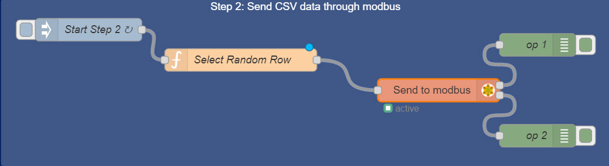
5. On the menu bar, click **Deploy** to activate the flow.

    Data from the Iris dataset is transmitted to the Modbus Slave Simulator.
6. In the upper-right corner of the e-RT3 Node window, click the **Debug** tab.

    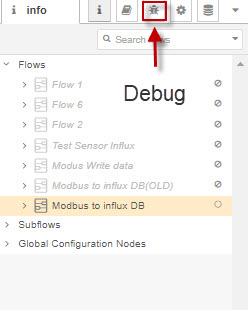
    
    Debug messages appear at an interval of 10 seconds in the Debug window.

The simulation e-RT3 Plus device is configured and running. Data from the .csv file is periodically sent to the Modbus Slave.

### Creating data model

A data model is created in the prediction e-RT3 Plus to enable the device to accept live data and make predictions.

This is done in three steps:

1. [Write the incoming Modbus data into Influx DB](#write-the-incoming-modbus-data-into-influx-db)
2. [Exporting the data from InfluxDB to a .csv file](#exporting-the-data-from-influxdb-to-a-csv-file)
3. [Using the .csv file in the Sample AI application to create a data model](#using-the-csv-file-in-the-sample-ai-application-to-create-a-data-model)

#### Write the incoming Modbus data into Influx DB

Follow these steps to create a flow that writes the incoming Modbus data into Influx DB:

1. Type the following URL in the address bar of your web browser:

    `{PREDICTION_ERT3_IP_ADDRESS}:{NODE_RED_PORT_NUMBER}`

    > **NOTE**: The default port number is 1880.

    The *Node-RED* *login* page appears.
2. Log on to the editor by using your user credentials.

    The Node-RED editor appears.

3. To read the data that is being sent by the Modbus Slave, perform these steps:

    >**Note**: In this node, the IP address and the register details of the Modbus Slave are specified to identify the data source. The configured node will read the data sent by the Modbus Slave and forward it to the next node.

    a. On the left pane, expand **modbus**, select the **Modbus Read** node, and drag it to the work area.

    b. Double-click the created node.

    The properties of the selected node are displayed on the right pane.

    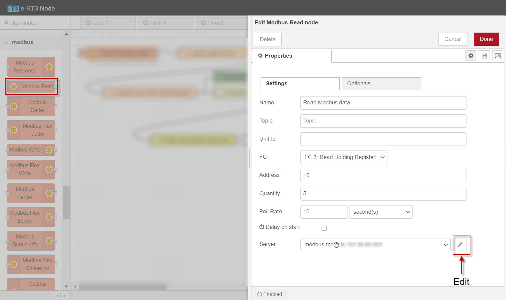

    c. In the **Name** box, specify the name of the node.

    d. From the FC drop-down list, select **FC 3: Read Holding Registers**.

    e. In the **Address** box, specify the address given while creating the Modbus Write node in the previous flow.

    f. In the **Quantity** box, specify 5 since the data being sent has four independent variables and one target variable.

    g. In the **Poll Rate** box, specify the interval as 10 seconds.

    h. Next to the **Server** drop-down list, click the **edit** icon and specify the following:

        Type: TCP
        Host: {SERVER_PC_IP_ADDRESS}
        Port: Specify the Modbus Slave Simulator port number. The default port number is 502.

    i. In the upper-right corner of the page, click **Done** to save the changes.

4. To format the data received at the node input for writing into InfluxDB, perform these steps:

    a. On the left pane, expand **function**, select the **function** node, and drag it to the work area.

    b. Double-click the created node.

    The properties of the selected node are displayed on the right pane.

    c. In the **Name** box, specify the name of the node.

    d. Click the **Function** tab, and type the following code in the editor to get the array received by the simulator:

    ```bash
    const dataArray = msg.payload
       
    payload = {
        'Sepal_length': dataArray[0] / 100,
        'Sepal_width': dataArray[1] / 100,
        'Petal_length': dataArray[2] / 100,
        'Petal_width': dataArray[3] / 100,
    }


    msg["payload"] = payload
    msg["data"] = { 
        'Actual_Target' : dataArray[4],
        'Features' : {...payload}
    }
    return msg;
    ```

    > **NOTE**: The values are divided by 100 to convert the integers back to float values.

    e. In the upper-right corner of the page, click **Done** to save the changes.

5. To combine the features and the actual target sent by the previous node, into a single object to be written to InfluxDB. perform these steps:

    a. On the left pane, expand **function**, select the **function** node, and drag it to the work area.

    b. Double-click the created node.

    The properties of the selected node are displayed on the right pane.

    c. In the **Name** box, specify the name of the node.

    d. Click the **Function** tab and type the following code in the editor:

    ```bash
    const features = msg.data.Features
    const target = msg.data.Actual_Target

    const payload = {
        ...features,
        'target': target
    }

    msg["payload"] = payload

    return msg;
    ```

    e. In the upper-right corner of the page, click **Done** to save the changes.

6. To write the input data to the specified InfluxDB database, perform these steps:

    a. On the left pane, expand **storage**, select the **influxdb out** node, and drag it to the work area.

    b. Double-click the created node.

    The properties of the selected node are displayed on the right pane.

    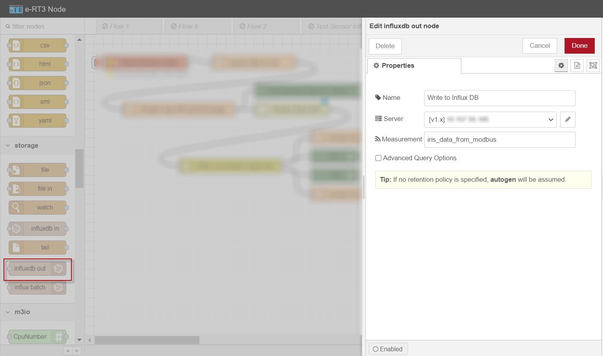

    c. In the **Name** box, specify the name of the node.

    d. Next to the **Server** drop-down list, click the **edit** icon and specify the following:

        Version: TCP
        Host: {SERVER_PC_IP_ADDRESS}
        Port: The default port number is 8086.
        Database: The name of the created InfluxDB database.
        Measurement: Name of measurement. 

    > **NOTE**: The `Name of measurement` and `Database name` must be noted for future use. It will be used later to query data in Grafana and for exporting the data in InfluxDB to a .csv file.
  
    e. In the upper-right corner of the page, click **Update**.

    f. In the upper-right corner of the page, click **Done** to save the changes.

    > **NOTE**: For more information about how to create an InfluxDB database, refer to [Create InfluxDB database](https://github.com/Yokogawa-Technologies-Solutions-India/e-RT3-docs/blob/master/Articles/Node-RED/Leveraging-e-RT3-Plus-capabilities-using-Node-RED.md#create-influxdb-database).

7. Use connectors to connect all the nodes in the following manner.

    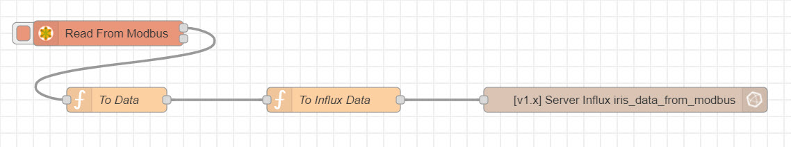

8. On the menu bar, click **Deploy** to activate the flow.

   The incoming data is written to InfluxDB.

#### Exporting the data from InfluxDB to a .csv file

The InfluxDB data must be exported to a .csv file that will be used by the AI application.

Follow these steps to export the InfluxDB data to a .csv file:
> **NOTE**: Docker must be running on the server PC.

1. Open Command Prompt on the server PC.
2. Run the following command to get the docker name.

    ```bash
    docker ps 
    ```

    A table appears, listing the active containers in Docker.
3. Locate the InfluxDB Docker container and run the following command to start communicating with InfluxDB.

    ```bash
    docker exec -it {INFLUXDB_NAME} bash    
    ```

    Here, `{INFLUXDB_NAME}` is the name of the InfluxDB container obtained from the previous step.

4. Run the following command to export the required data from InfluxDB to a .csv file.

    ```bash
    influx -database "{CREATED_DB_NAME}" -execute 'SELECT * FROM "{REQUIRED_MEASUREMENT_NAME}"' -format 'csv' > /var/lib/influxdb/{CSV_FILE_NAME}.csv
    ```

    Here, `{CREATED_DB_NAME}` refers to the name specified while creating the DB in InfluxDB, `{REQUIRED_MEASUREMENT_NAME}` refers to the name specified for the measurement while writing the data into the DB, and  `{CSV_FILE_NAME}` refers to the name of the .csv file to be created.

5. Run the following command to exit the InfluxDB container.

   ```bash
   exit
   ```

6. In the terminal, use the `cd` command to navigate to the folder where you want to store the .csv file.
7. Run the following command to copy the .csv file to the current folder.

    ```bash
    docker cp {INFLUXDB_NAME}:/var/lib/influxdb/{CSV_FILE_NAME}.csv .
    ```

The .csv file containing the data exported from InfluxDB is created.

#### Using the .csv file in the Sample AI application to create a data model

The .csv file that contains the exported data is used for creating a data model in the Sample AI application.

For information about how to deploy a sample AI application and create a data model using a .csv dataset, refer to [Deploying a sample AI application on e-RT3 Plus](https://github.com/Yokogawa-Technologies-Solutions-India/e-RT3-docs/blob/master/Articles/AI/Sample_AI_Application.md).

> **Note**: The name of the data model generated in the Sample AI application must be noted. This will be used in the next flow to call the prediction algorithm through REST API.

Once the data model is created, we can start creating a flow for predicting the target class from the incoming data.

### Starting live data prediction

Now that the data model is created, we must create the prediction flow. For this, we will modify and extend the previous [Create data model](#creating-data-model) flow.

In the previous flow, we took care of the processing of incoming data and writing it into InfluxDB. Now, we will extend this flow to call a prediction algorithm in the Sample AI application using REST API. The modified flow will read the incoming live data, call the prediction algorithm, and write the predicted values into InfluxDB.

Follow these steps to start the prediction of the incoming live data:

1. Open the "Create data model" Node-RED flow.
2. Remove all node connectors.

   > **Note**: The nodes will be reordered to modify the flow.
3. To package the data to be sent to the prediction algorithm, perform these steps:

    >**Note**: In this node, we configure the name of the data model to be used, and the values of the Iris dataset. This information is sent as a single object to the next node, which will call the prediction algorithm by using REST API.

    a. On the left pane, select the **function** node, and drag it to the work area.

    b. Double-click the created node.

    The properties of the selected node are displayed on the right pane.

    c. In the **Name** box, specify the name of the node.

    d. Click the **Function** tab and type the following code in the editor to remove the `Target` value from the array before passing it to the prediction model.

    ```bash
    const iris_data = msg.payload

    const values = Object.keys(iris_data || {}).map(function (key) {
    return key != "Target"?iris_data[key]:undefined;
    });
    msg["payload"] = {
        "model_name":"<name_of_the_generated_model>",
        "feature_values":values.filter(Boolean)
    }    
    return msg;
    ```

    > **Note**: The model name specified here is the model name that was generated while creating the data model in the Sample AI application.

    e. In the upper-right corner of the page, click **Done** to save the pages.

4. To call the prediction algorithm is called using the REST API, perform these steps:

    >**Note**: This node sends a http request and returns the response.

    a. On the left pane, expand **network**, select the **http request** node, and drag it to the work area.

    b. Double-click the created node.

    The properties of the selected node are displayed on the right pane.

    

    c. From the Method drop-down list, select **POST**.

    d. In the **URL** box, specify the following path of the REST API that is used for prediction:

    ```bash
    http://{PREDICTION_ERT3_IP_ADDRESS}:9092/api/predictions  
    ```

    e. From the Return drop-down list, select **a parsed JSON object**.

    f. In the **Name** box, specify the name of the node.

    g. In the upper-right corner of the page, click **Done** to save the changes.

5. To checks whether the prediction call is successful, perform these steps:

    a. On the left pane, expand **function**, select the **switch** node, and drag it to the work area.

    b. Double-click the created node.

    The properties of the selected node are displayed on the right pane.

    

    c. In the **Name** box, specify the name of the node.

    d. In the **Property** box, select **msg** from the drop-down list and specify `statusCode` in the adjacent box.

    e. Click **add**, and specify the following to route the output to port 1 in the prediction failure case:

    ```bash
        != 200
    ```

    f. Click **add**, and specify the following to route the output to port 2 in the prediction success case:

    ```bash
        == 200
    ```

    g. From the drop-down list at the bottom of the page, select **stopping after first match**.

    h. In the upper-right corner of the *Properties* page, click **Done**.

6. To convert the input data into a format that can be written into InfluxDB, perform these steps:

    >**Note**: This node must be connected to port 2 of the switch node output to handle the success case.

    a. On the left pane, expand **function**, select the **function** node, and drag it to the work area.

    b. Double-click the created node.

    The properties of the selected node are displayed on the right pane.

    c. In the **Name** box, specify the name of the node.

    d. Click the **Function** tab and type the following code in the editor:

    ```bash
    const predicted_target = msg.payload.predicted_target
    const features_headers = msg.payload.features.headers
    const features_values = msg.payload.features.values
    const actual_target = msg.data.Actual_Target

    let payload = {}
    features_headers.forEach(function(val,index) {
    payload = {...payload, ...{
    [val.toLowerCase()]:features_values[index]
    }}
    })
    payload = {...payload, ...{
    "target":actual_target,
    "predicted_target":predicted_target
    }}

    msg.payload = payload
    return msg;
    ```

    e. In the upper-right corner of the page, click **Done** to save the changes.

7. On the left pane, select the **debug** node and drag it onto the work area. Set the debug node to show `msg.payload`.

8. Now we have all the necessary nodes on the work area. Use connectors to connect all the nodes. The final flow should look something like this.

    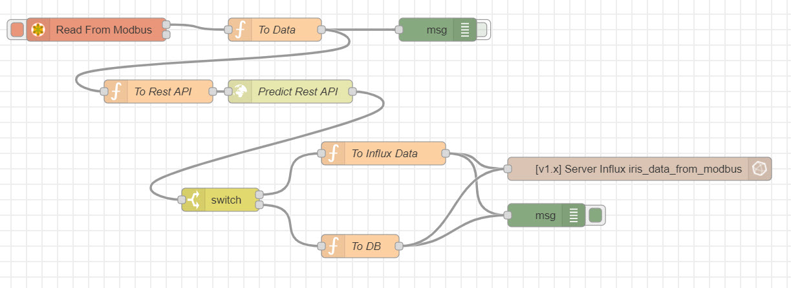

9. On the menu bar, click **Deploy** to activate the flow.

    The prediction e-RT3 Plus starts processing the incoming live data and the predictions are written into InfluxDB.

10. In the upper-right corner of the e-RT3 Node window, click the **Debug** tab.

    The debug pane appears, displaying the values written to InfluxDB.

### Visualizing predicted and actual data using Grafana

At this stage, InfluxDB receives data from the prediction e-RT3 Plus device. The next step is to display the data from InfluxDB using Grafana.

You can customize the dashboard by using various visualization tools. Moreover, you can plot graphs in different formats, against different parameters, and view multiple graphs simultaneously.

The following figure shows an example of how gauge plots, line plots, and bar plots are used to visualize the data:


For more information about how to configure Grafana and display timeseries data using its powerful graphics on a dashboard, refer to [Configure Grafana to display the data](https://github.com/Yokogawa-Technologies-Solutions-India/e-RT3-docs/blob/master/Articles/Node-RED/Leveraging-e-RT3-Plus-capabilities-using-Node-RED.md#configure-grafana-to-display-the-data).

Follow these steps to visualize data on Grafana:

1. Type the following URL in the address bar of your web browser:

    `{SERVER_PC_IP_ADDRESS}:{PORT_NUMBER}`

    The *Grafana* *login* page appears.

    > **NOTE**: The default port number is 3000.

2. Log on to Grafana by using your user credentials

    The *Grafana* *Home* page appears.

3. From the navigation menu on the left, click the **Settings icon**, and select **Configuration > Data Sources**.

4. Connect Grafana to InfluxDB.
5. Add panels to the dashboard as necessary.

    For more information on how to add and customize a panel, refer to [Grafana website](https://grafana.com/docs/grafana/latest/panels/add-a-panel/).
6. Configure your dashboard to suit your requirements.

   Once the configuration is complete, the data from InfluxDB is displayed according to the configured visualization settings.

For more information about how to configure the Dashboard and its data source, refer to [Connect Grafana to InfluxDB](https://github.com/Yokogawa-Technologies-Solutions-India/e-RT3-docs/blob/master/Articles/Node-RED/Leveraging-e-RT3-Plus-capabilities-using-Node-RED.md#connect-grafana-to-influxdb).

### Conclusion

This example lays the basic groundwork for creating custom AI solutions using e-RT3 Plus. You can explore this further by replacing simulated data with live data from sensors. Moreover, you can modify the dataset or create custom AI applications as necessary.

As demonstrated in this article, it is easy to create, deploy, and run AI applications on the e-RT3 Plus device.

---

### References

1. [Remote Communication with e-RT3 Plus](https://github.com/Yokogawa-Technologies-Solutions-India/e-RT3-docs/blob/master/Articles/e-RT3/Communication-with-e-RT3-Plus.md)
2. [Modbus Driver](https://www.modbusdriver.com/diagslave.html)
3. [Sending Telemetry Data from e-RT3 to the Cloud (Azure IoT hub)](https://github.com/Yokogawa-Technologies-Solutions-India/e-RT3-docs/blob/master/Articles/Azure/Send-telemetry-data-from-e-RT3-to-azure-IoT-hub.md)

---
