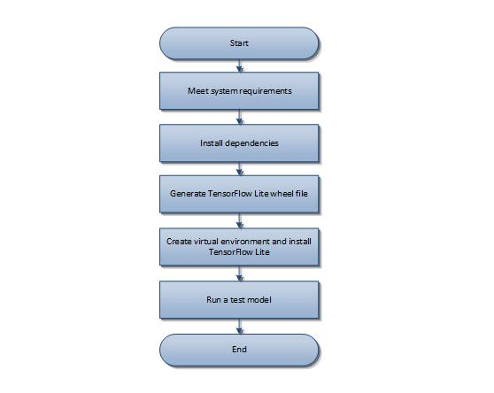

# Running a basic TensorFlow Lite model on e-RT3 Plus

## Introduction

In the [previous article](https://github.com/Yokogawa-Technologies-Solutions-India/e-RT3-docs/blob/master/Articles/Node-RED/BYOML_on_e-RT3_Plus.md), we explored how to run a pre-trained machine learning model on e-RT3 Plus by using Node-RED. Here, we explore how we can use the widely popular machine learning tool, TensorFlow Lite, on e-RT3 Plus. TensorFlow is an open-source software library for developing solutions in the field of machine learning and artificial intelligence. It is extensively used to create real-time solutions that involve image recognition, analytics, prediction, classification, and optimization, among others. TensorFlow Lite is a light-weight version of TensorFlow, which is specifically optimized for mobile, embedded, and IoT devices to reduce latency and power consumption. When used together with the e-RT3 Plus device, it opens up a wide range of opportunities to optimize industrial automation processes.

In this article, we demonstrate how to run a TensorFlow Lite model on e-RT3 Plus by using an open-source example from [GitHub](https://github.com/tensorflow/tensorflow/tree/master/tensorflow/lite/examples/python/#tensorflow-lite-python-image-classification-demo). This example uses a Python script  to run a pre-trained TensorFlow Lite model to recognize objects in the input image.


First, we download the TensorFlow repository and build a TensorFlow Lite image customized for e-RT3 Plus. Then, we install TensorFlow Lite on e-RT3 Plus. Next, we download the pre-trained model, Python script, and input image, and then customize the Python script for e-RT3 Plus. Finally, we run the script which uses the model to recognize objects in the input image.

The following figure shows the input image used in this example.


## Workflow

The following figure shows the workflow for running a TensorFlow Lite model on e-RT3 Plus.



## Prerequisites

The prerequisites for running a TensorFlow Lite model on e-RT3 Plus are as follows:

1. The e-RT3 Plus device
2. A computer to communicate with e-RT3 Plus

## Getting Started

Once you have your setup ready, follow these steps to run a TensorFlow Lite model on e-RT3 Plus:

   1. [Install dependencies](#install-dependencies)
   2. [Generate TensorFlow Lite wheel file from source code](#generate-tensorflow-lite-wheel-file-from-source-code)
   3. [Create virtual environment and install TensorFlow Lite](#create-virtual-environment-and-install-tensorflow-lite)
   4. [Run a test model](#run-a-test-model)

### Install dependencies

Before installing TensorFlow Lite, we must install the following dependencies:

1. CMake

    CMake is a platform agnostic and open-source software used for generating makefiles in a custom compiler environment.
2. pybind 11

    pybind11 is a library that is used for exposing C++ types in Python and vice versa.

Follow these steps to install CMake and pybind11:

1. Start PuTTY.
2. Log on to e-RT3 Plus.
3. To download and extract the CMake library, run the following commands.

   ```bash
   wget https://github.com/Kitware/CMake/releases/download/v3.17.1/cmake-3.17.1.tar.gz
   tar zxvf cmake-3.17.1.tar.gz
   ```

4. To build the libraries for running CMake, run the following commands.

    ```bash
    sudo apt update
    sudo apt install libssl-dev
    ```

5. To build the CMake library, run the following commands.

    ```bash
    cd cmake-3.17.1/
    ./bootstrap
    make
    ```

    >**Note**: It may take a while to build the CMake libraries.

6. To install CMake, run the following command.

    ```bash
    sudo make install
    ```

7. To confirm the installation, run the following command.

    ```bash
    cmake --version
    ```

    The CMake version is displayed, indicating that CMake is installed successfully.

8. To exit the `cmake-3.17.1` directory, run the following command.

    ```bash
    cd ..
    ```

9. To install pybind11, run the following command.

    ```bash
    sudo pip3 install pybind11
    ```

    pybind11 is installed.

### Generate TensorFlow Lite wheel file from source code

Since e-RT3 Plus is an Edge device, we must build a TensorFlow Lite wheel file from the TensorFlow source code.

>**Note**: The wheel file eliminates the need for recompiling the software during each installation cycle, thus reducing the installation time.

To customize the TensorFlow Lite build for e-RT3 Plus, we must tweak a few settings in the build file.

Follow these steps to build a TensorFlow Lite wheel file for e-RT3 Plus from the TensorFlow source code:

1. In the PuTTY terminal, download the TensorFlow source code from the GitHub repository by running the following command.

    ```bash
    git clone https://github.com/tensorflow/tensorflow.git tensorflow_src
    ```

2. Navigate to the directory that contains the TensorFlow repository and checkout revision 2.6 by running the following commands.

    ```bash
    cd tensorflow_src
    git checkout -f -b r2.6 origin/r2.6
    ```

3. Navigate to the directory `tensorflow_src/tensorflow/lite/tools/pip_package/`.

4. Modify the build file `build_pip_package_with_cmake.sh` by performing these steps:

    1. Add the following command at the top of the file.

        ```bash
        BUILD_NUM_JOBS=1
        ```

    2. In the file, search for the string `native)`.
    3. Add `-DTFLITE_ENABLE_XNNPACK=OFF \` to the list of build flags for the cmake command. The modified code must be in the following format.

        ```bash
        native)
        BUILD_FLAGS=${BUILD_FLAGS:-"-march=native -I${PYTHON_INCLUDE} -
        I${PYBIND11_INCLUDE}"}
        cmake \
            -DCMAKE_C_FLAGS="${BUILD_FLAGS}" \
            -DCMAKE_CXX_FLAGS="${BUILD_FLAGS}" \
            -DTFLITE_ENABLE_XNNPACK=OFF \ #Add this line
            "${TENSORFLOW_LITE_DIR}"
        ;;
        ```

    4. Save and close the file.

5. Navigate to the directory `tensorflow_src` by using the `cd` command.

6. Generate a wheel package for installing TensorFlow Lite on e-RT3 Plus by running the following command.

    ```bash
    PYTHON=python3 tensorflow/lite/tools/pip_package/build_pip_package_with_cmake.sh native
    ```

    The wheel file is generated in the following directory:

    `tensorflow/lite/tools/pip_package/gen/tflite_pip/python3/dist/`

### Create virtual environment and install TensorFlow Lite

To install the generated wheel file, we must first create a Python virtual environment.

Follow these steps to create a Python virtual environment and install the wheel file:

1. Navigate to the home directory by using the `cd` command.
2. To create a Python virtual environment, run the following commands.

    ```bash
    sudo apt install python3-venv
    python3 -m venv tf-env --system-site-packages
    source tf-env/bin/activate
    ```

3. To install the wheel package, run the following command.

    ```bash
    pip install wheel
    ```

4. To install image processing libraries, run the following command.

    ```bash
    sudo apt install libtiff5-dev libjpeg8-dev libopenjp2-7-dev zlib1g-dev libfreetype6-dev liblcms2-dev libwebp-dev tcl8.6-dev tk8.6-dev python3-tk libharfbuzz-dev libfribidi-dev libxcb1-dev
    ```

5. To install the generated wheel file, run the following command.

    ```bash
    pip install cython numpy tensorflow_src/tensorflow/lite/tools/pip_package/gen/tflite_pip/python3/dist/<TF_WHEEL_FILE> --no-cache-dir
    ```

TensorFlow Lite is installed on e-RT3 Plus.

### Run a test model

Now that we have installed TensorFlow Lite on e-RT3 Plus, we can test a TensorFlow Lite model.

Follow these steps to run a test model on e-RT3 Plus:

1. [Download the object recognition code from GitHub](#download-the-object-recognition-code-from-github)
2. [Modify the Python script](#modify-the-python-script)
3. [Execute the sample code](#execute-the-sample-code)

#### Download the object recognition code from GitHub

Follow these steps to download the sample code:

1. To create a folder to store the downloaded files, run the following command in the PuTTY terminal.

    ```bash
    mkdir tmp
    ```

2. To download the input image, run the following command.

    The input image can be an arbitrary image that contains identifiable objects.

    ```bash
    curl https://raw.githubusercontent.com/tensorflow/tensorflow/master/tensorflow/lite/examples/label_image/testdata/grace_hopper.bmp > tmp/grace_hopper.bmp
    ```

3. To download the pre-trained TensorFlow Lite model and labels file, run the following command.

    ```bash
    curl https://storage.googleapis.com/download.tensorflow.org/models/mobilenet_v1_2018_02_22/mobilenet_v1_1.0_224.tgz | tar xzv -C tmp
    curl https://storage.googleapis.com/download.tensorflow.org/models/mobilenet_v1_1.0_224_frozen.tgz | tar xzv -C tmp mobilenet_v1_1.0_224/labels.txt
    ```

4. To copy the labels file to the directory `tmp`, run the following command.

    The `labels.txt` file contains the names of the objects that the pre-trained model is able to recognize.

    ```bash
    mv tmp/mobilenet_v1_1.0_224/labels.txt tmp/
    ```

5. To download the Python code that uses the model to identify objects in images, run the following command.

    ```bash
    curl https://raw.githubusercontent.com/tensorflow/tensorflow/master/tensorflow/lite/examples/python/label_image.py > label_image.py
    ```

#### Modify the Python script

The downloaded code in `label_image.py` is created for TensorFlow. Hence, we must modify it to use for TensorFlow Lite.

Follow these steps to customize the Python script for TensorFlow Lite:

1. Open the Python script `label_image.py` in an editor.
2. In the file, search for `import tensorflow as tf` and replace it with `import tflite_runtime.interpreter as tflite`.
3. Next, search for `interpreter = tf.lite.Interpreter(model_path=args.model_file, num_threads=args.num_threads)` and replace it with `interpreter = tflite.Interpreter(model_path=args.model_file, num_threads=args.num_threads)`.
4. Save the file and close it.

#### Execute the sample code

To execute the Python script, run the following command:

```bash
python3 label_image.py --model_file tmp/mobilenet_v1_1.0_224.tflite --label_file tmp/labels.txt --image tmp/grace_hopper.bmp
```

The Python script is executed and the results are displayed in the following format.

```bash
0.919721: 653:military uniform
0.017762: 907:Windsor tie
0.007507: 668:mortarboard
0.005419: 466:bulletproof vest
0.003828: 458:bow tie, bow-tie, bowtie
time: 3208.580ms
```

By analyzing the results, and comparing it with the input image, we can infer that a military uniform has been detected in the image with a confidence score of `0.919721` or 91%. Similarly, the Windsor tie, mortarboard, bulletproof vest, and bow-tie are detected with different confidence scores.

Finally, the processing time for recognizing these objects is displayed.

## Conclusion

With a few modifications to the TensorFlow Lite build settings, you can quickly install and run TensorFlow Lite models on e-RT3 Plus. This opens the door for implementing a wide range of machine learning and artificial intelligence solutions on e-RT3 Plus.

## References

1. [TensorFlow Lite Python image classification demo](https://github.com/tensorflow/tensorflow/tree/master/tensorflow/lite/examples/python/)
2. [Build TensorFlow Lite Python Wheel Package](https://www.tensorflow.org/lite/guide/build_cmake_pip)
3. [Python quickstart](https://www.tensorflow.org/lite/guide/python#run_an_inference_using_tflite_runtime)
