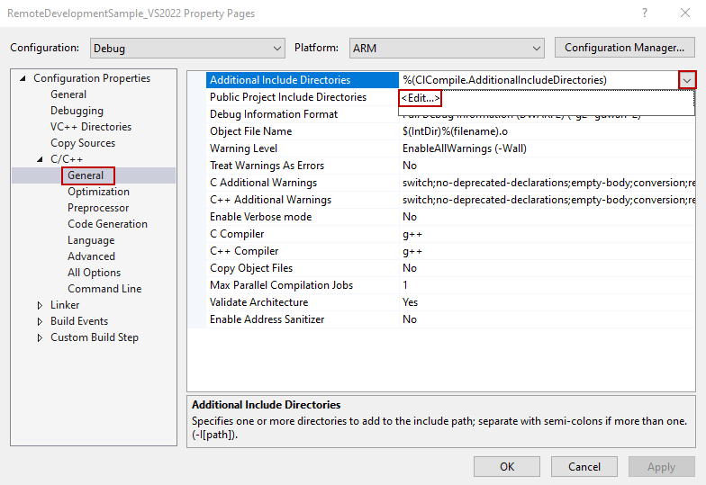

# Using Visual Studio to set up a C/C++ remote development environment

## Introduction

In the previous articles, we have demonstrated a number of programs, mostly written in Python, that run on an Edge device. However, there are times when we need to write programs in C/C++. It is easy to set up a C/C++ remote development environment on an Edge device such as e-RT3 Plus or Raspberry Pi. In this article, we demonstrate how to set up the C/C++ environment on an Ubuntu installed Edge device using Visual Studio.

## Environment

**Supported devices (OS)**

- e-RT3 Plus F3RP70-2L (Ubuntu 18.04 32-bit)
  Edge controller of Yokogawa.
- Raspberry Pi 4 Model B (Ubuntu Server 20.04 32-bit）

The `armhf` architecture package runs on these devices.

**Software requirements**

Visual Studio Professional 2022 version 17.2.6

## Getting started

The first step towards setting up a Visual Studio environment on the device is to install the `gdbserver` package. To install the `gdbserver` package on the device, run the following commands.

```bash
sudo apt update
sudo apt install g++ make gdb gdbserver zip
```

> **Note**: By default, this package is installed on e-RT3 Plus.

## Installing Visual Studio

Follow these steps to install Visual Studio:

1. Install the tool set required to set up the Linux environment.

    Open Visual Studio Installer and install **Linux and embedded development with C++**.

    

    For more information about Linux development with C++ in Visual Studio 2022, refer to the [official documentation](https://docs.microsoft.com/en-us/cpp/linux/?view=msvc-170).

2. Configure the settings for connecting Visual Studio and the device by performing these steps:

    1. Start Visual Studio.
    2. Open **Tools** **>** **Options** **>** **Cross Platform** **>** **Connection Manager**.
    3. Click **Add**.

        

    4. Enter the following details and click **Connect**.

        | Items | Value |
        |---|---|
        | Host name  | IP address of device |
        | Port | 22 |
        | User name | User name for device |
        | Authentication type | Password |
        | Password | User password |

        

3. To download the header to be used in IntelliSense, click **Connection Manager** **>** **Remote Header IntelliSense Manager**, select the device that you added, and then click **Download**.

    

## Creating and debugging a project

Creating and debugging a project involves the following steps:

1. [Creating a project](#creating-a-project)
2. [Configuring project settings](#configuring-project-settings)
3. [Building and debugging a project](#building-and-debugging-a-project)

### Creating a project

Follow these steps to create a project:

1. Start Visual Studio and create a new project.
2. Specify the project type as **C++** and **Linux**, select **Console Application**, and create a project by specifying the project name.

    

### Configuring project settings

Follow these steps to configure project settings:

1. From the menu bar, select **Project** **>** **{project-name} Properties**.

    

2. From the Configuration drop-down list, select **Debug**.
3. From the Platform drop-down list,  select **ARM**.

    

4. On the left pane, select **General**.
5. On the right pane, from the **Remote Build Machine** drop-down list, select the added device.
6. Click **Apply**.
7. On the left pane, select **Debugging**.

    

8. From the **Remote Debug Machine** drop-down list, select the added device.
9. From the **Debugging Mode** drop-down list, select `gdbserver`, and then click **Apply**.

### Building and debugging a project

Follow these steps to build and debug a project:

1. After selecting **Debug** for Configuration and **ARM** for Platform, place a break point anywhere in the source code to build and run the program.

    

    If the program stops at the break point, it indicates that the project is created successfully.

    

    The output is displayed in the Linux console window.

    

## Appendix

### Adding source files

Follow these steps to add source files:

1. Right-click the project icon, and select **Add** **>** **New Item**.

    The *Add New Item* dialog box appears.

    

2. Specify the file name, select the file type and then click **Add**.

    

### Library links

1. Open the Project properties.
2. On the left pane, select **Configuration Properties** **>** **Linker** **>** **Input** **>** **Library dependencies**, and then click **Edit**.

    

3. Enter the name of the library to be added. 

   The following image shows the scenario when `libm` is added.

    

### Adding Include path

If you are using a header file that is available in a location other than the default location, you must configure the Include path settings.

1. From the Project Properties, navigate to **C/C++** **>** **General** **>** **Additional Include directories**, and then click **Edit**.

    

2. Specify the directory path on device that includes the header file and click **OK**.

    

## References

1. [AI platform for industries | Yokogawa Electric Corporation](https://www.yokogawa.com/solutions/products-platforms/control-system/ert3-embedded-controller/#Overview)
2. [Linux development with C++](https://docs.microsoft.com/en-us/cpp/linux/?view=msvc-170)