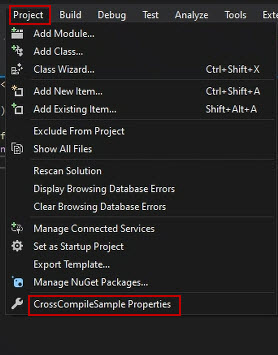

# Cross compiling C/C++ programs for  Ubuntu installed on Edge devices

## Introduction

Developing a large-scale program on an Edge device can take a considerable amount of time. To avoid this, in this document, we introduce a method for cross compiling C/C++ for a device on which Ubuntu is installed.

This enables you to develop a program using the Windows Subsystem for Linux (WSL) and deploy the program on Edge devices.


## Environment

**Supported device (OS)**

e-RT3 Plus F3RP70-2L (Ubuntu 18.04 32-bit): An Edge controller from Yokogawa.

The `armhf` architecture package runs on this device.

**Windows version**

Windows 10 64-bit version 1909

**Software version**

Visual Studio Professional 2019 version 16.9.6

## Getting started

Before you start building a cross-compile platform, you must install the `libc6` package on e-RT3 Plus.

Run the following commands to install the package:

```bash
sudo apt update
sudo apt install libc6-dbg
```

> **Note**: In some cases, you may need to  configure the [sudo](https://github.com/Yokogawa-Technologies-Solutions-India/e-RT3-docs/blob/master/Articles/Azure/Send-telemetry-data-from-e-RT3-to-azure-IoT-hub.md#enabling-sudo-user) and [proxy](https://github.com/Yokogawa-Technologies-Solutions-India/e-RT3-docs/blob/master/Articles/Azure/Send-telemetry-data-from-e-RT3-to-azure-IoT-hub.md#proxy-settings) settings.

## WSL preparation

### Installing WSL

1. Install WSL by following the steps described in the [Microsoft official procedure](https://docs.microsoft.com/en-us/windows/wsl/install).
2. Download Ubuntu 18.04 LTS from [Microsoft Store](https://apps.microsoft.com/store/detail/ubuntu-1804-on-windows/9N9TNGVNDL3Q?hl=en-in&gl=IN).
    

### Configuring WSL settings

1. Start WSL and login.
2. Run the following commands to install the required packages.

    ```bash
    sudo apt update

    # Install the build environment for armhf
    sudo apt install crossbuild-essential-armhf

    # Install other required packages
    sudo apt install make rsync zip
    ```

3. You can verify that the installation is successful by running the following commands.

    ```bash
    $ arm-linux-gnueabihf-gcc --version
    arm-linux-gnueabihf-gcc (Ubuntu/Linaro 7.5.0-3ubuntu1~18.04) 7.5.0
    Copyright (C) 2017 Free Software Foundation, Inc.
    This is free software; see the source for copying conditions. There is NO
    warranty; not even for MERCHANTABILITY or FITNESS FOR A PARTICULAR PURPOSE.

    
    $ arm-linux-gnueabihf-g++ --version
    arm-linux-gnueabihf-g++ (Ubuntu/Linaro 7.5.0-3ubuntu1~18.04) 7.5.0
    Copyright (C) 2017 Free Software Foundation, Inc.
    This is free software; see the source for copying conditions. There is NO
    warranty; not even for MERCHANTABILITY or FITNESS FOR A PARTICULAR PURPOSE.
    ```

> **Note**: If the computer is in an environment that requires proxies to connect to the internet, you must configure the [proxy settings](https://github.com/Yokogawa-Technologies-Solutions-India/e-RT3-docs/blob/master/Articles/Azure/Send-telemetry-data-from-e-RT3-to-azure-IoT-hub.md#proxy-settings).

## Installing Visual Studio

The steps to install Visual Studio are described in the [previous article](https://github.com/Yokogawa-Technologies-Solutions-India/e-RT3-docs/blob/master/Articles/VisualStudio_C_CPP/CCPlusRemoteDevelopmentEnvironment.md).

> **Note**: You need not download IntelliSense to execute the steps that are described in this article.

## Creating and debugging projects

Creating and debugging a project involves the following steps:

1. [Creating a project](#creating-a-project)
2. [Configuring project settings](#configuring-project-settings)
3. [Building and debugging the project](#building-and-debugging-the-project)

### Creating a project

Follow these steps to create a project:

1. Start Visual Studio and create a new project.

2. Specify the project type as **C++** and **Linux**, select **Console Application**, and create a project by specifying the project name.

   

### Configuring project settings

1. From the menu bar, click **Project > Properties**.

    For more information about configuring the project settings for a Linux WSL subsystem, refer to the [official documentation](https://devblogs.microsoft.com/cppblog/c-with-visual-studio-2019-and-windows-subsystem-for-linux-wsl/).

    

2. From the Configuration drop-down list, select **Debug**.
3. From the Platform drop-down list, select **x64**.
4. On the left pane, select **General**. 
5. On the right pane, under the **Platform Toolset** section, from the **Platform Toolset** drop-down list, select **GCC for Windows Subsystem for Linux**.
6. Click **Apply**

    

7. On the left pane, click **Debugging**.

    

8. From the **Remote Debug Machine** drop-down list, select the added device.
9. On the left pane, select **C/C++**.
10. On the right pane, under the **General** section,  in the **C Compiler** and **C++ Compiler** boxes, type `arm-linux-gnueabihf-g++`.

    

11. On the left pane, select **Linker**.
12. On the right pane, under the **General** section, in the **Linker** box, type `arm-linux-gnueabihf-g++`.

    

13. Click **Apply**.
    The project settings are configured.

### Building and debugging the project

Follow these steps to build and debug the project:

1. From the **Debug** drop-down list, select **x64**.

    

2. Place a break point anywhere in the source code.
3. Build and run the program.
4. If the program stops at the break point, it indicates that the project is created successfully.

    

    The output is displayed in the Linux console window.
    

## Appendix

### Accessing WSL files

WSL files are saved in the current Linux directory. To navigate to the directory, type [`\\wsl$`](\\wsl$) in the address bar of Windows Explorer.


### Build project without debugging

You can build only the project without debugging it.

1. From the menu bar, select **Build > {project-name}**.

    

The output file is saved in the following location:

`<Solution directory>\<Project directory>\bin\<Platform>\<Configuration>\`


### Using device-specific libraries

When you build a program using device-specific libraries, you must include the library and header files in the project.

1. Create the `inc` and `lib` folders in the project directory to store the header and library files respectively.

    

2. Open the project properties in Visual Studio.
3. On the left pane, select **C/C++ > General**.
4. On the right pane, in the **Additional Include Directories** box, specify the `inc` folder location.

    

5. On the left pane, select **Linker > General**.
6. In the **Additional Library Directories** box, specify the `lib` folder location.

    

7. In the **Library Dependent File**, specify the name of the library. For example, in case of `libfoo.so`, type `foo`.

    

8. Click **Apply**.

## References

1. [AI Platform for Industries | Yokogawa Electric Corp](https://www.yokogawa.com/solutions/products-platforms/control-system/ert3-embedded-controller/#Overview)
2. [C++ with Visual Studio 2019 and Windows Subsystem for Linux (WSL) | C++ Team Blog](https://devblogs.microsoft.com/cppblog/c-with-visual-studio-2019-and-windows-subsystem-for-linux-wsl/)