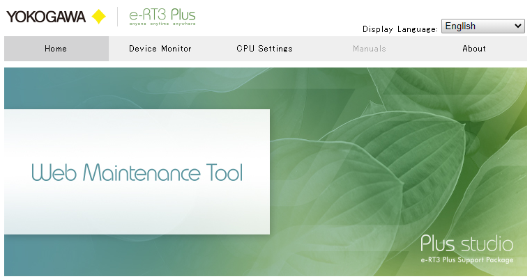
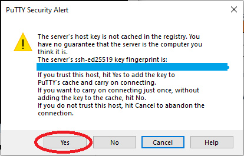

# Communication with e-RT3 Plus (remote)

## Connecting to e-RT3 Plus from browser
The browser based connection allows the user to perform limited tasks like monitoring the device and CPU settings.

---

## Establishing browser based connection by e-RT3 Plus

In order to establish a browser based connection, the user must be aware of the IP address and should belong to same network.

### Steps
1. Make sure you belong to the same network as the device.
2. Type in the IP address of e-RT3. (By default, 192.168.3.72). It opens the website which looks like the following image.
3. Now the user can perform tasks like monitoring the device and CPU setting

This is how the user can access the device through a browser

---

## Communicating  with e-RT3 Plus by SSH
With the help of SSH connection, user can perform many tasks. But in order to connect by SSH, user needs to have PuTTY installed in their system and should be aware of the IP address and the login credentials of the device.

---

### Establishing SSH connection to e-RT3 Plus
### Steps

1. Make sure you belong to same network as device.
2. Open PuTTY and type in the IP address of e-RT3. (By default, 192.168.3.72) and hit enter.

3. When establishing connection for the first time, the PuTTY Security Alert dialog is displayed. Click “Yes” to continue.

4. Now it will ask for user id and password. Enter the user id and password. But only normal user can access e-RT3 Plus with SSH with the default settings.

5. Now the user is good to perform different tasks.

   User can perform tasks like 
   1. adding new user (only with root access),
   2. deleting user (only with root access),
   3. changing password (only with root access),
   4. installing applications (only with root access),
   5. updating the applications (only with root access),
   6. create new folders,
   7. deleting the folders,
   8. copying a file,
   9. moving a file, etc. 

The SSH connection provides the safest communication between the user and the device and it is most preferred by developers. The browser based connection has limited tasks that can be performed. But both connections let the user to connect to e-RT3 Plus easily.

---